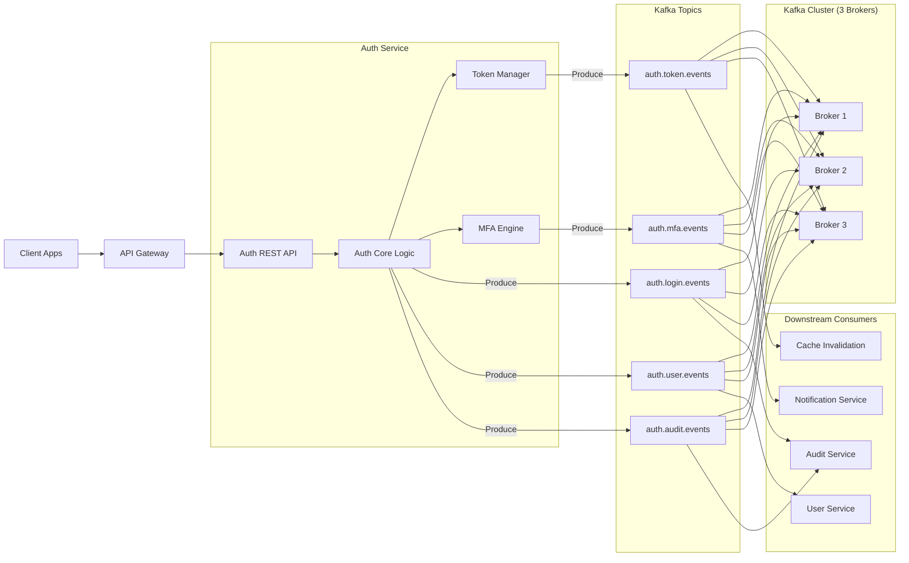

# 🔐 Auth Service – Kafka-Centric HLD (3-Broker Setup)

## 1️⃣ Scope & Assumptions

**System scope**

* Single **Auth Service** (Spring Boot / JVM based)
* Kafka used for **event-driven auth workflows**
* Downstream services (User, Notification, Audit) consume auth events

**Kafka assumptions**

* **3 Kafka brokers**
* **Replication factor = 3**
* **Min ISR = 2**
* **Zookeeper or KRaft mode** (diagram supports both)

---

## 2️⃣ Core Auth Use-Cases Covered via Kafka

| Auth Flow                | Kafka Role          |
|--------------------------|---------------------|
| Login success/failure    | Emit events         |
| Account lock/unlock      | Event propagation   |
| MFA challenge issued     | Async processing    |
| Token issued / revoked   | Event sourcing      |
| Role / permission change | Cache invalidation  |
| Audit trail              | Guaranteed delivery |

---

## 3️⃣ Kafka Topics (Auth-Specific Only)

| Topic               | Partitions | Purpose               |
|---------------------|------------|-----------------------|
| `auth.login.events` | 6          | Login success/failure |
| `auth.token.events` | 6          | Token issued/revoked  |
| `auth.mfa.events`   | 3          | MFA triggers          |
| `auth.user.events`  | 3          | User status changes   |
| `auth.audit.events` | 3          | Compliance & audit    |

✔️ **Why partitions > brokers?**
→ Allows **parallelism + future scaling** without repartitioning.

---

## 4️⃣ Auth Service – Kafka Interaction Model

### Producers

* Auth API emits **domain events**
* Uses **Idempotent Producer**
* `acks=all`
* `enable.idempotence=true`

### Consumers

* Separate **consumer groups per downstream concern**
* Manual offset commit
* Retry → DLQ pattern

---

## 5️⃣ DevOps-Level Kafka Architecture (Mermaid)

### 🧩 Full Kafka + Auth HLD Diagram



---

## 6️⃣ Kafka DevOps Configuration (Auth-Optimized)

### Broker-Level

```yaml
default.replication.factor: 3
min.insync.replicas: 2
unclean.leader.election.enable: false
```

### Producer (Auth Service)

```yaml
acks: all
retries: 5
linger.ms: 5
enable.idempotence: true
```

### Consumer (Downstream)

```yaml
enable.auto.commit: false
isolation.level: read_committed
max.poll.records: 500
```

---

## 7️⃣ Failure Scenarios (3 Brokers Coverage)

| Failure                  | Result           |
|--------------------------|------------------|
| 1 broker down            | ✅ No downtime    |
| 1 broker + 1 replica lag | ✅ Still writable |
| Producer retry           | ✅ Exactly-once   |
| Consumer crash           | ✅ Offset replay  |
| Message poison           | ✅ DLQ            |

---

## 8️⃣ Why 3 Brokers Are “Enough” for Auth

✔ Strong consistency (ISR=2)
✔ Zero message loss
✔ Ordering per user key
✔ Supports audit compliance
✔ Production-grade HA

> Auth is **latency-sensitive but low-throughput** → 3 brokers is a sweet spot.

---

## 9️⃣ Design Patterns Used

* **Event-Driven Architecture**
* **Transactional Outbox (optional)**
* **CQRS (Command via API, Query via events)**
* **Idempotent Producer**
* **Consumer Group Isolation**
* **DLQ Pattern**

