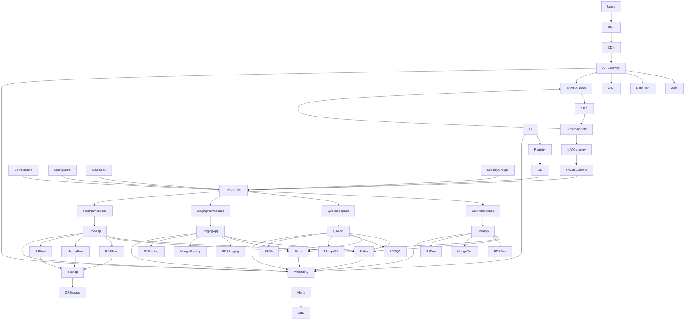

```mermaid
flowchart TB

Users
DNS
CDN
APIGateway
Auth
RateLimit
WAF
LoadBalancer

VPC
PublicSubnets
PrivateSubnets
NATGateway

EKSCluster
DevNamespace
QANamespace
StagingNamespace
ProdNamespace

DevApp
QAApp
StagingApp
ProdApp

Kafka
Redis

RDSDev
RDSQA
RDSStaging
RDSProd

MongoDev
MongoQA
MongoStaging
MongoProd

S3Dev
S3QA
S3Staging
S3Prod

SecretsStore
ConfigStore
IAMRoles
SecurityGroups

CI
Registry
CD

Monitoring
Alerts
SNS

Backup
DRStorage

Users --> DNS
DNS --> CDN
CDN --> APIGateway

APIGateway --> Auth
APIGateway --> RateLimit
APIGateway --> WAF
APIGateway --> LoadBalancer

LoadBalancer --> VPC
VPC --> PublicSubnets
PublicSubnets --> LoadBalancer
PublicSubnets --> NATGateway
NATGateway --> PrivateSubnets
PrivateSubnets --> EKSCluster

EKSCluster --> DevNamespace
EKSCluster --> QANamespace
EKSCluster --> StagingNamespace
EKSCluster --> ProdNamespace

DevNamespace --> DevApp
QANamespace --> QAApp
StagingNamespace --> StagingApp
ProdNamespace --> ProdApp

CI --> Registry
Registry --> CD
CD --> EKSCluster

SecretsStore --> EKSCluster
ConfigStore --> EKSCluster
IAMRoles --> EKSCluster
SecurityGroups --> EKSCluster

DevApp --> Kafka
QAApp --> Kafka
StagingApp --> Kafka
ProdApp --> Kafka

DevApp --> Redis
QAApp --> Redis
StagingApp --> Redis
ProdApp --> Redis

DevApp --> RDSDev
QAApp --> RDSQA
StagingApp --> RDSStaging
ProdApp --> RDSProd

DevApp --> MongoDev
QAApp --> MongoQA
StagingApp --> MongoStaging
ProdApp --> MongoProd

DevApp --> S3Dev
QAApp --> S3QA
StagingApp --> S3Staging
ProdApp --> S3Prod

RDSProd --> Backup
MongoProd --> Backup
S3Prod --> Backup
Backup --> DRStorage

DevApp --> Monitoring
QAApp --> Monitoring
StagingApp --> Monitoring
ProdApp --> Monitoring
Kafka --> Monitoring
Redis --> Monitoring
APIGateway --> Monitoring
CI --> Monitoring

Monitoring --> Alerts
Alerts --> SNS
```