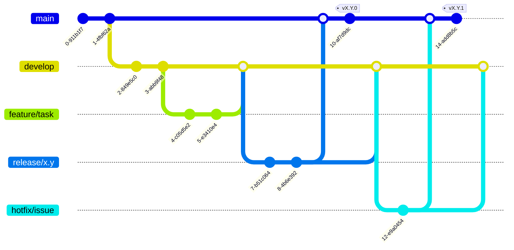
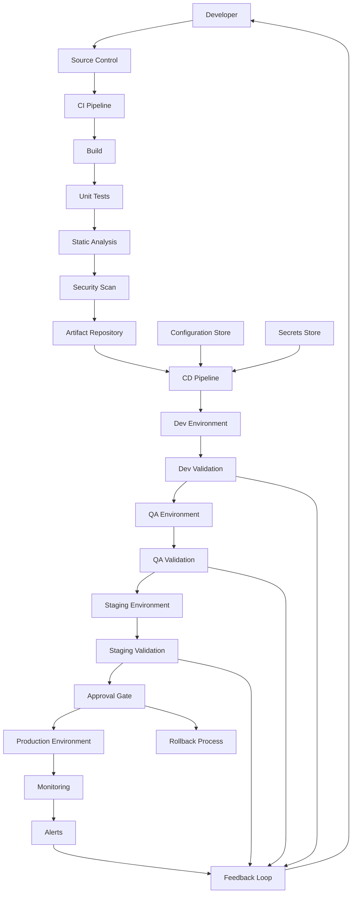

# Development & Deployment Workflow

This document describes the **standard Git workflow** and 
the **CI/CD pipeline with environments and feedback loops**
used across teams and services.

The goal is to ensure:

* Predictable releases
* Safe deployments
* Fast feedback from **Dev, QA, Staging, and Production**

---

## 🔁 1. Git Workflow (Source Code Lifecycle)

This diagram explains **how code flows through branches**, from feature development to production and hotfixes.

### Branching Model

* `main` → production-ready code
* `develop` → integration branch
* `feature/*` → short-lived feature work
* `release/*` → stabilization before release
* `hotfix/*` → emergency production fixes

### 📊 GitGraph

### Key Principles

* Features always merge into `develop`
* Releases are cut from `develop`
* Production is updated only from `release` or `hotfix`
* Hotfixes are merged back to `develop` to avoid drift

---

## 2. CI/CD Pipeline with Environments & Feedback

This diagram shows **how the same artifact** flows through environments with **validation and feedback at every stage**.

### Environments Covered

* Dev
* QA
* Staging
* Production

Each environment provides **feedback**, not just production.

### 📊 CI/CD + Environments (Top → Bottom)

---

## Environment → Feedback Responsibility

| Environment | Feedback Type                         |
|-------------|---------------------------------------|
| Dev         | Logic, early integration              |
| QA          | Functional and regression             |
| Staging     | Performance, config, prod-like issues |
| Production  | Reliability, latency, incidents       |

---

## ✅ Core DevOps Guarantees

* Same artifact promoted across all environments
* No rebuilding between environments
* Fail fast in Dev and QA
* Approval before Production
* Rollback always available
* Feedback loops at **every stage**

