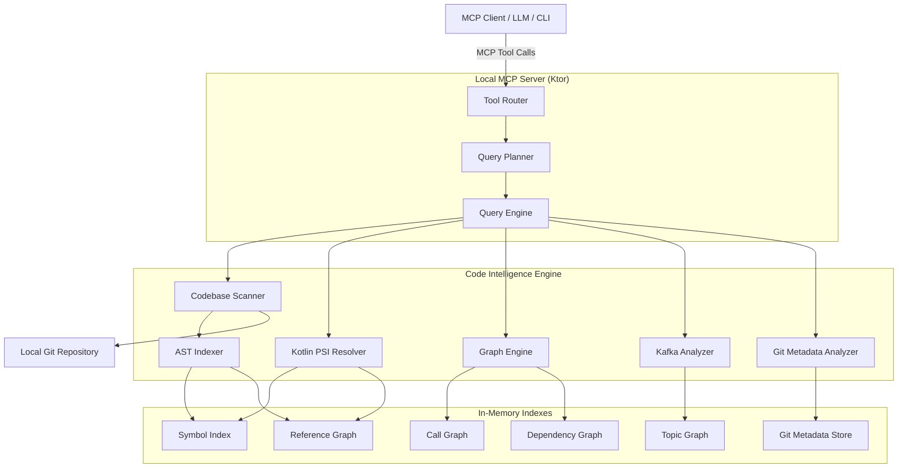
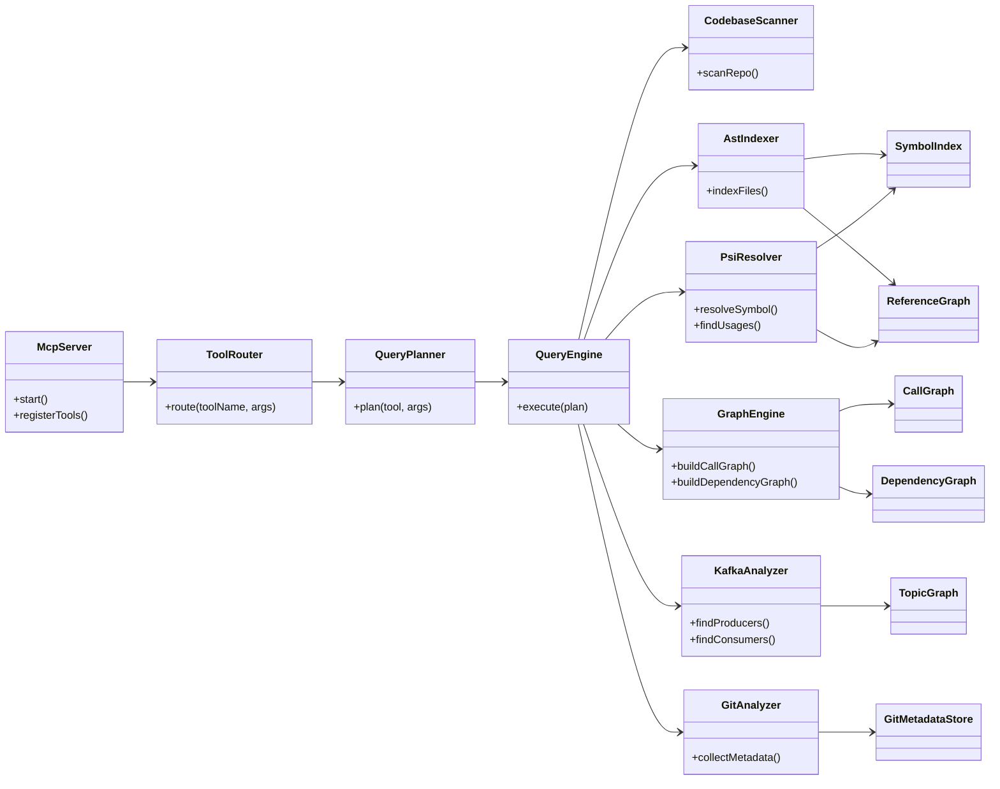
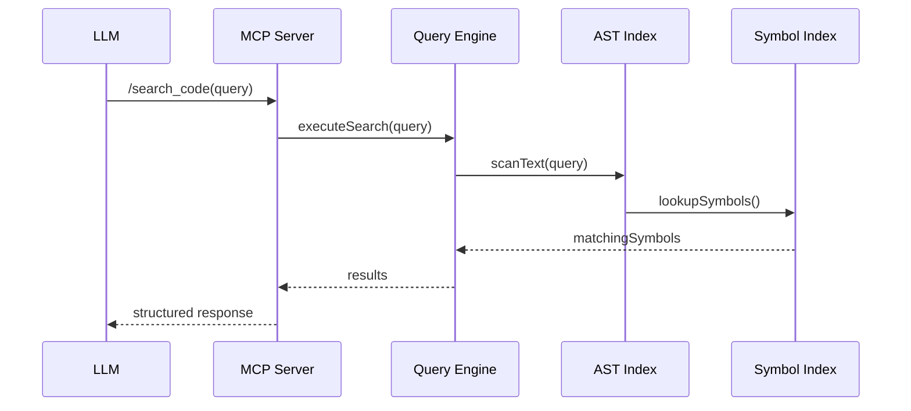
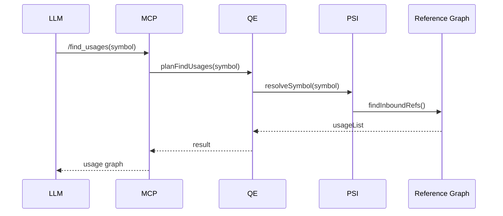
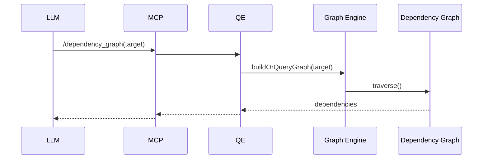
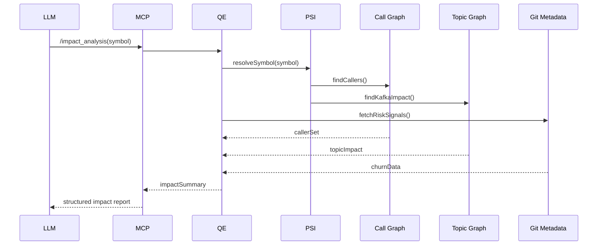

# 1️⃣ High-Level Architecture Diagram (HLD)

### Purpose

Shows **system boundaries, responsibilities, and data flow**
→ This is your **system design interview diagram**



### Key Interview Callouts

* **Tree-sitter first**, PSI only for precision
* **Graphs are first-class citizens**
* Entire system is **offline + deterministic**

---

# 2️⃣ Component / Class Diagram

### Purpose

Shows **internal structure & responsibilities**
→ This answers *“how would you implement it?”*



### Design Patterns Used

* **Facade** → `QueryEngine`
* **Command** → MCP tool execution
* **Builder** → Graph construction
* **Strategy** → Tree-sitter vs PSI resolution

---

# 3️⃣ Core Data Model (ER-Style)

### Purpose

Shows **what you store & why**
→ Great for *“how do you model this?”*

```mermaid
erDiagram
    FILE ||--o{ CLASS: contains
    CLASS ||--o{ METHOD: defines
    METHOD ||--o{ METHOD: calls
    CLASS ||--o{ CLASS: depends_on
    MODULE ||--o{ CLASS: owns
    METHOD }o--o{ SYMBOL: references
    CLASS }o--o{ SYMBOL: references
    KAFKA_TOPIC ||--o{ KAFKA_CONSUMER: consumed_by
    KAFKA_TOPIC ||--o{ KAFKA_PRODUCER: produced_by
    FILE ||--|| GIT_METADATA: has

    FILE {
        string path
        string module
    }

    CLASS {
        string name
        string package
    }

    METHOD {
        string name
        string signature
    }

    KAFKA_TOPIC {
        string name
    }

    GIT_METADATA {
        string lastAuthor
        int commitCount
    }
```

### Important Scope Note

⚠️ All relationships are **static**
No runtime / reflection resolution (intentionally out of scope)

---

# 4️⃣ Sequence Diagrams (Critical MCP Tools)

---

## 4.1 `/search_code`



---

## 4.2 `/find_usages`



---

## 4.3 `/dependency_graph`



---

## 4.4 `/impact_analysis` (Most Important)

