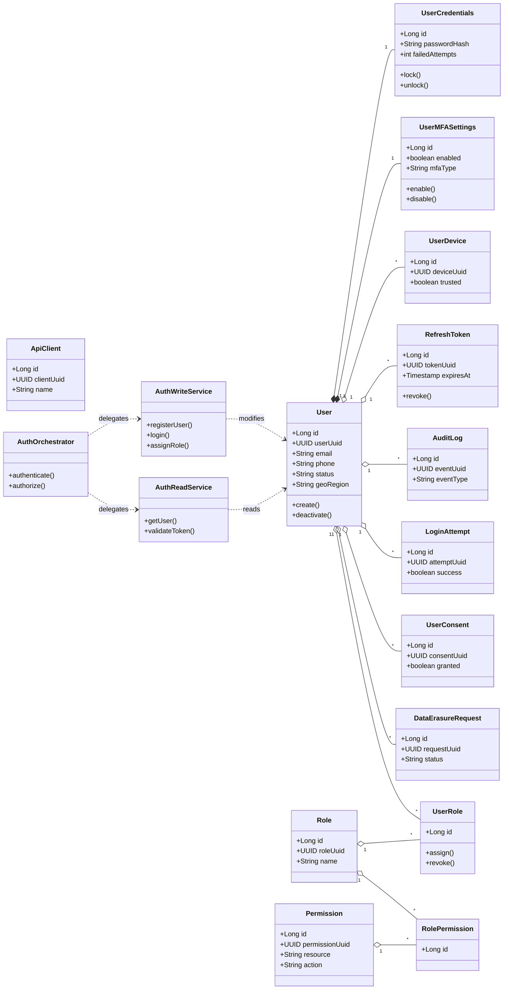

# Class Diagram for Authentication and Authorization Service

```mermaid
classDiagram
    direction LR
%% =========================
%% ENTITIES
%% =========================

    class User {
        +Long id
        +UUID userUuid
        +String email
        +String phone
        +String status
        +String geoRegion
        +create()
        +deactivate()
    }

    class UserCredentials {
        +Long id
        +String passwordHash
        +int failedAttempts
        +lock()
        +unlock()
    }

    class UserMFASettings {
        +Long id
        +boolean enabled
        +String mfaType
        +enable()
        +disable()
    }

    class Role {
        +Long id
        +UUID roleUuid
        +String name
    }

    class Permission {
        +Long id
        +UUID permissionUuid
        +String resource
        +String action
    }

    class UserRole {
        +Long id
        +assign()
        +revoke()
    }

    class RolePermission {
        +Long id
    }

    class RefreshToken {
        +Long id
        +UUID tokenUuid
        +Timestamp expiresAt
        +revoke()
    }

    class UserDevice {
        +Long id
        +UUID deviceUuid
        +boolean trusted
    }

    class AuditLog {
        +Long id
        +UUID eventUuid
        +String eventType
    }

    class LoginAttempt {
        +Long id
        +UUID attemptUuid
        +boolean success
    }

    class ApiClient {
        +Long id
        +UUID clientUuid
        +String name
    }

    class UserConsent {
        +Long id
        +UUID consentUuid
        +boolean granted
    }

    class DataErasureRequest {
        +Long id
        +UUID requestUuid
        +String status
    }

%% =========================
%% SERVICES
%% =========================

    class AuthOrchestrator {
        +authenticate()
        +authorize()
    }

    class AuthWriteService {
        +registerUser()
        +login()
        +assignRole()
    }

    class AuthReadService {
        +getUser()
        +validateToken()
    }

%% =========================
%% RELATIONSHIPS
%% =========================
    User "1" *-- "1" UserCredentials
    User "1" *-- "1" UserMFASettings

User "1" o-- "*" UserDevice
User "1" o-- "*" RefreshToken
User "1" o-- "*" AuditLog
User "1" o-- "*" LoginAttempt
User "1" o-- "*" UserConsent
User "1" o-- "*" DataErasureRequest

User "1" o-- "*" UserRole
Role "1" o-- "*" UserRole

Role "1" o-- "*" RolePermission
Permission "1" o-- "*" RolePermission

AuthOrchestrator ..> AuthWriteService: delegates
AuthOrchestrator ..> AuthReadService: delegates

AuthWriteService ..> User: modifies
AuthReadService ..> User: reads

```
