# Login and Authentication Sequences

## Purpose

Authenticate a user using **username/password** and optionally **MFA (OTP)**, ensuring retries are safe and no duplicate
side effects occur.

## Preconditions

* User exists
* User account is active
* Idempotency key is provided by client

## Sequence: Login + MFA Initiation

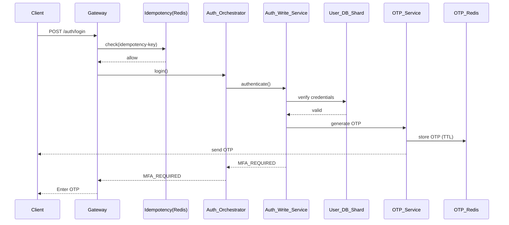

## Guarantees

* Password is verified only once per idempotency key
* OTP is short-lived and stored only in Redis
* Login fails closed on DB or OTP failure

---

# Sequence: OTP Verification

## Purpose

Verify OTP and complete authentication by issuing tokens.

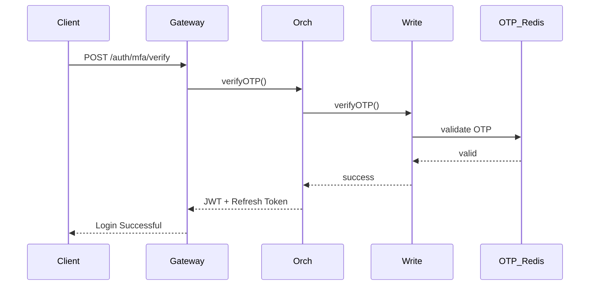

## Guarantees

* OTP can be used only once
* Expired or reused OTP is rejected
* Tokens are issued only after MFA success

---

# Sequence: Registration-sequence

## Purpose

Create a new user account in the correct shard and emit audit events.

## Preconditions

* Email / phone not already registered
* Valid registration payload

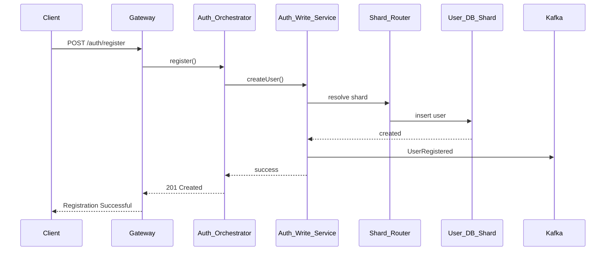

## Guarantees

* User is written to exactly one shard
* No cross-shard writes
* Registration event is emitted asynchronously

---

# Sequence: OAuth-sequence

## Purpose

Authenticate users via external identity providers (Google, Apple, SSO).

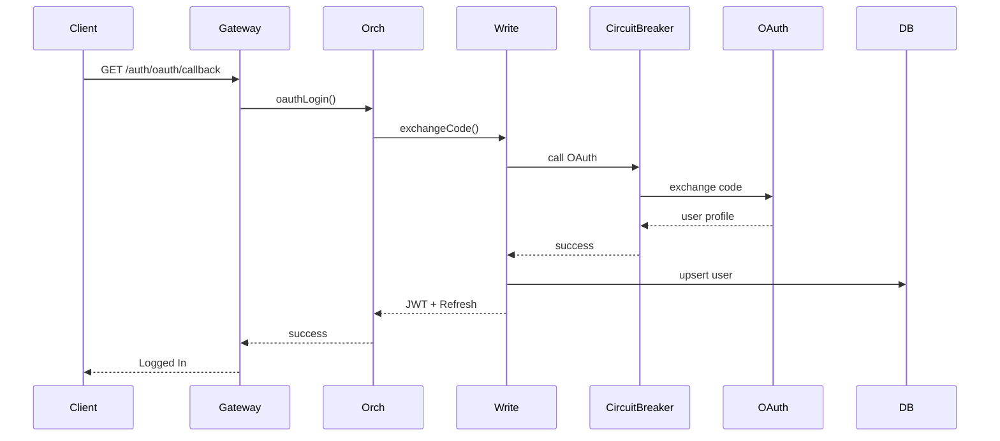

## Guarantees

* OAuth failures do not cascade (circuit breaker)
* User record is idempotently created or updated
* External calls are never on read path

---

# Sequence: token-refresh

## Purpose

Issue a new access token using a valid refresh token.

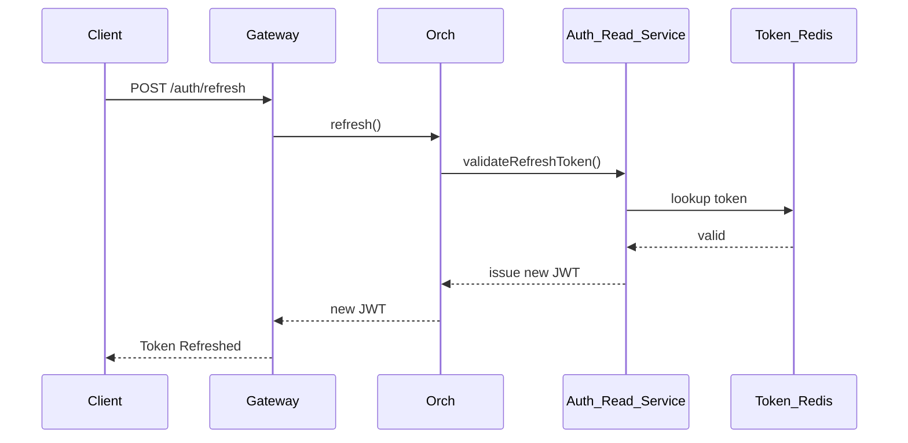

## Guarantees

* Refresh tokens are centrally revocable
* Access tokens remain short-lived
* No DB access on refresh path

---

# Sequence: logout-sequence

## Purpose

Invalidate user sessions and revoke refresh tokens.

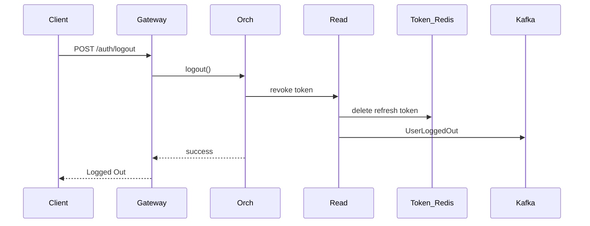

## Guarantees

* Logout is idempotent
* Tokens cannot be reused after logout
* Audit event is always emitted

---

# Sequence: token validation

## Purpose

Validate JWT for every API request with minimal latency.

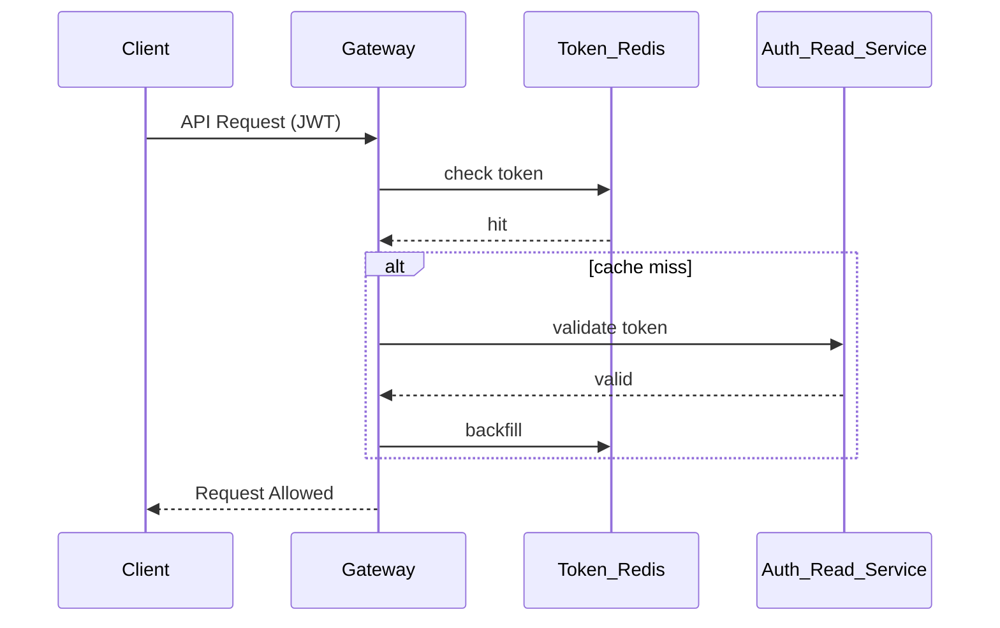

## Guarantees

* High availability (AP)
* Bounded staleness accepted
* Gateway enforces authorization decisions
---

## ➕ Sequence: Password Reset (Request)

### Purpose

Initiate secure password recovery.

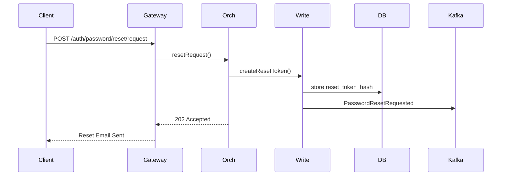

### Guarantees

* Token is single-use
* Token expires
* Event always audited

---

## ➕ Sequence: Password Reset (Confirm)

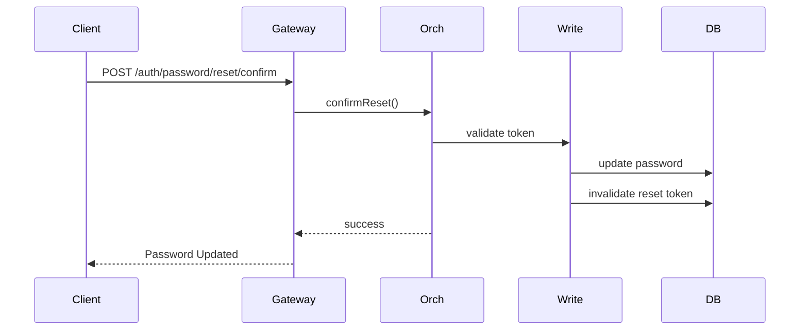

---

## ➕ Sequence: Account Lock (Brute Force)

### Purpose

Lock account after repeated failures.

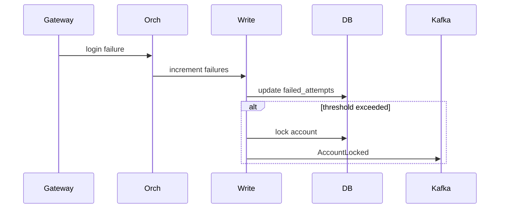

---

## ➕ Sequence: Admin User Disable (Force Logout)

### Purpose

Immediately revoke all user sessions.

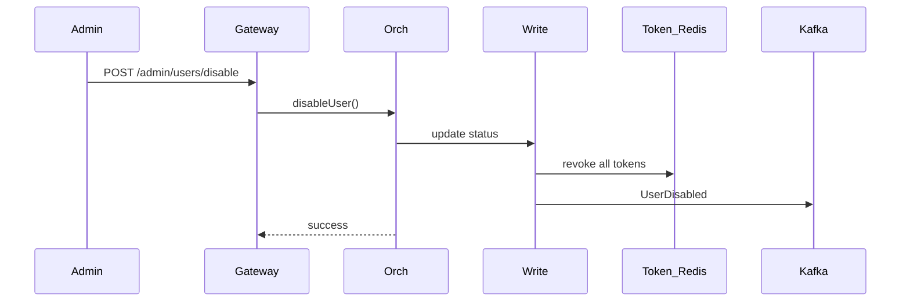

### Guarantees

* All refresh tokens invalidated
* Access tokens expire naturally
* No further login allowed

---

## ➕ Sequence: New Device Login (MFA Escalation)

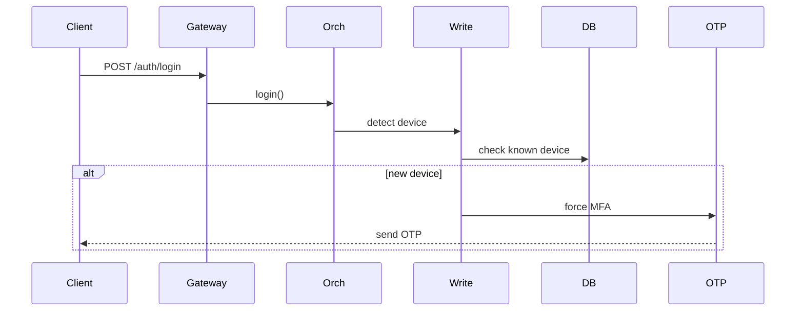

---

## ➕ Sequence: Auth Read — User Context

### Purpose

Used by downstream services.

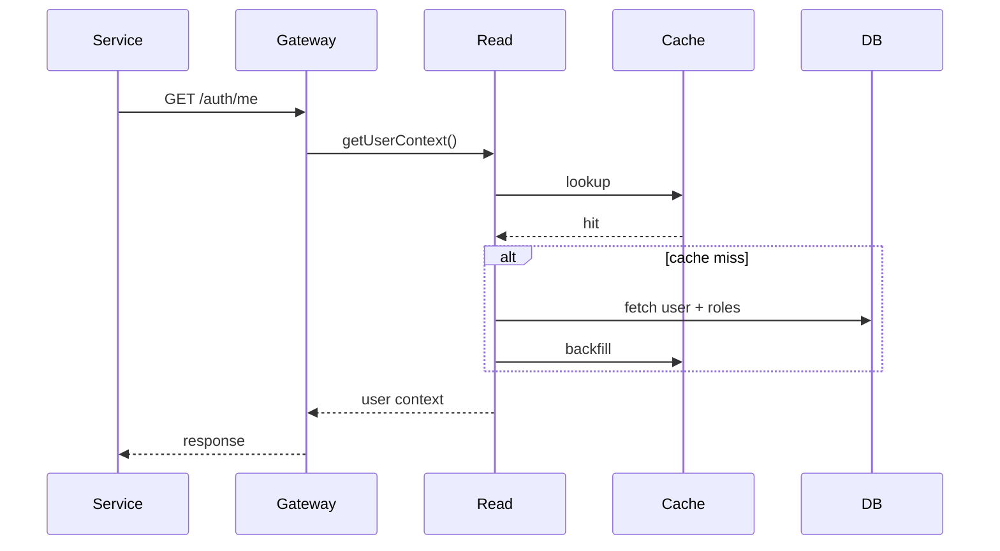

