# 🔐 Auth Platform — Database Schema (Dual-ID, Production)

**DB:** PostgreSQL
**Sharding:** by `user_uuid` (hash + geo)
**Rule:**

* `id` → internal joins only
* `*_uuid` → exposed outside DB

---


```mermaid
erDiagram

USERS {
  BIGINT id PK
  UUID user_uuid UK
  VARCHAR email UK
  VARCHAR phone
  VARCHAR status
  VARCHAR geo_region
  TIMESTAMP created_at
  TIMESTAMP updated_at
  BIGINT version
  TIMESTAMP deleted_at
}

USER_CREDENTIALS {
  BIGINT id PK
  BIGINT user_id FK
  VARCHAR password_hash
  VARCHAR password_algo
  INT failed_attempts
  TIMESTAMP locked_until
  TIMESTAMP last_login_at
  VARCHAR last_login_ip
}

USER_MFA_SETTINGS {
  BIGINT id PK
  BIGINT user_id FK
  BOOLEAN mfa_enabled
  VARCHAR mfa_type
  VARCHAR totp_secret_ref
  TIMESTAMP enabled_at
  TIMESTAMP disabled_at
}

ROLES {
  BIGINT id PK
  UUID role_uuid UK
  VARCHAR role_name UK
  VARCHAR description
}

PERMISSIONS {
  BIGINT id PK
  UUID permission_uuid UK
  VARCHAR resource
  VARCHAR action
}

ROLE_PERMISSIONS {
  BIGINT id PK
  BIGINT role_id FK
  BIGINT permission_id FK
}

USER_ROLES {
  BIGINT id PK
  BIGINT user_id FK
  BIGINT role_id FK
  TIMESTAMP assigned_at
  TIMESTAMP revoked_at
}

REFRESH_TOKENS {
  BIGINT id PK
  UUID token_uuid UK
  BIGINT user_id FK
  BIGINT device_id FK
  TIMESTAMP issued_at
  TIMESTAMP expires_at
  VARCHAR status
}

AUTH_AUDIT_LOG {
  BIGINT id PK
  UUID event_uuid
  BIGINT user_id FK
  VARCHAR event_type
  VARCHAR source_ip
  JSONB event_payload
  TIMESTAMP created_at
}

LOGIN_ATTEMPTS {
  BIGINT id PK
  UUID attempt_uuid UK
  BIGINT user_id FK
  VARCHAR email
  BOOLEAN success
  VARCHAR failure_reason
  TIMESTAMP created_at
}

USER_DEVICES {
  BIGINT id PK
  UUID device_uuid UK
  BIGINT user_id FK
  VARCHAR device_type
  VARCHAR os
  VARCHAR browser
  BOOLEAN trusted
  TIMESTAMP first_seen_at
  TIMESTAMP last_seen_at
}

PASSWORD_RESET_REQUESTS {
  BIGINT id PK
  UUID reset_uuid UK
  BIGINT user_id FK
  VARCHAR reset_token_hash
  TIMESTAMP expires_at
  TIMESTAMP used_at
}

USER_STATUS_HISTORY {
  BIGINT id PK
  UUID history_uuid UK
  BIGINT user_id FK
  VARCHAR old_status
  VARCHAR new_status
  VARCHAR reason
  TIMESTAMP changed_at
}

API_CLIENTS {
  BIGINT id PK
  UUID client_uuid UK
  VARCHAR client_name
  TEXT scopes
  VARCHAR status
}

USER_CONSENTS {
  BIGINT id PK
  UUID consent_uuid UK
  BIGINT user_id FK
  VARCHAR consent_type
  BOOLEAN granted
  TIMESTAMP granted_at
  TIMESTAMP revoked_at
}

DATA_ERASURE_REQUESTS {
  BIGINT id PK
  UUID request_uuid UK
  BIGINT user_id FK
  TIMESTAMP requested_at
  TIMESTAMP processed_at
  VARCHAR status
}

%% ---------------- RELATIONSHIPS ----------------

USERS ||--|| USER_CREDENTIALS : has
USERS ||--|| USER_MFA_SETTINGS : has

USERS ||--o{ USER_ROLES : assigned
ROLES ||--o{ USER_ROLES : contains

ROLES ||--o{ ROLE_PERMISSIONS : grants
PERMISSIONS ||--o{ ROLE_PERMISSIONS : mapped_to

USERS ||--o{ REFRESH_TOKENS : issues
USER_DEVICES ||--o{ REFRESH_TOKENS : binds

USERS ||--o{ AUTH_AUDIT_LOG : generates
USERS ||--o{ LOGIN_ATTEMPTS : attempts

USERS ||--o{ USER_DEVICES : owns
USERS ||--o{ PASSWORD_RESET_REQUESTS : requests

USERS ||--o{ USER_STATUS_HISTORY : changes
USERS ||--o{ USER_CONSENTS : grants

USERS ||--o{ DATA_ERASURE_REQUESTS : requests
```

## 1️⃣ GLOBAL SEQUENCES

```sql
CREATE SEQUENCE seq_users_id;
CREATE SEQUENCE seq_user_credentials_id;
CREATE SEQUENCE seq_user_mfa_id;
CREATE SEQUENCE seq_roles_id;
CREATE SEQUENCE seq_permissions_id;
CREATE SEQUENCE seq_user_roles_id;
CREATE SEQUENCE seq_refresh_tokens_id;
CREATE SEQUENCE seq_audit_log_id;
CREATE SEQUENCE seq_login_attempts_id;
CREATE SEQUENCE seq_user_devices_id;
CREATE SEQUENCE seq_password_reset_id;
CREATE SEQUENCE seq_user_status_history_id;
CREATE SEQUENCE seq_api_clients_id;
CREATE SEQUENCE seq_user_consents_id;
CREATE SEQUENCE seq_data_erasure_id;
```

---

## 2️⃣ USERS (CORE IDENTITY)

```sql
CREATE TABLE users
(
    id         BIGINT PRIMARY KEY    DEFAULT nextval('seq_users_id'),
    user_uuid  UUID         NOT NULL UNIQUE,

    email      VARCHAR(255) NOT NULL,
    phone      VARCHAR(20),

    status     VARCHAR(20)  NOT NULL
        CHECK (status IN ('ACTIVE', 'LOCKED', 'DISABLED', 'DELETED')),

    geo_region VARCHAR(20)  NOT NULL,

    created_at TIMESTAMP    NOT NULL,
    created_by VARCHAR(50)  NOT NULL,
    updated_at TIMESTAMP    NOT NULL,
    updated_by VARCHAR(50)  NOT NULL,

    version    BIGINT       NOT NULL DEFAULT 1,
    deleted_at TIMESTAMP,
    deleted_by VARCHAR(50)
);
```

```sql
CREATE UNIQUE INDEX ux_users_email ON users (email);
CREATE UNIQUE INDEX ux_users_uuid ON users (user_uuid);
CREATE INDEX ix_users_status ON users (status);
```

---

## 3️⃣ USER_CREDENTIALS

```sql
CREATE TABLE user_credentials
(
    id               BIGINT PRIMARY KEY   DEFAULT nextval('seq_user_credentials_id'),
    user_id          BIGINT      NOT NULL,

    password_hash    VARCHAR(255),
    password_algo    VARCHAR(50),

    failed_attempts  INT         NOT NULL DEFAULT 0 CHECK (failed_attempts >= 0),
    locked_until     TIMESTAMP,

    last_login_at    TIMESTAMP,
    last_login_ip    VARCHAR(50),
    last_login_agent VARCHAR(255),

    created_at       TIMESTAMP   NOT NULL,
    updated_at       TIMESTAMP   NOT NULL,
    updated_by       VARCHAR(50) NOT NULL,

    FOREIGN KEY (user_id) REFERENCES users (id) ON DELETE CASCADE
);
```

```sql
CREATE INDEX ix_cred_user ON user_credentials (user_id);
CREATE INDEX ix_cred_locked ON user_credentials (locked_until);
```

---

## 4️⃣ USER_MFA_SETTINGS

```sql
CREATE TABLE user_mfa_settings
(
    id              BIGINT PRIMARY KEY DEFAULT nextval('seq_user_mfa_id'),
    user_id         BIGINT      NOT NULL,

    mfa_enabled     BOOLEAN     NOT NULL,
    mfa_type        VARCHAR(20) CHECK (mfa_type IN ('SMS', 'EMAIL', 'TOTP')),
    totp_secret_ref VARCHAR(100),

    enabled_at      TIMESTAMP,
    disabled_at     TIMESTAMP,

    updated_at      TIMESTAMP   NOT NULL,
    updated_by      VARCHAR(50) NOT NULL,

    FOREIGN KEY (user_id) REFERENCES users (id) ON DELETE CASCADE
);
```

---

## 5️⃣ ROLES

```sql
CREATE TABLE roles
(
    id          BIGINT PRIMARY KEY    DEFAULT nextval('seq_roles_id'),
    role_uuid   UUID         NOT NULL UNIQUE,

    role_name   VARCHAR(100) NOT NULL UNIQUE,
    description VARCHAR(255),

    created_at  TIMESTAMP    NOT NULL,
    created_by  VARCHAR(50)  NOT NULL,
    updated_at  TIMESTAMP    NOT NULL,
    updated_by  VARCHAR(50)  NOT NULL,
    version     BIGINT       NOT NULL DEFAULT 1
);
```

---

## 6️⃣ PERMISSIONS

```sql
CREATE TABLE permissions
(
    id              BIGINT PRIMARY KEY DEFAULT nextval('seq_permissions_id'),
    permission_uuid UUID         NOT NULL UNIQUE,

    resource        VARCHAR(100) NOT NULL,
    action          VARCHAR(50)  NOT NULL,

    created_at      TIMESTAMP    NOT NULL,
    created_by      VARCHAR(50)  NOT NULL,

    UNIQUE (resource, action)
);
```

---

## 7️⃣ USER_ROLES

```sql
CREATE TABLE user_roles
(
    id          BIGINT PRIMARY KEY DEFAULT nextval('seq_user_roles_id'),
    user_id     BIGINT      NOT NULL,
    role_id     BIGINT      NOT NULL,

    assigned_at TIMESTAMP   NOT NULL,
    assigned_by VARCHAR(50) NOT NULL,
    revoked_at  TIMESTAMP,
    revoked_by  VARCHAR(50),

    FOREIGN KEY (user_id) REFERENCES users (id) ON DELETE CASCADE,
    FOREIGN KEY (role_id) REFERENCES roles (id)
);
```

```sql
CREATE UNIQUE INDEX ux_user_role ON user_roles (user_id, role_id);
```

---

## 8️⃣ REFRESH_TOKENS

```sql
CREATE TABLE refresh_tokens
(
    id         BIGINT PRIMARY KEY DEFAULT nextval('seq_refresh_tokens_id'),
    token_uuid UUID      NOT NULL UNIQUE,

    user_id    BIGINT    NOT NULL,
    device_id  BIGINT,

    issued_at  TIMESTAMP NOT NULL,
    expires_at TIMESTAMP NOT NULL,

    revoked_at TIMESTAMP,
    revoked_by VARCHAR(50),

    status     VARCHAR(20)
        CHECK (status IN ('ACTIVE', 'REVOKED', 'EXPIRED')),

    FOREIGN KEY (user_id) REFERENCES users (id) ON DELETE CASCADE
);
```

```sql
CREATE INDEX ix_rt_user ON refresh_tokens (user_id);
CREATE INDEX ix_rt_expiry ON refresh_tokens (expires_at);
```

---

## 9️⃣ AUTH_AUDIT_LOG (HIGH VOLUME)

```sql
CREATE TABLE auth_audit_log
(
    id            BIGINT PRIMARY KEY DEFAULT nextval('seq_audit_log_id'),
    event_uuid    UUID        NOT NULL,

    user_id       BIGINT,
    event_type    VARCHAR(50) NOT NULL,

    source_ip     VARCHAR(50),
    user_agent    VARCHAR(255),

    request_id    VARCHAR(100),
    event_payload JSONB,

    created_at    TIMESTAMP   NOT NULL
);
```

```sql
CREATE INDEX ix_audit_user ON auth_audit_log (user_id);
CREATE INDEX ix_audit_time ON auth_audit_log (created_at);
```

---

## 🔟 LOGIN_ATTEMPTS

```sql
CREATE TABLE login_attempts
(
    id             BIGINT PRIMARY KEY DEFAULT nextval('seq_login_attempts_id'),
    attempt_uuid   UUID      NOT NULL UNIQUE,

    user_id        BIGINT,
    email          VARCHAR(255),

    success        BOOLEAN   NOT NULL,
    failure_reason VARCHAR(50),

    source_ip      VARCHAR(50),
    user_agent     VARCHAR(255),

    created_at     TIMESTAMP NOT NULL
);
```

---

## 1️⃣1️⃣ USER_DEVICES

```sql
CREATE TABLE user_devices
(
    id            BIGINT PRIMARY KEY DEFAULT nextval('seq_user_devices_id'),
    device_uuid   UUID      NOT NULL UNIQUE,

    user_id       BIGINT    NOT NULL,

    device_type   VARCHAR(50),
    os            VARCHAR(50),
    browser       VARCHAR(50),

    first_seen_at TIMESTAMP NOT NULL,
    last_seen_at  TIMESTAMP NOT NULL,

    trusted       BOOLEAN            DEFAULT false,

    FOREIGN KEY (user_id) REFERENCES users (id) ON DELETE CASCADE
);
```

---

## 1️⃣2️⃣ PASSWORD_RESET_REQUESTS

```sql
CREATE TABLE password_reset_requests
(
    id               BIGINT PRIMARY KEY DEFAULT nextval('seq_password_reset_id'),
    reset_uuid       UUID         NOT NULL UNIQUE,

    user_id          BIGINT       NOT NULL,
    reset_token_hash VARCHAR(255) NOT NULL,

    expires_at       TIMESTAMP    NOT NULL,
    used_at          TIMESTAMP,

    created_at       TIMESTAMP    NOT NULL,

    FOREIGN KEY (user_id) REFERENCES users (id) ON DELETE CASCADE
);
```

---

## 1️⃣3️⃣ USER_STATUS_HISTORY

```sql
CREATE TABLE user_status_history
(
    id           BIGINT PRIMARY KEY DEFAULT nextval('seq_user_status_history_id'),
    history_uuid UUID      NOT NULL UNIQUE,

    user_id      BIGINT    NOT NULL,
    old_status   VARCHAR(20),
    new_status   VARCHAR(20),

    changed_by   VARCHAR(50),
    reason       VARCHAR(255),
    changed_at   TIMESTAMP NOT NULL,

    FOREIGN KEY (user_id) REFERENCES users (id)
);
```

---

## 1️⃣4️⃣ API_CLIENTS

```sql
CREATE TABLE api_clients
(
    id                 BIGINT PRIMARY KEY DEFAULT nextval('seq_api_clients_id'),
    client_uuid        UUID      NOT NULL UNIQUE,

    client_name        VARCHAR(100),
    client_secret_hash VARCHAR(255),
    scopes             TEXT[],

    created_at         TIMESTAMP NOT NULL,
    created_by         VARCHAR(50),
    status             VARCHAR(20)
);
```

---

## 1️⃣5️⃣ USER_CONSENTS

```sql
CREATE TABLE user_consents
(
    id           BIGINT PRIMARY KEY DEFAULT nextval('seq_user_consents_id'),
    consent_uuid UUID   NOT NULL UNIQUE,

    user_id      BIGINT NOT NULL,
    consent_type VARCHAR(50),

    granted      BOOLEAN,
    granted_at   TIMESTAMP,
    revoked_at   TIMESTAMP,

    FOREIGN KEY (user_id) REFERENCES users (id)
);
```

---

## 1️⃣6️⃣ DATA_ERASURE_REQUESTS

```sql
CREATE TABLE data_erasure_requests
(
    id           BIGINT PRIMARY KEY DEFAULT nextval('seq_data_erasure_id'),
    request_uuid UUID      NOT NULL UNIQUE,

    user_id      BIGINT    NOT NULL,
    requested_at TIMESTAMP NOT NULL,
    processed_at TIMESTAMP,
    status       VARCHAR(20),

    FOREIGN KEY (user_id) REFERENCES users (id)
);
```
