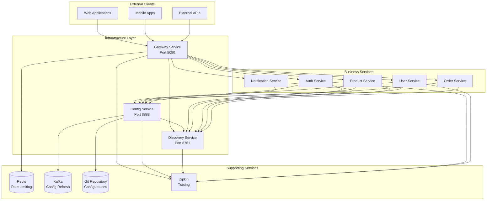
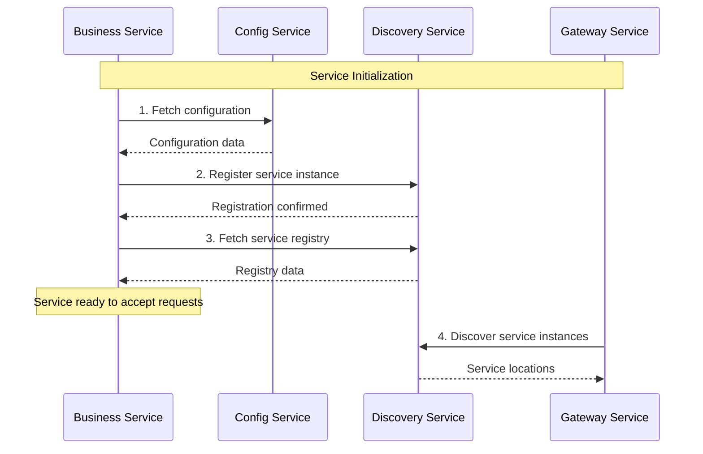
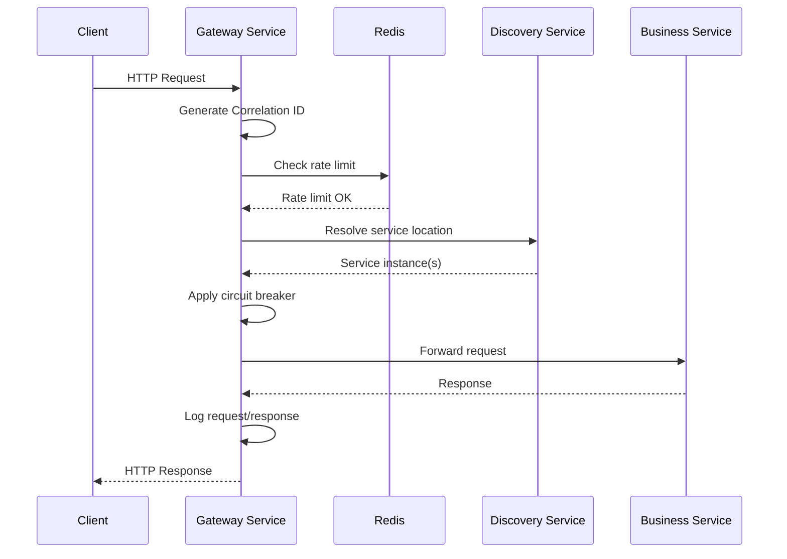
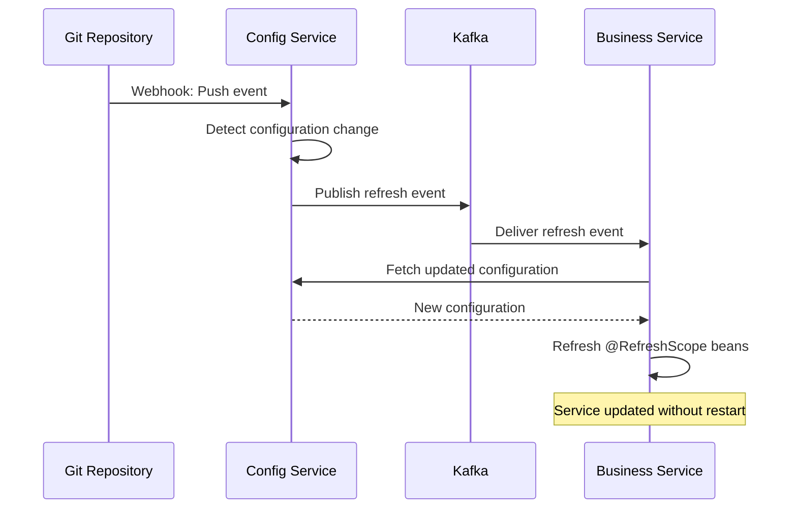
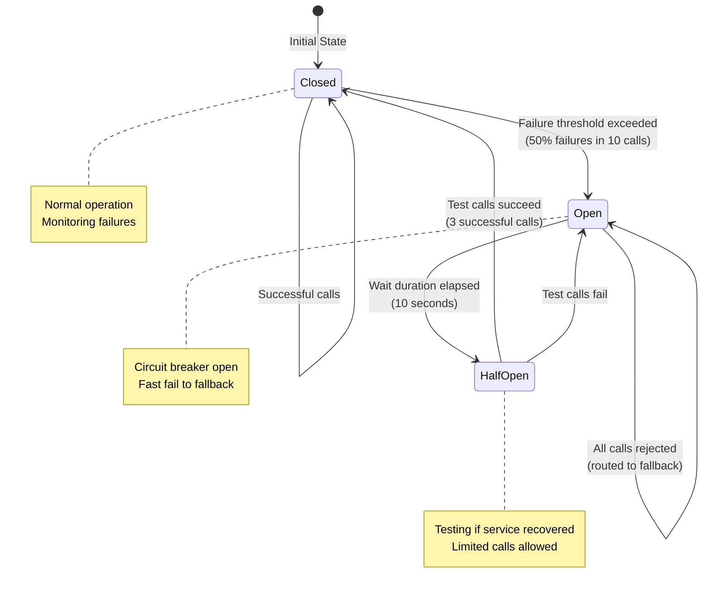
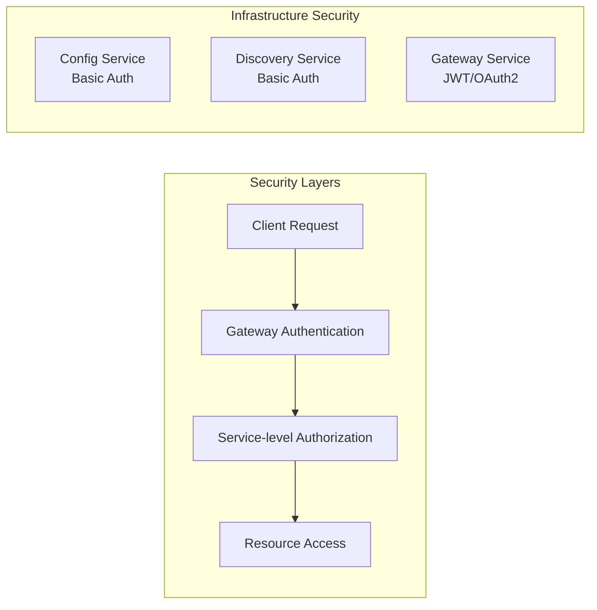
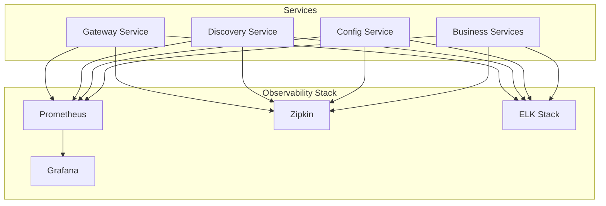

# Infrastructure Services Architecture

## Overview

The platform infrastructure services provide the foundational capabilities for the microservices ecosystem. These services handle configuration management, service discovery, and API gateway functionality, enabling seamless communication and management of business services.

## Architecture Diagram



## Component Overview

### 1. Gateway Service

**Purpose**: Single entry point for all client requests, providing routing, security, and resilience.

**Key Responsibilities**:
- Request routing to backend services
- Rate limiting (1000 req/min per IP)
- Circuit breaking for fault tolerance
- CORS handling for web clients
- Correlation ID generation and propagation
- Request/response logging
- Load balancing across service instances

**Technology Stack**:
- Spring Cloud Gateway (reactive)
- Resilience4j (circuit breaker)
- Redis (rate limiting)
- Netflix Eureka Client (service discovery)

**Port**: 8080

### 2. Discovery Service

**Purpose**: Service registry for dynamic service discovery and health monitoring.

**Key Responsibilities**:
- Service registration and de-registration
- Health check monitoring
- Service instance metadata management
- Self-preservation mode for network resilience
- Peer replication for high availability
- Dashboard for registry visualization

**Technology Stack**:
- Netflix Eureka Server
- Spring Security (dashboard authentication)
- Spring Boot Actuator (metrics)

**Port**: 8761

### 3. Config Service

**Purpose**: Centralized configuration management with encryption and dynamic refresh.

**Key Responsibilities**:
- Configuration storage and retrieval
- Git backend integration
- Symmetric and asymmetric encryption
- Configuration refresh via Spring Cloud Bus
- Git webhook support for automatic updates
- Audit logging for compliance

**Technology Stack**:
- Spring Cloud Config Server
- Spring Cloud Bus (Kafka)
- Spring Cloud Config Monitor
- Spring Security (endpoint protection)

**Port**: 8888

## Data Flow Diagrams

### Service Startup Flow



### Request Routing Flow



### Configuration Refresh Flow



### Circuit Breaker Flow



## Component Interactions

### Service Discovery Integration

All services interact with Discovery Service:

1. **Registration**: Services register on startup with metadata (host, port, health URL)
2. **Heartbeat**: Services send heartbeats every 30 seconds
3. **Discovery**: Services fetch registry to discover other services
4. **Health Monitoring**: Eureka monitors health and evicts unhealthy instances

### Configuration Management Integration

All services fetch configuration from Config Service:

1. **Bootstrap Phase**: Services fetch config before application context initialization
2. **Profile-based**: Different configs for dev, staging, prod environments
3. **Encryption**: Sensitive values encrypted with `{cipher}` prefix
4. **Refresh**: Services can refresh configuration without restart via Spring Cloud Bus

### Gateway Routing Integration

Gateway routes requests to business services:

1. **Service Discovery**: Gateway discovers service instances from Eureka
2. **Load Balancing**: Distributes requests across multiple instances
3. **Circuit Breaking**: Protects against cascading failures
4. **Rate Limiting**: Prevents abuse and ensures fair usage

## Security Architecture

### Authentication & Authorization



**Security Measures**:
- **Config Service**: Basic authentication for all endpoints
- **Discovery Service**: Basic authentication for dashboard and registry operations
- **Gateway Service**: JWT/OAuth2 token validation (when integrated with Auth Service)
- **Encryption**: Sensitive configuration values encrypted at rest
- **TLS/SSL**: All inter-service communication over HTTPS in production
- **Network Isolation**: Services communicate over private network

### Audit Logging

All infrastructure services implement audit logging:
- Configuration access (who, when, what)
- Service registration/de-registration
- Authentication attempts
- Administrative operations
- Correlation IDs for request tracing

## Observability Architecture

### Metrics Collection



**Observability Features**:
- **Metrics**: Prometheus-compatible metrics at `/actuator/prometheus`
- **Tracing**: Distributed tracing with Zipkin/Jaeger
- **Logging**: Structured JSON logging with correlation IDs
- **Health Checks**: Liveness and readiness probes
- **Dashboards**: Grafana dashboards for visualization

### Key Metrics

**Gateway Service**:
- Request rate per route
- Response time percentiles (p50, p95, p99)
- Error rate per route
- Circuit breaker state
- Rate limit violations

**Discovery Service**:
- Registered instances count
- Registered applications count
- Heartbeat success/failure rate
- Self-preservation mode status

**Config Service**:
- Configuration request rate
- Encryption/decryption operations
- Refresh event count
- Git sync status

## Resilience Patterns

### 1. Circuit Breaker

Prevents cascading failures by failing fast when a service is unavailable.

**Configuration**:
- Sliding window: 10 calls
- Failure threshold: 50%
- Wait duration: 10 seconds
- Half-open calls: 3

### 2. Retry with Exponential Backoff

Automatically retries failed requests with increasing delays.

**Configuration**:
- Max attempts: 3
- Initial delay: 100ms
- Multiplier: 2 (100ms, 200ms, 400ms)

### 3. Timeout

Prevents hanging requests by enforcing timeouts.

**Configuration**:
- Connect timeout: 5 seconds
- Response timeout: 30 seconds

### 4. Rate Limiting

Protects services from abuse and ensures fair resource usage.

**Configuration**:
- Rate: 1000 requests/minute per IP
- Burst capacity: 2000 requests

### 5. Fallback

Provides graceful degradation when services are unavailable.

**Implementation**:
- Fallback endpoints return informative error messages
- HTTP 503 status with Retry-After header
- Cached data when available

## Deployment Architecture

### Development Environment

```
┌─────────────────────────────────────┐
│         Docker Compose              │
│  ┌──────────┐  ┌──────────┐        │
│  │ Gateway  │  │Discovery │        │
│  └──────────┘  └──────────┘        │
│  ┌──────────┐  ┌──────────┐        │
│  │  Config  │  │  Redis   │        │
│  └──────────┘  └──────────┘        │
│  ┌──────────┐  ┌──────────┐        │
│  │  Kafka   │  │  Zipkin  │        │
│  └──────────┘  └──────────┘        │
└─────────────────────────────────────┘
```

### Production Environment (Kubernetes)

```
┌─────────────────────────────────────────────────┐
│              Kubernetes Cluster                 │
│                                                 │
│  ┌─────────────────────────────────────────┐  │
│  │         Ingress Controller              │  │
│  └─────────────────────────────────────────┘  │
│                      │                         │
│  ┌──────────────────┴──────────────────────┐  │
│  │         Gateway Service (3 pods)        │  │
│  └─────────────────────────────────────────┘  │
│           │                    │               │
│  ┌────────┴────────┐  ┌───────┴────────┐     │
│  │ Discovery (3)   │  │  Config (2)    │     │
│  └─────────────────┘  └────────────────┘     │
│                                                │
│  ┌─────────────────────────────────────────┐  │
│  │      Business Services (N pods)         │  │
│  └─────────────────────────────────────────┘  │
│                                                │
│  External Services:                            │
│  - Redis Cluster (ElastiCache)                │
│  - Kafka Cluster (MSK)                        │
│  - Git Repository (GitHub/GitLab)             │
└─────────────────────────────────────────────────┘
```

## High Availability

### Discovery Service HA

Run 3+ Eureka instances with peer awareness:

```yaml
# Instance 1
eureka:
  client:
    service-url:
      defaultZone: http://eureka2:8761/eureka/,http://eureka3:8761/eureka/

# Instance 2
eureka:
  client:
    service-url:
      defaultZone: http://eureka1:8761/eureka/,http://eureka3:8761/eureka/

# Instance 3
eureka:
  client:
    service-url:
      defaultZone: http://eureka1:8761/eureka/,http://eureka2:8761/eureka/
```

### Config Service HA

Run multiple Config Service instances behind a load balancer. All instances share the same Git repository.

### Gateway Service HA

Run multiple Gateway instances behind a load balancer. Redis should be clustered for rate limiting.

## Scaling Considerations

### Horizontal Scaling

**Gateway Service**:
- Stateless, can scale horizontally
- Redis handles rate limiting state
- Recommended: 2-5 instances based on traffic

**Discovery Service**:
- Recommended: 3 instances for HA
- More instances increase replication overhead
- 3-5 instances sufficient for most deployments

**Config Service**:
- Stateless, can scale horizontally
- Git repository is shared
- Recommended: 2-3 instances

### Vertical Scaling

**Resource Requirements**:
- Gateway: 1GB RAM, 1 CPU (high traffic)
- Discovery: 512MB RAM, 0.5 CPU
- Config: 512MB RAM, 0.5 CPU

## Network Architecture

### Port Allocation

| Service | Port | Protocol | Purpose |
|---------|------|----------|---------|
| Gateway | 8080 | HTTP | API Gateway |
| Discovery | 8761 | HTTP | Service Registry |
| Config | 8888 | HTTP | Configuration Server |
| Redis | 6379 | TCP | Rate Limiting |
| Kafka | 9092 | TCP | Message Bus |
| Zipkin | 9411 | HTTP | Distributed Tracing |

### Network Segmentation

```
┌─────────────────────────────────────┐
│         Public Network              │
│  (Internet-facing)                  │
│  - Gateway Service only             │
└─────────────────────────────────────┘
              │
┌─────────────────────────────────────┐
│      Application Network            │
│  (Private)                          │
│  - Business Services                │
│  - Gateway (internal interface)     │
└─────────────────────────────────────┘
              │
┌─────────────────────────────────────┐
│    Infrastructure Network           │
│  (Private)                          │
│  - Discovery Service                │
│  - Config Service                   │
│  - Redis, Kafka                     │
└─────────────────────────────────────┘
```

## Performance Considerations

### Caching Strategy

**Config Service**:
- Git repository cached in memory
- Configuration responses cached with TTL
- Reduces Git fetch overhead

**Discovery Service**:
- Registry cached with 30-second refresh
- Response cache updated every 30 seconds
- Balances freshness and performance

**Gateway Service**:
- Route definitions cached
- Service instance list cached
- Redis for rate limit state

### Connection Pooling

- HTTP client connection pools configured
- Redis connection pooling enabled
- Kafka producer/consumer pools optimized

## Disaster Recovery

### Backup Strategy

**Config Service**:
- Git repository is source of truth
- Regular Git backups to secondary location
- Configuration history preserved in Git

**Discovery Service**:
- Registry is ephemeral (no backup needed)
- Services re-register on startup
- Self-healing through service registration

**Gateway Service**:
- Stateless (no backup needed)
- Configuration in Config Service

### Recovery Procedures

1. **Config Service Failure**: Services use cached configuration until recovery
2. **Discovery Service Failure**: Services use cached registry for short period
3. **Gateway Service Failure**: Load balancer routes to healthy instances
4. **Redis Failure**: Rate limiting disabled, gateway continues routing
5. **Kafka Failure**: Configuration refresh disabled, manual refresh required

## Future Enhancements

1. **Service Mesh Integration**: Migrate to Istio/Linkerd for advanced traffic management
2. **API Management**: Add API versioning, documentation, and developer portal
3. **Advanced Security**: Implement OAuth2/OIDC, mTLS, API key management
4. **Multi-Region**: Deploy across multiple regions for global availability
5. **GraphQL Gateway**: Add GraphQL support alongside REST
6. **WebSocket Support**: Enable real-time communication through gateway

## References

- [Spring Cloud Gateway](https://docs.spring.io/spring-cloud-gateway/docs/current/reference/html/)
- [Netflix Eureka](https://github.com/Netflix/eureka/wiki)
- [Spring Cloud Config](https://docs.spring.io/spring-cloud-config/docs/current/reference/html/)
- [Resilience4j](https://resilience4j.readme.io/)
- [Microservices Patterns](https://microservices.io/patterns/index.html)
