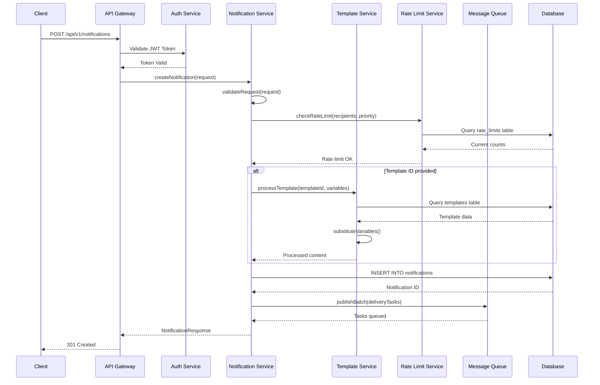
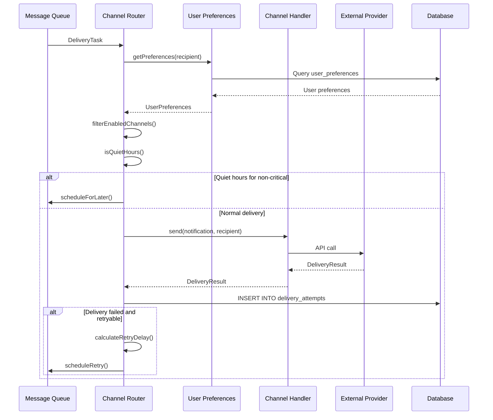

# Notification Service - Low-Level Design (LLD)

## Overview

This document provides detailed implementation specifications for the enterprise-grade Notification Service, including class structures, method signatures, algorithms, Kafka event processing, and detailed sequence diagrams. The system supports email, SMS, and WhatsApp channels with comprehensive audit logging, compliance features, and enterprise scalability.

## Detailed Class Design

### Core Service Classes

#### Notification Controller Layer

```typescript
@RestController
@RequestMapping("/api/v1/notifications")
@Validated
public class NotificationController {
  private final NotificationService notificationService;
  private final RateLimitService rateLimitService;
  private final AuditService auditService;
  private final MetricsService metricsService;

  @PostMapping
  @PreAuthorize("hasRole('NOTIFICATION_SEND')")
  public ResponseEntity<NotificationResponse> createNotification(
    @Valid @RequestBody CreateNotificationRequest request,
    @RequestHeader("X-Client-ID") String clientId,
    HttpServletRequest httpRequest
  ) {
    // Rate limiting check
    rateLimitService.checkRateLimit(clientId, request.getRecipients().size());
    
    // Audit logging
    auditService.logApiRequest("CREATE_NOTIFICATION", clientId, 
      httpRequest.getRemoteAddr(), request);
    
    // Metrics collection
    Timer.Sample sample = Timer.start(metricsService.getRegistry());
    
    try {
      NotificationResponse response = notificationService.createNotification(request);
      
      // Success metrics
      metricsService.incrementCounter("notifications.created.success", 
        "channel", String.join(",", request.getChannels()));
      
      return ResponseEntity.ok(response);
    } catch (ValidationException e) {
      metricsService.incrementCounter("notifications.created.validation_error");
      throw new BadRequestException(e.getMessage());
    } catch (RateLimitExceededException e) {
      metricsService.incrementCounter("notifications.created.rate_limited");
      throw new TooManyRequestsException("Rate limit exceeded");
    } finally {
      sample.stop(Timer.builder("notifications.api.duration")
        .tag("endpoint", "create")
        .register(metricsService.getRegistry()));
    }
  }

  @PostMapping("/bulk")
  @PreAuthorize("hasRole('NOTIFICATION_BULK_SEND')")
  public ResponseEntity<BulkNotificationResponse> createBulkNotifications(
    @Valid @RequestBody BulkNotificationRequest request,
    @RequestHeader("X-Client-ID") String clientId
  ) {
    // Validate bulk request size
    if (request.getNotifications().size() > 10000) {
      throw new BadRequestException("Bulk request cannot exceed 10,000 notifications");
    }
    
    BulkNotificationResponse response = notificationService.createBulkNotifications(request);
    
    metricsService.incrementCounter("notifications.bulk.created", 
      "count", String.valueOf(request.getNotifications().size()));
    
    return ResponseEntity.ok(response);
  }

  @GetMapping("/{id}")
  public ResponseEntity<NotificationStatusResponse> getNotificationStatus(
    @PathVariable String id,
    @RequestHeader("X-Client-ID") String clientId
  ) {
    NotificationStatusResponse status = notificationService.getNotificationStatus(id);
    
    // Check if client has access to this notification
    if (!notificationService.hasAccess(clientId, id)) {
      throw new ForbiddenException("Access denied to notification");
    }
    
    return ResponseEntity.ok(status);
  }

  @PutMapping("/{id}/cancel")
  @PreAuthorize("hasRole('NOTIFICATION_CANCEL')")
  public ResponseEntity<Void> cancelNotification(
    @PathVariable String id,
    @RequestHeader("X-Client-ID") String clientId
  ) {
    notificationService.cancelNotification(id, clientId);
    
    auditService.logAction("CANCEL_NOTIFICATION", clientId, id);
    metricsService.incrementCounter("notifications.cancelled");
    
    return ResponseEntity.noContent().build();
  }
}
```

### Core Service Classes

```java
@Service
@Transactional
public class NotificationService {
  private final TemplateService templateService;
  private final PreferenceService preferenceService;
  private final RateLimitService rateLimitService;
  private final KafkaProducer kafkaProducer;
  private final NotificationRepository notificationRepository;
  private final AuditService auditService;
  private final MetricsService metricsService;
  private final RedisTemplate<String, Object> redisTemplate;

  public NotificationResponse createNotification(CreateNotificationRequest request) {
    // 1. Validate request
    validateRequest(request);
    
    // 2. Check rate limits for all recipients
    rateLimitService.checkRateLimit(request.getSenderId(), request.getRecipients());
    
    // 3. Process template if provided
    NotificationContent content = request.getTemplateId() != null 
      ? templateService.processTemplate(request.getTemplateId(), request.getParameters())
      : request.getContent();
    
    // 4. Filter recipients based on preferences
    List<String> eligibleRecipients = filterEligibleRecipients(
      request.getRecipients(), request.getChannels());
    
    if (eligibleRecipients.isEmpty()) {
      throw new BusinessException("No eligible recipients after preference filtering");
    }
    
    // 5. Create notification record with audit trail
    Notification notification = Notification.builder()
      .id(UUID.randomUUID().toString())
      .senderId(request.getSenderId())
      .recipients(eligibleRecipients)
      .templateId(request.getTemplateId())
      .parameters(request.getParameters())
      .content(content)
      .channels(request.getChannels())
      .priority(request.getPriority())
      .scheduledAt(request.getScheduledAt())
      .status(NotificationStatus.PENDING)
      .createdAt(Instant.now())
      .metadata(request.getMetadata())
      .build();
    
    notification = notificationRepository.save(notification);
    
    // 6. Audit logging
    auditService.logNotificationCreated(notification, request.getSenderId());
    
    // 7. Queue for delivery via Kafka
    queueForDelivery(notification);
    
    // 8. Cache notification for quick status lookups
    cacheNotification(notification);
    
    // 9. Update metrics
    metricsService.incrementCounter("notifications.created", 
      Map.of("priority", notification.getPriority().toString(),
             "channels", String.join(",", notification.getChannels())));
    
    return NotificationResponse.builder()
      .id(notification.getId())
      .status(notification.getStatus())
      .estimatedDelivery(calculateEstimatedDelivery(notification))
      .eligibleRecipients(eligibleRecipients.size())
      .build();
  }

  public BulkNotificationResponse createBulkNotifications(BulkNotificationRequest request) {
    List<NotificationResponse> results = new ArrayList<>();
    List<CompletableFuture<NotificationResponse>> futures = new ArrayList<>();
    
    // Process in parallel batches for better performance
    int batchSize = 100;
    for (int i = 0; i < request.getNotifications().size(); i += batchSize) {
      List<CreateNotificationRequest> batch = request.getNotifications()
        .subList(i, Math.min(i + batchSize, request.getNotifications().size()));
      
      CompletableFuture<NotificationResponse> future = CompletableFuture
        .supplyAsync(() -> processBatch(batch))
        .exceptionally(throwable -> {
          log.error("Batch processing failed", throwable);
          return NotificationResponse.builder()
            .error(throwable.getMessage())
            .build();
        });
      
      futures.add(future);
    }
    
    // Wait for all batches to complete
    CompletableFuture.allOf(futures.toArray(new CompletableFuture[0])).join();
    
    futures.forEach(future -> {
      try {
        results.add(future.get());
      } catch (Exception e) {
        log.error("Failed to get batch result", e);
      }
    });
    
    return BulkNotificationResponse.builder()
      .results(results)
      .totalProcessed(results.size())
      .successCount(results.stream().mapToInt(r -> r.getError() == null ? 1 : 0).sum())
      .build();
  }

  private void queueForDelivery(Notification notification) {
    // Create Kafka events for each channel
    notification.getChannels().forEach(channel -> {
      NotificationEvent event = NotificationEvent.builder()
        .notificationId(notification.getId())
        .channel(channel)
        .recipients(notification.getRecipients())
        .content(notification.getContent())
        .priority(notification.getPriority())
        .scheduledAt(notification.getScheduledAt())
        .metadata(notification.getMetadata())
        .createdAt(Instant.now())
        .build();
      
      String topic = "notification." + channel.toLowerCase();
      String key = notification.getId() + ":" + channel;
      
      kafkaProducer.send(new ProducerRecord<>(topic, key, event))
        .addCallback(
          result -> log.debug("Notification queued successfully: {}", notification.getId()),
          failure -> {
            log.error("Failed to queue notification: {}", notification.getId(), failure);
            // Update notification status to failed
            updateNotificationStatus(notification.getId(), NotificationStatus.FAILED, 
              "Failed to queue: " + failure.getMessage());
          }
        );
    });
  }

  private List<String> filterEligibleRecipients(List<String> recipients, List<String> channels) {
    return recipients.stream()
      .filter(recipient -> {
        try {
          return preferenceService.isEligibleForChannels(recipient, channels);
        } catch (Exception e) {
          log.warn("Failed to check preferences for recipient: {}", recipient, e);
          return false; // Fail safe - don't send if we can't verify preferences
        }
      })
      .collect(Collectors.toList());
  }

  private void validateRequest(CreateNotificationRequest request) {
    if (request.getRecipients() == null || request.getRecipients().isEmpty()) {
      throw new ValidationException("Recipients are required");
    }
    
    if (request.getRecipients().size() > 10000) {
      throw new ValidationException("Maximum 10,000 recipients per request");
    }
    
    if (request.getContent() == null && request.getTemplateId() == null) {
      throw new ValidationException("Either content or templateId is required");
    }
    
    if (request.getChannels() == null || request.getChannels().isEmpty()) {
      throw new ValidationException("At least one channel is required");
    }
    
    // Validate channel types
    List<String> validChannels = Arrays.asList("email", "sms", "whatsapp");
    request.getChannels().forEach(channel -> {
      if (!validChannels.contains(channel.toLowerCase())) {
        throw new ValidationException("Invalid channel: " + channel);
      }
    });
    
    // Validate scheduled time
    if (request.getScheduledAt() != null && request.getScheduledAt().isBefore(Instant.now())) {
      throw new ValidationException("Scheduled time cannot be in the past");
    }
  }

  private void cacheNotification(Notification notification) {
    String cacheKey = "notification:" + notification.getId();
    redisTemplate.opsForValue().set(cacheKey, notification, Duration.ofHours(24));
  }

  private Instant calculateEstimatedDelivery(Notification notification) {
    Instant baseTime = notification.getScheduledAt() != null 
      ? notification.getScheduledAt() 
      : Instant.now();
    
    // Add processing time based on priority
    Duration processingTime = switch (notification.getPriority()) {
      case CRITICAL -> Duration.ofSeconds(30);
      case HIGH -> Duration.ofMinutes(2);
      case NORMAL -> Duration.ofMinutes(5);
      case LOW -> Duration.ofMinutes(15);
    };
    
    return baseTime.plus(processingTime);
  }
}

// Kafka Event Processing
@Component
public class NotificationEventProcessor {
  private final Map<String, ChannelWorker> channelWorkers;
  private final NotificationRepository notificationRepository;
  private final AuditService auditService;
  private final MetricsService metricsService;

  @KafkaListener(topics = "notification.email", groupId = "notification-email-workers")
  public void processEmailNotification(
    @Payload NotificationEvent event,
    @Header(KafkaHeaders.RECEIVED_TOPIC) String topic,
    @Header(KafkaHeaders.RECEIVED_PARTITION_ID) int partition,
    @Header(KafkaHeaders.OFFSET) long offset
  ) {
    processNotificationEvent(event, "email", topic, partition, offset);
  }

  @KafkaListener(topics = "notification.sms", groupId = "notification-sms-workers")
  public void processSmsNotification(
    @Payload NotificationEvent event,
    @Header(KafkaHeaders.RECEIVED_TOPIC) String topic,
    @Header(KafkaHeaders.RECEIVED_PARTITION_ID) int partition,
    @Header(KafkaHeaders.OFFSET) long offset
  ) {
    processNotificationEvent(event, "sms", topic, partition, offset);
  }

  @KafkaListener(topics = "notification.whatsapp", groupId = "notification-whatsapp-workers")
  public void processWhatsAppNotification(
    @Payload NotificationEvent event,
    @Header(KafkaHeaders.RECEIVED_TOPIC) String topic,
    @Header(KafkaHeaders.RECEIVED_PARTITION_ID) int partition,
    @Header(KafkaHeaders.OFFSET) long offset
  ) {
    processNotificationEvent(event, "whatsapp", topic, partition, offset);
  }

  private void processNotificationEvent(NotificationEvent event, String channel, 
                                      String topic, int partition, long offset) {
    Timer.Sample sample = Timer.start(metricsService.getRegistry());
    String correlationId = UUID.randomUUID().toString();
    
    try {
      log.info("Processing notification event: {} for channel: {} [{}:{}:{}]", 
        event.getNotificationId(), channel, topic, partition, offset);
      
      // Get channel worker
      ChannelWorker worker = channelWorkers.get(channel);
      if (worker == null) {
        throw new IllegalStateException("No worker found for channel: " + channel);
      }
      
      // Check if notification is still valid
      if (!isNotificationValid(event)) {
        log.warn("Skipping invalid/cancelled notification: {}", event.getNotificationId());
        return;
      }
      
      // Process each recipient
      List<CompletableFuture<DeliveryResult>> deliveryFutures = event.getRecipients()
        .stream()
        .map(recipient -> processRecipientAsync(worker, event, recipient, correlationId))
        .collect(Collectors.toList());
      
      // Wait for all deliveries to complete
      CompletableFuture.allOf(deliveryFutures.toArray(new CompletableFuture[0]))
        .thenRun(() -> {
          log.info("Completed processing notification: {} for channel: {}", 
            event.getNotificationId(), channel);
          
          // Update overall notification status
          updateNotificationStatus(event.getNotificationId(), channel, deliveryFutures);
        })
        .exceptionally(throwable -> {
          log.error("Failed to process notification: {} for channel: {}", 
            event.getNotificationId(), channel, throwable);
          return null;
        });
      
      metricsService.incrementCounter("notifications.processed", 
        Map.of("channel", channel, "status", "success"));
      
    } catch (Exception e) {
      log.error("Error processing notification event: {} for channel: {}", 
        event.getNotificationId(), channel, e);
      
      metricsService.incrementCounter("notifications.processed", 
        Map.of("channel", channel, "status", "error"));
      
      // Send to retry queue or DLQ based on error type
      handleProcessingError(event, channel, e);
      
    } finally {
      sample.stop(Timer.builder("notification.processing.duration")
        .tag("channel", channel)
        .register(metricsService.getRegistry()));
    }
  }

  private CompletableFuture<DeliveryResult> processRecipientAsync(
    ChannelWorker worker, NotificationEvent event, String recipient, String correlationId
  ) {
    return CompletableFuture.supplyAsync(() -> {
      try {
        // Create delivery log entry
        DeliveryLog deliveryLog = createDeliveryLog(event, recipient, event.getChannel());
        
        // Attempt delivery
        DeliveryResult result = worker.deliver(event, recipient);
        
        // Update delivery log
        updateDeliveryLog(deliveryLog, result);
        
        // Audit logging
        auditService.logDeliveryAttempt(event.getNotificationId(), recipient, 
          event.getChannel(), result, correlationId);
        
        return result;
        
      } catch (Exception e) {
        log.error("Failed to deliver to recipient: {} for notification: {}", 
          recipient, event.getNotificationId(), e);
        
        DeliveryResult errorResult = DeliveryResult.builder()
          .success(false)
          .error(e.getMessage())
          .retryable(isRetryableError(e))
          .build();
        
        return errorResult;
      }
    });
  }
}

// Channel Router
class ChannelRouter {
  private channelHandlers: Map<Channel, ChannelHandler>;
  private userPreferencesService: UserPreferencesService;
  private deliveryRepository: DeliveryAttemptRepository;

  constructor() {
    this.channelHandlers = new Map([
      ['push', new PushNotificationHandler()],
      ['email', new EmailHandler()],
      ['sms', new SmsHandler()],
      ['in_app', new InAppHandler()]
    ]);
  }

  async processDeliveryTask(task: DeliveryTask): Promise<void> {
    const userPreferences = await this.userPreferencesService.getPreferences(task.recipient);
    const enabledChannels = this.filterEnabledChannels(task.channels, userPreferences);
    
    if (enabledChannels.length === 0) {
      await this.recordDeliveryAttempt(task, null, 'failed', 'No enabled channels');
      return;
    }

    // Process channels in parallel
    const deliveryPromises = enabledChannels.map(channel => 
      this.deliverToChannel(task, channel, userPreferences)
    );

    await Promise.allSettled(deliveryPromises);
  }

  private async deliverToChannel(
    task: DeliveryTask, 
    channel: Channel, 
    preferences: UserPreferences
  ): Promise<void> {
    const handler = this.channelHandlers.get(channel);
    if (!handler) {
      throw new Error(`No handler found for channel: ${channel}`);
    }

    // Check quiet hours
    if (this.isQuietHours(preferences, task.priority)) {
      await this.scheduleForLater(task, channel);
      return;
    }

    try {
      const notification = await this.getNotification(task.notificationId);
      const result = await handler.send(notification, task.recipient);
      
      await this.recordDeliveryAttempt(
        task, 
        channel, 
        result.success ? 'sent' : 'failed',
        result.error,
        result.deliveryId
      );

      if (!result.success && result.retryable) {
        await this.scheduleRetry(task, channel, 1);
      }
    } catch (error) {
      await this.recordDeliveryAttempt(task, channel, 'failed', error.message);
      await this.scheduleRetry(task, channel, 1);
    }
  }

  private filterEnabledChannels(
    requestedChannels: Channel[], 
    preferences: UserPreferences
  ): Channel[] {
    return requestedChannels.filter(channel => {
      const channelPref = preferences.channels[channel];
      return channelPref?.enabled !== false;
    });
  }

  private isQuietHours(preferences: UserPreferences, priority: Priority): boolean {
    if (priority === 'critical') return false;
    if (!preferences.quietHours) return false;
    
    const now = new Date();
    const currentTime = now.toTimeString().slice(0, 5); // HH:MM format
    
    return currentTime >= preferences.quietHours.start && 
           currentTime <= preferences.quietHours.end;
  }

  private async scheduleRetry(task: DeliveryTask, channel: Channel, attemptNumber: number): Promise<void> {
    const retryPolicy = this.getRetryPolicy(channel);
    
    if (attemptNumber >= retryPolicy.maxAttempts) {
      await this.recordDeliveryAttempt(task, channel, 'failed', 'Max retry attempts exceeded');
      return;
    }

    const delay = this.calculateRetryDelay(retryPolicy, attemptNumber);
    const retryTask = {
      ...task,
      channels: [channel],
      attemptNumber,
      scheduledAt: new Date(Date.now() + delay)
    };

    await this.messageQueue.publish('notification.retry', retryTask, { delay });
  }

  private calculateRetryDelay(policy: RetryPolicy, attemptNumber: number): number {
    switch (policy.backoffStrategy) {
      case 'exponential':
        return Math.min(policy.baseDelay * Math.pow(2, attemptNumber - 1), policy.maxDelay);
      case 'linear':
        return Math.min(policy.baseDelay * attemptNumber, policy.maxDelay);
      case 'fixed':
        return policy.baseDelay;
      default:
        return policy.baseDelay;
    }
  }
}

// Template Service
class TemplateService {
  private templateRepository: TemplateRepository;
  private templateCache: Map<string, Template>;

  async processTemplate(templateId: string, variables: Record<string, any>): Promise<NotificationContent> {
    const template = await this.getTemplate(templateId);
    
    if (!template.active) {
      throw new Error(`Template ${templateId} is not active`);
    }

    this.validateRequiredVariables(template, variables);
    
    return {
      title: this.substituteVariables(template.channels.push?.title || '', variables),
      body: this.substituteVariables(template.channels.push?.body || '', variables),
      data: template.channels.push?.data || {}
    };
  }

  private substituteVariables(template: string, variables: Record<string, any>): string {
    return template.replace(/\{\{(\w+)\}\}/g, (match, variableName) => {
      const value = variables[variableName];
      if (value === undefined) {
        throw new Error(`Missing required variable: ${variableName}`);
      }
      return String(value);
    });
  }

  private validateRequiredVariables(template: Template, variables: Record<string, any>): void {
    const requiredVars = template.variables.filter(v => v.required);
    const missingVars = requiredVars.filter(v => !(v.name in variables));
    
    if (missingVars.length > 0) {
      throw new ValidationError(`Missing required variables: ${missingVars.map(v => v.name).join(', ')}`);
    }
  }

  async createTemplate(templateData: CreateTemplateRequest): Promise<Template> {
    const template: Template = {
      id: generateUUID(),
      name: templateData.name,
      description: templateData.description,
      channels: templateData.channels,
      variables: templateData.variables,
      version: 1,
      active: true,
      createdAt: new Date()
    };

    return await this.templateRepository.create(template);
  }
}

// Rate Limiting Service
class RateLimitService {
  private redis: RedisClient;
  private defaultLimits: RateLimitConfig;

  constructor() {
    this.defaultLimits = {
      normal: { limit: 10, windowMs: 3600000 }, // 10 per hour
      high: { limit: 50, windowMs: 3600000 },   // 50 per hour
      critical: { limit: -1, windowMs: 0 }      // No limit
    };
  }

  async checkRateLimit(recipients: string[], priority: Priority = 'normal'): Promise<void> {
    if (priority === 'critical') return; // No rate limiting for critical

    const config = this.defaultLimits[priority];
    const windowStart = Math.floor(Date.now() / config.windowMs) * config.windowMs;
    
    const pipeline = this.redis.pipeline();
    
    for (const recipient of recipients) {
      const key = `rate_limit:${recipient}:${windowStart}`;
      pipeline.incr(key);
      pipeline.expire(key, Math.ceil(config.windowMs / 1000));
    }
    
    const results = await pipeline.exec();
    
    for (let i = 0; i < recipients.length; i++) {
      const count = results[i * 2][1] as number;
      if (count > config.limit) {
        throw new RateLimitExceededError(`Rate limit exceeded for user ${recipients[i]}`);
      }
    }
  }

  async getRemainingQuota(userId: string, priority: Priority = 'normal'): Promise<number> {
    if (priority === 'critical') return -1;

    const config = this.defaultLimits[priority];
    const windowStart = Math.floor(Date.now() / config.windowMs) * config.windowMs;
    const key = `rate_limit:${userId}:${windowStart}`;
    
    const current = await this.redis.get(key) || 0;
    return Math.max(0, config.limit - Number(current));
  }
}
```

## Channel Worker Implementations

### Email Channel Worker

```java
@Component("email")
public class EmailChannelWorker implements ChannelWorker {
  private final EmailProviderFactory emailProviderFactory;
  private final TemplateService templateService;
  private final CircuitBreakerRegistry circuitBreakerRegistry;
  private final RetryTemplate retryTemplate;
  private final MetricsService metricsService;

  @Override
  public DeliveryResult deliver(NotificationEvent event, String recipient) {
    Timer.Sample sample = Timer.start(metricsService.getRegistry());
    
    try {
      // Get recipient email address
      RecipientInfo recipientInfo = getRecipientInfo(recipient);
      if (!isValidEmail(recipientInfo.getEmail())) {
        return DeliveryResult.builder()
          .success(false)
          .error("Invalid email address")
          .retryable(false)
          .build();
      }
      
      // Build email content
      EmailContent emailContent = buildEmailContent(event, recipientInfo);
      
      // Get email provider with circuit breaker
      EmailProvider provider = emailProviderFactory.getPrimaryProvider();
      CircuitBreaker circuitBreaker = circuitBreakerRegistry.circuitBreaker("email-provider");
      
      // Send email with retry logic
      EmailDeliveryResult result = circuitBreaker.executeSupplier(() -> 
        retryTemplate.execute(context -> {
          log.debug("Sending email to: {} (attempt: {})", 
            recipientInfo.getEmail(), context.getRetryCount() + 1);
          
          return provider.sendEmail(EmailRequest.builder()
            .to(recipientInfo.getEmail())
            .subject(emailContent.getSubject())
            .htmlBody(emailContent.getHtmlBody())
            .textBody(emailContent.getTextBody())
            .headers(buildEmailHeaders(event))
            .metadata(Map.of(
              "notificationId", event.getNotificationId(),
              "recipient", recipient,
              "correlationId", MDC.get("correlationId")
            ))
            .build());
        })
      );
      
      metricsService.incrementCounter("email.sent.success", 
        Map.of("provider", provider.getName()));
      
      return DeliveryResult.builder()
        .success(true)
        .deliveryId(result.getMessageId())
        .providerResponse(result.getProviderResponse())
        .deliveredAt(Instant.now())
        .build();
      
    } catch (CircuitBreakerOpenException e) {
      log.warn("Circuit breaker open for email provider");
      
      // Try fallback provider
      return tryFallbackProvider(event, recipient);
      
    } catch (Exception e) {
      log.error("Failed to send email for notification: {}", event.getNotificationId(), e);
      
      metricsService.incrementCounter("email.sent.error", 
        Map.of("error", e.getClass().getSimpleName()));
      
      return DeliveryResult.builder()
        .success(false)
        .error(e.getMessage())
        .retryable(isRetryableError(e))
        .build();
        
    } finally {
      sample.stop(Timer.builder("email.delivery.duration")
        .register(metricsService.getRegistry()));
    }
  }

  private EmailContent buildEmailContent(NotificationEvent event, RecipientInfo recipient) {
    // Use template if available, otherwise use direct content
    if (event.getTemplateId() != null) {
      return templateService.renderEmailTemplate(
        event.getTemplateId(), 
        event.getParameters(), 
        recipient.getLocale()
      );
    }
    
    return EmailContent.builder()
      .subject(event.getContent().getTitle())
      .htmlBody(generateHtmlBody(event.getContent()))
      .textBody(event.getContent().getBody())
      .build();
  }

  private String generateHtmlBody(NotificationContent content) {
    return """
      <!DOCTYPE html>
      <html>
        <head>
          <meta charset="utf-8">
          <meta name="viewport" content="width=device-width, initial-scale=1.0">
          <title>%s</title>
          <style>
            body { font-family: Arial, sans-serif; line-height: 1.6; color: #333; }
            .container { max-width: 600px; margin: 0 auto; padding: 20px; }
            .header { background: #f8f9fa; padding: 20px; border-radius: 5px; }
            .content { padding: 20px 0; }
            .footer { font-size: 12px; color: #666; border-top: 1px solid #eee; padding-top: 20px; }
            .button { background: #007bff; color: white; padding: 12px 24px; text-decoration: none; border-radius: 5px; display: inline-block; }
          </style>
        </head>
        <body>
          <div class="container">
            <div class="header">
              <h1>%s</h1>
            </div>
            <div class="content">
              <p>%s</p>
              %s
            </div>
            <div class="footer">
              <p>This is an automated message. Please do not reply to this email.</p>
            </div>
          </div>
        </body>
      </html>
      """.formatted(
        content.getTitle(),
        content.getTitle(),
        content.getBody(),
        content.getActionUrl() != null 
          ? "<p><a href=\"" + content.getActionUrl() + "\" class=\"button\">Take Action</a></p>"
          : ""
      );
  }

  private DeliveryResult tryFallbackProvider(NotificationEvent event, String recipient) {
    try {
      EmailProvider fallbackProvider = emailProviderFactory.getFallbackProvider();
      // Implement fallback logic similar to primary provider
      // ... implementation details
      
      return DeliveryResult.builder()
        .success(true)
        .deliveryId("fallback-" + UUID.randomUUID())
        .build();
        
    } catch (Exception e) {
      return DeliveryResult.builder()
        .success(false)
        .error("All email providers failed: " + e.getMessage())
        .retryable(true)
        .build();
    }
  }
}
```

### SMS Channel Worker

```java
@Component("sms")
public class SmsChannelWorker implements ChannelWorker {
  private final SmsProviderFactory smsProviderFactory;
  private final PhoneNumberValidator phoneNumberValidator;
  private final CircuitBreakerRegistry circuitBreakerRegistry;
  private final RetryTemplate retryTemplate;
  private final MetricsService metricsService;

  @Override
  public DeliveryResult deliver(NotificationEvent event, String recipient) {
    Timer.Sample sample = Timer.start(metricsService.getRegistry());
    
    try {
      // Get and validate phone number
      RecipientInfo recipientInfo = getRecipientInfo(recipient);
      String phoneNumber = recipientInfo.getPhoneNumber();
      
      if (!phoneNumberValidator.isValid(phoneNumber)) {
        return DeliveryResult.builder()
          .success(false)
          .error("Invalid phone number format")
          .retryable(false)
          .build();
      }
      
      // Check opt-in status for SMS
      if (!recipientInfo.isSmsOptedIn()) {
        log.warn("Recipient {} has not opted in for SMS", recipient);
        return DeliveryResult.builder()
          .success(false)
          .error("Recipient not opted in for SMS")
          .retryable(false)
          .build();
      }
      
      // Build SMS content (limit to 160 characters for single SMS)
      String smsContent = buildSmsContent(event, recipientInfo);
      if (smsContent.length() > 1600) { // Allow up to 10 SMS segments
        smsContent = smsContent.substring(0, 1597) + "...";
      }
      
      // Get SMS provider with circuit breaker
      SmsProvider provider = smsProviderFactory.getPrimaryProvider();
      CircuitBreaker circuitBreaker = circuitBreakerRegistry.circuitBreaker("sms-provider");
      
      // Send SMS with retry logic
      SmsDeliveryResult result = circuitBreaker.executeSupplier(() ->
        retryTemplate.execute(context -> {
          log.debug("Sending SMS to: {} (attempt: {})", 
            phoneNumber, context.getRetryCount() + 1);
          
          return provider.sendSms(SmsRequest.builder()
            .to(phoneNumber)
            .message(smsContent)
            .metadata(Map.of(
              "notificationId", event.getNotificationId(),
              "recipient", recipient
            ))
            .build());
        })
      );
      
      metricsService.incrementCounter("sms.sent.success", 
        Map.of("provider", provider.getName(),
               "segments", String.valueOf(calculateSmsSegments(smsContent))));
      
      return DeliveryResult.builder()
        .success(true)
        .deliveryId(result.getMessageId())
        .providerResponse(result.getProviderResponse())
        .deliveredAt(Instant.now())
        .cost(calculateSmsCost(smsContent, recipientInfo.getCountryCode()))
        .build();
        
    } catch (Exception e) {
      log.error("Failed to send SMS for notification: {}", event.getNotificationId(), e);
      
      metricsService.incrementCounter("sms.sent.error", 
        Map.of("error", e.getClass().getSimpleName()));
      
      return DeliveryResult.builder()
        .success(false)
        .error(e.getMessage())
        .retryable(isRetryableError(e))
        .build();
        
    } finally {
      sample.stop(Timer.builder("sms.delivery.duration")
        .register(metricsService.getRegistry()));
    }
  }

  private String buildSmsContent(NotificationEvent event, RecipientInfo recipient) {
    // SMS content should be concise and clear
    StringBuilder content = new StringBuilder();
    
    // Add title if short enough
    if (event.getContent().getTitle().length() <= 50) {
      content.append(event.getContent().getTitle()).append("\n\n");
    }
    
    // Add main message
    content.append(event.getContent().getBody());
    
    // Add action URL if present (use URL shortener)
    if (event.getContent().getActionUrl() != null) {
      String shortUrl = urlShortenerService.shorten(event.getContent().getActionUrl());
      content.append("\n\nAction: ").append(shortUrl);
    }
    
    // Add unsubscribe link for marketing messages
    if (isMarketingMessage(event)) {
      content.append("\n\nReply STOP to opt out");
    }
    
    return content.toString();
  }

  private int calculateSmsSegments(String content) {
    // Standard SMS is 160 characters, Unicode SMS is 70 characters
    boolean isUnicode = !content.matches("^[\\x00-\\x7F]*$");
    int maxLength = isUnicode ? 70 : 160;
    return (int) Math.ceil((double) content.length() / maxLength);
  }

  private BigDecimal calculateSmsCost(String content, String countryCode) {
    int segments = calculateSmsSegments(content);
    BigDecimal baseCost = smsProviderFactory.getBaseCost(countryCode);
    return baseCost.multiply(BigDecimal.valueOf(segments));
  }
}
```

### WhatsApp Channel Worker

```java
@Component("whatsapp")
public class WhatsAppChannelWorker implements ChannelWorker {
  private final WhatsAppProviderFactory whatsAppProviderFactory;
  private final TemplateService templateService;
  private final CircuitBreakerRegistry circuitBreakerRegistry;
  private final RetryTemplate retryTemplate;
  private final MetricsService metricsService;

  @Override
  public DeliveryResult deliver(NotificationEvent event, String recipient) {
    Timer.Sample sample = Timer.start(metricsService.getRegistry());
    
    try {
      // Get recipient WhatsApp number
      RecipientInfo recipientInfo = getRecipientInfo(recipient);
      String whatsappNumber = recipientInfo.getWhatsAppNumber();
      
      if (whatsappNumber == null || whatsappNumber.isEmpty()) {
        return DeliveryResult.builder()
          .success(false)
          .error("No WhatsApp number available")
          .retryable(false)
          .build();
      }
      
      // Check opt-in status for WhatsApp (required by WhatsApp Business API)
      if (!recipientInfo.isWhatsAppOptedIn()) {
        log.warn("Recipient {} has not opted in for WhatsApp", recipient);
        return DeliveryResult.builder()
          .success(false)
          .error("Recipient not opted in for WhatsApp")
          .retryable(false)
          .build();
      }
      
      // Build WhatsApp message (can be template or freeform)
      WhatsAppMessage message = buildWhatsAppMessage(event, recipientInfo);
      
      // Get WhatsApp provider with circuit breaker
      WhatsAppProvider provider = whatsAppProviderFactory.getPrimaryProvider();
      CircuitBreaker circuitBreaker = circuitBreakerRegistry.circuitBreaker("whatsapp-provider");
      
      // Send WhatsApp message with retry logic
      WhatsAppDeliveryResult result = circuitBreaker.executeSupplier(() ->
        retryTemplate.execute(context -> {
          log.debug("Sending WhatsApp message to: {} (attempt: {})", 
            whatsappNumber, context.getRetryCount() + 1);
          
          return provider.sendMessage(WhatsAppRequest.builder()
            .to(whatsappNumber)
            .message(message)
            .metadata(Map.of(
              "notificationId", event.getNotificationId(),
              "recipient", recipient
            ))
            .build());
        })
      );
      
      metricsService.incrementCounter("whatsapp.sent.success", 
        Map.of("provider", provider.getName(),
               "messageType", message.getType()));
      
      return DeliveryResult.builder()
        .success(true)
        .deliveryId(result.getMessageId())
        .providerResponse(result.getProviderResponse())
        .deliveredAt(Instant.now())
        .build();
        
    } catch (Exception e) {
      log.error("Failed to send WhatsApp message for notification: {}", 
        event.getNotificationId(), e);
      
      metricsService.incrementCounter("whatsapp.sent.error", 
        Map.of("error", e.getClass().getSimpleName()));
      
      return DeliveryResult.builder()
        .success(false)
        .error(e.getMessage())
        .retryable(isRetryableError(e))
        .build();
        
    } finally {
      sample.stop(Timer.builder("whatsapp.delivery.duration")
        .register(metricsService.getRegistry()));
    }
  }

  private WhatsAppMessage buildWhatsAppMessage(NotificationEvent event, RecipientInfo recipient) {
    // Use WhatsApp template if available (required for promotional messages)
    if (event.getTemplateId() != null && isPromotionalMessage(event)) {
      return templateService.renderWhatsAppTemplate(
        event.getTemplateId(),
        event.getParameters(),
        recipient.getLocale()
      );
    }
    
    // Build text message for transactional messages
    return WhatsAppMessage.builder()
      .type("text")
      .text(WhatsAppText.builder()
        .body(formatWhatsAppText(event.getContent()))
        .build())
      .build();
  }

  private String formatWhatsAppText(NotificationContent content) {
    StringBuilder message = new StringBuilder();
    
    // Add title with formatting
    if (content.getTitle() != null && !content.getTitle().isEmpty()) {
      message.append("*").append(content.getTitle()).append("*\n\n");
    }
    
    // Add main content
    message.append(content.getBody());
    
    // Add action URL if present
    if (content.getActionUrl() != null) {
      message.append("\n\n🔗 ").append(content.getActionUrl());
    }
    
    return message.toString();
  }

  private boolean isPromotionalMessage(NotificationEvent event) {
    return event.getMetadata() != null && 
           "promotional".equals(event.getMetadata().get("messageType"));
  }
}
```

### Push Notification Handler

```typescript
class PushNotificationHandler implements ChannelHandler {
  private fcmClient: FCMClient;
  private apnsClient: APNSClient;

  async send(notification: Notification, recipient: string): Promise<DeliveryResult> {
    const user = await this.getUserDevices(recipient);
    
    if (!user.devices || user.devices.length === 0) {
      return {
        success: false,
        error: 'No registered devices',
        retryable: false
      };
    }

    const results = await Promise.allSettled(
      user.devices.map(device => this.sendToDevice(notification, device))
    );

    const successCount = results.filter(r => r.status === 'fulfilled').length;
    
    return {
      success: successCount > 0,
      deliveryId: `push_${Date.now()}_${recipient}`,
      error: successCount === 0 ? 'All devices failed' : undefined,
      retryable: successCount === 0
    };
  }

  private async sendToDevice(notification: Notification, device: UserDevice): Promise<void> {
    const payload = {
      notification: {
        title: notification.content.title,
        body: notification.content.body,
        image: notification.content.imageUrl
      },
      data: notification.content.data || {},
      token: device.token
    };

    switch (device.platform) {
      case 'android':
        return await this.fcmClient.send(payload);
      case 'ios':
        return await this.apnsClient.send(this.convertToAPNSPayload(payload));
      default:
        throw new Error(`Unsupported platform: ${device.platform}`);
    }
  }

  validateRecipient(recipient: User): boolean {
    return recipient.devices && recipient.devices.length > 0;
  }

  async getDeliveryStatus(deliveryId: string): Promise<DeliveryStatus> {
    // Implementation depends on provider webhooks
    return 'sent'; // Simplified
  }

  async handleWebhook(payload: any): Promise<void> {
    // Handle FCM/APNS delivery receipts
    const { messageId, status, timestamp } = payload;
    
    await this.updateDeliveryStatus(messageId, status, timestamp);
  }
}
```

### Email Handler

```typescript
class EmailHandler implements ChannelHandler {
  private emailProvider: EmailProvider;

  async send(notification: Notification, recipient: string): Promise<DeliveryResult> {
    try {
      const user = await this.getUser(recipient);
      
      if (!user.email || !this.isValidEmail(user.email)) {
        return {
          success: false,
          error: 'Invalid email address',
          retryable: false
        };
      }

      const emailContent = this.buildEmailContent(notification);
      
      const result = await this.emailProvider.send({
        to: user.email,
        subject: emailContent.subject,
        html: emailContent.html,
        text: emailContent.text,
        metadata: {
          notificationId: notification.id,
          userId: recipient
        }
      });

      return {
        success: true,
        deliveryId: result.messageId,
        retryable: false
      };
    } catch (error) {
      return {
        success: false,
        error: error.message,
        retryable: this.isRetryableError(error)
      };
    }
  }

  private buildEmailContent(notification: Notification): EmailContent {
    return {
      subject: notification.content.title,
      html: this.generateHTMLTemplate(notification),
      text: notification.content.body
    };
  }

  private generateHTMLTemplate(notification: Notification): string {
    return `
      <!DOCTYPE html>
      <html>
        <head>
          <meta charset="utf-8">
          <title>${notification.content.title}</title>
        </head>
        <body>
          <div style="max-width: 600px; margin: 0 auto; font-family: Arial, sans-serif;">
            <h1>${notification.content.title}</h1>
            <p>${notification.content.body}</p>
            ${notification.content.actionUrl ? 
              `<a href="${notification.content.actionUrl}" style="background: #007bff; color: white; padding: 10px 20px; text-decoration: none; border-radius: 5px;">Take Action</a>` 
              : ''}
          </div>
        </body>
      </html>
    `;
  }

  private isRetryableError(error: any): boolean {
    const retryableCodes = ['TIMEOUT', 'RATE_LIMITED', 'TEMPORARY_FAILURE'];
    return retryableCodes.includes(error.code);
  }
}
```

## Enterprise Database Schema Implementation

### Enhanced Schema with Audit and Compliance

```sql
-- Create custom types for better type safety
CREATE TYPE notification_channel AS ENUM ('email', 'sms', 'whatsapp');
CREATE TYPE notification_status AS ENUM ('pending', 'queued', 'processing', 'sent', 'delivered', 'failed', 'cancelled');
CREATE TYPE notification_priority AS ENUM ('low', 'normal', 'high', 'critical');
CREATE TYPE delivery_status AS ENUM ('pending', 'sent', 'delivered', 'failed', 'bounced', 'complained', 'unsubscribed');

-- Enhanced notifications table with partitioning and audit fields

-- Notifications table
CREATE TABLE notifications (
    id UUID PRIMARY KEY DEFAULT gen_random_uuid(),
    template_id UUID REFERENCES templates(id) ON DELETE SET NULL,
    content JSONB NOT NULL,
    priority VARCHAR(20) NOT NULL CHECK (priority IN ('low', 'normal', 'high', 'critical')),
    channels TEXT[] NOT NULL,
    scheduled_at TIMESTAMP WITH TIME ZONE,
    expires_at TIMESTAMP WITH TIME ZONE,
    metadata JSONB DEFAULT '{}',
    created_at TIMESTAMP WITH TIME ZONE DEFAULT NOW(),
    created_by VARCHAR(255) NOT NULL,
    
    -- Indexes
    CONSTRAINT valid_channels CHECK (
        channels <@ ARRAY['push', 'email', 'sms', 'in_app']::TEXT[]
    )
);

CREATE INDEX idx_notifications_created_at ON notifications(created_at);
CREATE INDEX idx_notifications_scheduled_at ON notifications(scheduled_at) WHERE scheduled_at IS NOT NULL;
CREATE INDEX idx_notifications_priority ON notifications(priority);
CREATE INDEX idx_notifications_template_id ON notifications(template_id) WHERE template_id IS NOT NULL;

-- Delivery attempts table
CREATE TABLE delivery_attempts (
    id UUID PRIMARY KEY DEFAULT gen_random_uuid(),
    notification_id UUID NOT NULL REFERENCES notifications(id) ON DELETE CASCADE,
    recipient VARCHAR(255) NOT NULL,
    channel VARCHAR(20) NOT NULL CHECK (channel IN ('push', 'email', 'sms', 'in_app')),
    status VARCHAR(20) NOT NULL CHECK (status IN ('pending', 'sent', 'delivered', 'failed', 'read')),
    attempt_number INTEGER NOT NULL DEFAULT 1,
    delivered_at TIMESTAMP WITH TIME ZONE,
    failure_reason TEXT,
    external_id VARCHAR(255),
    created_at TIMESTAMP WITH TIME ZONE DEFAULT NOW(),
    updated_at TIMESTAMP WITH TIME ZONE DEFAULT NOW(),
    
    -- Constraints
    UNIQUE(notification_id, recipient, channel, attempt_number)
);

CREATE INDEX idx_delivery_attempts_notification_id ON delivery_attempts(notification_id);
CREATE INDEX idx_delivery_attempts_recipient ON delivery_attempts(recipient);
CREATE INDEX idx_delivery_attempts_status ON delivery_attempts(status);
CREATE INDEX idx_delivery_attempts_created_at ON delivery_attempts(created_at);
CREATE INDEX idx_delivery_attempts_channel_status ON delivery_attempts(channel, status);

-- User preferences table
CREATE TABLE user_preferences (
    user_id VARCHAR(255) PRIMARY KEY,
    preferences JSONB NOT NULL DEFAULT '{}',
    created_at TIMESTAMP WITH TIME ZONE DEFAULT NOW(),
    updated_at TIMESTAMP WITH TIME ZONE DEFAULT NOW(),
    
    -- JSON schema validation
    CONSTRAINT valid_preferences CHECK (
        jsonb_typeof(preferences) = 'object'
    )
);

CREATE INDEX idx_user_preferences_updated_at ON user_preferences(updated_at);

-- Templates table
CREATE TABLE templates (
    id UUID PRIMARY KEY DEFAULT gen_random_uuid(),
    name VARCHAR(255) NOT NULL,
    description TEXT,
    channels JSONB NOT NULL,
    variables JSONB NOT NULL DEFAULT '[]',
    version INTEGER NOT NULL DEFAULT 1,
    active BOOLEAN DEFAULT true,
    created_at TIMESTAMP WITH TIME ZONE DEFAULT NOW(),
    updated_at TIMESTAMP WITH TIME ZONE DEFAULT NOW(),
    created_by VARCHAR(255) NOT NULL,
    
    -- Constraints
    UNIQUE(name, version),
    CONSTRAINT valid_channels_json CHECK (jsonb_typeof(channels) = 'object'),
    CONSTRAINT valid_variables_json CHECK (jsonb_typeof(variables) = 'array')
);

CREATE INDEX idx_templates_name ON templates(name);
CREATE INDEX idx_templates_active ON templates(active);
CREATE INDEX idx_templates_created_at ON templates(created_at);

-- Rate limiting table (optimized for time-series data)
CREATE TABLE rate_limits (
    user_id VARCHAR(255) NOT NULL,
    time_window TIMESTAMP WITH TIME ZONE NOT NULL,
    priority VARCHAR(20) NOT NULL,
    notification_count INTEGER NOT NULL DEFAULT 0,
    created_at TIMESTAMP WITH TIME ZONE DEFAULT NOW(),
    
    PRIMARY KEY (user_id, time_window, priority)
);

CREATE INDEX idx_rate_limits_time_window ON rate_limits(time_window);

-- Partitioning for rate_limits table (monthly partitions)
CREATE TABLE rate_limits_template (
    LIKE rate_limits INCLUDING ALL
) PARTITION BY RANGE (time_window);

-- User devices table (for push notifications)
CREATE TABLE user_devices (
    id UUID PRIMARY KEY DEFAULT gen_random_uuid(),
    user_id VARCHAR(255) NOT NULL,
    device_token VARCHAR(500) NOT NULL,
    platform VARCHAR(20) NOT NULL CHECK (platform IN ('ios', 'android', 'web')),
    app_version VARCHAR(50),
    os_version VARCHAR(50),
    active BOOLEAN DEFAULT true,
    created_at TIMESTAMP WITH TIME ZONE DEFAULT NOW(),
    updated_at TIMESTAMP WITH TIME ZONE DEFAULT NOW(),
    
    UNIQUE(device_token, platform)
);

CREATE INDEX idx_user_devices_user_id ON user_devices(user_id);
CREATE INDEX idx_user_devices_active ON user_devices(active);

-- Triggers for updated_at timestamps
CREATE OR REPLACE FUNCTION update_updated_at_column()
RETURNS TRIGGER AS $$
BEGIN
    NEW.updated_at = NOW();
    RETURN NEW;
END;
$$ language 'plpgsql';

CREATE TRIGGER update_delivery_attempts_updated_at 
    BEFORE UPDATE ON delivery_attempts 
    FOR EACH ROW EXECUTE FUNCTION update_updated_at_column();

CREATE TRIGGER update_user_preferences_updated_at 
    BEFORE UPDATE ON user_preferences 
    FOR EACH ROW EXECUTE FUNCTION update_updated_at_column();

CREATE TRIGGER update_templates_updated_at 
    BEFORE UPDATE ON templates 
    FOR EACH ROW EXECUTE FUNCTION update_updated_at_column();

CREATE TRIGGER update_user_devices_updated_at 
    BEFORE UPDATE ON user_devices 
    FOR EACH ROW EXECUTE FUNCTION update_updated_at_column();
```

## Detailed Sequence Diagrams

### Notification Creation Flow



### Delivery Processing Flow



## Performance Optimizations

### Database Optimizations

```sql
-- Materialized view for delivery metrics
CREATE MATERIALIZED VIEW delivery_metrics_hourly AS
SELECT 
    date_trunc('hour', created_at) as hour,
    channel,
    status,
    COUNT(*) as count,
    AVG(EXTRACT(EPOCH FROM (delivered_at - created_at))) as avg_delivery_time_seconds
FROM delivery_attempts 
WHERE created_at >= NOW() - INTERVAL '7 days'
GROUP BY date_trunc('hour', created_at), channel, status;

CREATE UNIQUE INDEX idx_delivery_metrics_hourly_unique 
ON delivery_metrics_hourly(hour, channel, status);

-- Refresh materialized view every hour
CREATE OR REPLACE FUNCTION refresh_delivery_metrics()
RETURNS void AS $$
BEGIN
    REFRESH MATERIALIZED VIEW CONCURRENTLY delivery_metrics_hourly;
END;
$$ LANGUAGE plpgsql;

-- Connection pooling configuration
-- PgBouncer configuration for connection pooling
-- pool_mode = transaction
-- max_client_conn = 1000
-- default_pool_size = 25
-- max_db_connections = 100
```

### Caching Strategy

```typescript
class CacheService {
  private redis: RedisClient;
  
  // Template caching
  async getTemplate(templateId: string): Promise<Template | null> {
    const cacheKey = `template:${templateId}`;
    const cached = await this.redis.get(cacheKey);
    
    if (cached) {
      return JSON.parse(cached);
    }
    
    const template = await this.templateRepository.findById(templateId);
    if (template) {
      await this.redis.setex(cacheKey, 3600, JSON.stringify(template)); // 1 hour TTL
    }
    
    return template;
  }
  
  // User preferences caching
  async getUserPreferences(userId: string): Promise<UserPreferences | null> {
    const cacheKey = `preferences:${userId}`;
    const cached = await this.redis.get(cacheKey);
    
    if (cached) {
      return JSON.parse(cached);
    }
    
    const preferences = await this.userPreferencesRepository.findByUserId(userId);
    if (preferences) {
      await this.redis.setex(cacheKey, 1800, JSON.stringify(preferences)); // 30 min TTL
    }
    
    return preferences;
  }
  
  // Invalidate cache on updates
  async invalidateUserPreferences(userId: string): Promise<void> {
    await this.redis.del(`preferences:${userId}`);
  }
}
```

This Low-Level Design provides the detailed implementation specifications needed for developers to build the notification service, including specific class methods, database optimizations, and performance considerations.
### 
Enhanced Database Schema with Enterprise Features

```sql
-- Create custom types for better type safety and performance
CREATE TYPE notification_channel AS ENUM ('email', 'sms', 'whatsapp');
CREATE TYPE notification_status AS ENUM ('pending', 'queued', 'processing', 'sent', 'delivered', 'failed', 'cancelled');
CREATE TYPE notification_priority AS ENUM ('low', 'normal', 'high', 'critical');
CREATE TYPE delivery_status AS ENUM ('pending', 'sent', 'delivered', 'failed', 'bounced', 'complained', 'unsubscribed');
CREATE TYPE audit_event_type AS ENUM ('created', 'updated', 'cancelled', 'delivered', 'failed', 'opted_out', 'complained');

-- Enhanced notifications table with comprehensive audit and compliance features
CREATE TABLE notifications (
    id UUID PRIMARY KEY DEFAULT gen_random_uuid(),
    sender_id VARCHAR(255) NOT NULL,
    recipients JSONB NOT NULL,
    template_id UUID REFERENCES templates(id) ON DELETE SET NULL,
    parameters JSONB DEFAULT '{}',
    content JSONB NOT NULL,
    channels notification_channel[] NOT NULL,
    priority notification_priority NOT NULL DEFAULT 'normal',
    status notification_status NOT NULL DEFAULT 'pending',
    scheduled_at TIMESTAMP WITH TIME ZONE,
    expires_at TIMESTAMP WITH TIME ZONE,
    created_at TIMESTAMP WITH TIME ZONE DEFAULT NOW(),
    updated_at TIMESTAMP WITH TIME ZONE DEFAULT NOW(),
    retry_count INTEGER DEFAULT 0,
    error_message TEXT,
    metadata JSONB DEFAULT '{}',
    
    -- Audit fields for compliance
    created_by VARCHAR(255) NOT NULL,
    client_id VARCHAR(255) NOT NULL,
    ip_address INET,
    user_agent TEXT,
    
    -- GDPR and compliance fields
    consent_timestamp TIMESTAMP WITH TIME ZONE,
    consent_source VARCHAR(100),
    data_retention_until TIMESTAMP WITH TIME ZONE,
    legal_basis VARCHAR(100), -- GDPR legal basis
    
    -- Performance optimization fields
    estimated_delivery TIMESTAMP WITH TIME ZONE,
    total_recipients INTEGER GENERATED ALWAYS AS (jsonb_array_length(recipients)) STORED,
    
    -- Business metrics
    campaign_id VARCHAR(255),
    cost_estimate DECIMAL(10,4),
    
    -- Constraints for data integrity
    CONSTRAINT valid_recipients CHECK (jsonb_typeof(recipients) = 'array' AND jsonb_array_length(recipients) > 0),
    CONSTRAINT valid_channels CHECK (array_length(channels, 1) > 0),
    CONSTRAINT valid_schedule CHECK (scheduled_at IS NULL OR scheduled_at > created_at),
    CONSTRAINT valid_expiry CHECK (expires_at IS NULL OR expires_at > created_at),
    CONSTRAINT valid_retention CHECK (data_retention_until IS NULL OR data_retention_until > created_at)
) PARTITION BY RANGE (created_at);

-- Create monthly partitions for optimal performance
DO $$
DECLARE
    start_date DATE := '2024-01-01';
    end_date DATE := '2025-01-01';
    current_date DATE := start_date;
    next_date DATE;
    table_name TEXT;
BEGIN
    WHILE current_date < end_date LOOP
        next_date := current_date + INTERVAL '1 month';
        table_name := 'notifications_' || to_char(current_date, 'YYYY_MM');
        
        EXECUTE format('CREATE TABLE %I PARTITION OF notifications FOR VALUES FROM (%L) TO (%L)',
                      table_name, current_date, next_date);
        
        current_date := next_date;
    END LOOP;
END $$;

-- Comprehensive indexing strategy for performance
CREATE INDEX idx_notifications_status_created ON notifications (status, created_at);
CREATE INDEX idx_notifications_sender_created ON notifications (sender_id, created_at);
CREATE INDEX idx_notifications_client_created ON notifications (client_id, created_at);
CREATE INDEX idx_notifications_scheduled ON notifications (scheduled_at) WHERE scheduled_at IS NOT NULL;
CREATE INDEX idx_notifications_priority_status ON notifications (priority, status);
CREATE INDEX idx_notifications_campaign ON notifications (campaign_id) WHERE campaign_id IS NOT NULL;
CREATE INDEX idx_notifications_recipients_gin ON notifications USING GIN (recipients);
CREATE INDEX idx_notifications_metadata_gin ON notifications USING GIN (metadata);
CREATE INDEX idx_notifications_channels_gin ON notifications USING GIN (channels);

-- Partial indexes for common operational queries
CREATE INDEX idx_notifications_pending ON notifications (created_at) WHERE status = 'pending';
CREATE INDEX idx_notifications_failed ON notifications (created_at) WHERE status = 'failed';
CREATE INDEX idx_notifications_high_priority ON notifications (created_at) WHERE priority IN ('high', 'critical');
CREATE INDEX idx_notifications_retry ON notifications (retry_count, created_at) WHERE status = 'failed' AND retry_count < 5;

-- Enhanced templates table with versioning and localization
CREATE TABLE templates (
    id UUID PRIMARY KEY DEFAULT gen_random_uuid(),
    name VARCHAR(255) NOT NULL,
    version INTEGER NOT NULL DEFAULT 1,
    locale VARCHAR(10) NOT NULL DEFAULT 'en',
    channel notification_channel NOT NULL,
    subject TEXT,
    body TEXT NOT NULL,
    html_body TEXT, -- For email templates
    required_parameters JSONB NOT NULL DEFAULT '[]',
    optional_parameters JSONB NOT NULL DEFAULT '[]',
    active BOOLEAN DEFAULT true,
    created_at TIMESTAMP WITH TIME ZONE DEFAULT NOW(),
    updated_at TIMESTAMP WITH TIME ZONE DEFAULT NOW(),
    created_by VARCHAR(255) NOT NULL,
    
    -- Template metadata
    description TEXT,
    category VARCHAR(100),
    tags TEXT[],
    
    -- Compliance and approval
    approved_by VARCHAR(255),
    approved_at TIMESTAMP WITH TIME ZONE,
    compliance_notes TEXT,
    
    -- Performance tracking
    usage_count BIGINT DEFAULT 0,
    last_used_at TIMESTAMP WITH TIME ZONE,
    
    UNIQUE(name, version, locale, channel),
    CONSTRAINT valid_parameters CHECK (jsonb_typeof(required_parameters) = 'array' AND jsonb_typeof(optional_parameters) = 'array')
);

CREATE INDEX idx_templates_name_active ON templates (name, active);
CREATE INDEX idx_templates_channel_active ON templates (channel, active);
CREATE INDEX idx_templates_category ON templates (category) WHERE category IS NOT NULL;
CREATE INDEX idx_templates_tags_gin ON templates USING GIN (tags);
CREATE INDEX idx_templates_usage ON templates (usage_count DESC, last_used_at DESC);

-- Recipient preferences with comprehensive opt-in/opt-out tracking
CREATE TABLE recipient_preferences (
    recipient_id VARCHAR(255) NOT NULL,
    channel notification_channel NOT NULL,
    opted_in BOOLEAN NOT NULL DEFAULT true,
    opt_in_timestamp TIMESTAMP WITH TIME ZONE DEFAULT NOW(),
    opt_out_timestamp TIMESTAMP WITH TIME ZONE,
    opt_in_source VARCHAR(100), -- web, api, sms, etc.
    opt_out_source VARCHAR(100),
    opt_in_ip_address INET,
    opt_out_ip_address INET,
    
    -- Preference details
    frequency_preference VARCHAR(50), -- immediate, daily, weekly
    quiet_hours_start TIME,
    quiet_hours_end TIME,
    timezone VARCHAR(50),
    
    -- Compliance tracking
    consent_version VARCHAR(50),
    legal_basis VARCHAR(100),
    data_processing_consent BOOLEAN DEFAULT false,
    marketing_consent BOOLEAN DEFAULT false,
    
    created_at TIMESTAMP WITH TIME ZONE DEFAULT NOW(),
    updated_at TIMESTAMP WITH TIME ZONE DEFAULT NOW(),
    
    PRIMARY KEY (recipient_id, channel),
    CONSTRAINT valid_quiet_hours CHECK (
        (quiet_hours_start IS NULL AND quiet_hours_end IS NULL) OR
        (quiet_hours_start IS NOT NULL AND quiet_hours_end IS NOT NULL)
    )
);

CREATE INDEX idx_recipient_prefs_opted_in ON recipient_preferences (channel, opted_in);
CREATE INDEX idx_recipient_prefs_updated ON recipient_preferences (updated_at);
CREATE INDEX idx_recipient_prefs_marketing ON recipient_preferences (marketing_consent) WHERE marketing_consent = true;

-- Comprehensive audit logging table (separate database recommended)
CREATE TABLE audit_logs (
    id BIGSERIAL PRIMARY KEY,
    notification_id UUID,
    recipient_id VARCHAR(255),
    event_type audit_event_type NOT NULL,
    event_data JSONB NOT NULL,
    timestamp TIMESTAMP WITH TIME ZONE DEFAULT NOW(),
    
    -- User context
    user_id VARCHAR(255),
    client_id VARCHAR(255),
    ip_address INET,
    user_agent TEXT,
    session_id VARCHAR(255),
    
    -- Request context
    correlation_id UUID,
    request_id VARCHAR(255),
    api_version VARCHAR(20),
    
    -- Compliance fields
    retention_until TIMESTAMP WITH TIME ZONE,
    anonymized BOOLEAN DEFAULT false,
    
    CONSTRAINT valid_event_data CHECK (jsonb_typeof(event_data) = 'object')
) PARTITION BY RANGE (timestamp);

-- Create weekly partitions for audit logs
DO $$
DECLARE
    start_date DATE := '2024-01-01';
    end_date DATE := '2025-01-01';
    current_date DATE := start_date;
    next_date DATE;
    table_name TEXT;
BEGIN
    WHILE current_date < end_date LOOP
        next_date := current_date + INTERVAL '1 week';
        table_name := 'audit_logs_' || to_char(current_date, 'YYYY_WW');
        
        EXECUTE format('CREATE TABLE %I PARTITION OF audit_logs FOR VALUES FROM (%L) TO (%L)',
                      table_name, current_date, next_date);
        
        current_date := next_date;
    END LOOP;
END $$;

CREATE INDEX idx_audit_logs_notification ON audit_logs (notification_id, timestamp);
CREATE INDEX idx_audit_logs_recipient ON audit_logs (recipient_id, timestamp);
CREATE INDEX idx_audit_logs_event_type ON audit_logs (event_type, timestamp);
CREATE INDEX idx_audit_logs_user ON audit_logs (user_id, timestamp);
CREATE INDEX idx_audit_logs_correlation ON audit_logs (correlation_id);

-- Delivery tracking with provider-specific details
CREATE TABLE delivery_logs (
    id BIGSERIAL PRIMARY KEY,
    notification_id UUID NOT NULL REFERENCES notifications(id) ON DELETE CASCADE,
    recipient_id VARCHAR(255) NOT NULL,
    channel notification_channel NOT NULL,
    provider VARCHAR(100) NOT NULL,
    provider_message_id VARCHAR(255),
    status delivery_status NOT NULL,
    attempt_number INTEGER NOT NULL DEFAULT 1,
    
    -- Timing information
    queued_at TIMESTAMP WITH TIME ZONE DEFAULT NOW(),
    sent_at TIMESTAMP WITH TIME ZONE,
    delivered_at TIMESTAMP WITH TIME ZONE,
    failed_at TIMESTAMP WITH TIME ZONE,
    
    -- Provider response details
    provider_response JSONB,
    error_code VARCHAR(100),
    error_message TEXT,
    
    -- Cost tracking
    cost DECIMAL(10,6),
    currency VARCHAR(3) DEFAULT 'USD',
    
    -- Performance metrics
    processing_duration_ms INTEGER,
    provider_latency_ms INTEGER,
    
    UNIQUE(notification_id, recipient_id, channel, attempt_number)
) PARTITION BY RANGE (queued_at);

-- Create weekly partitions for delivery logs
DO $$
DECLARE
    start_date DATE := '2024-01-01';
    end_date DATE := '2025-01-01';
    current_date DATE := start_date;
    next_date DATE;
    table_name TEXT;
BEGIN
    WHILE current_date < end_date LOOP
        next_date := current_date + INTERVAL '1 week';
        table_name := 'delivery_logs_' || to_char(current_date, 'YYYY_WW');
        
        EXECUTE format('CREATE TABLE %I PARTITION OF delivery_logs FOR VALUES FROM (%L) TO (%L)',
                      table_name, current_date, next_date);
        
        current_date := next_date;
    END LOOP;
END $$;

CREATE INDEX idx_delivery_logs_notification ON delivery_logs (notification_id, queued_at);
CREATE INDEX idx_delivery_logs_recipient ON delivery_logs (recipient_id, queued_at);
CREATE INDEX idx_delivery_logs_status ON delivery_logs (status, queued_at);
CREATE INDEX idx_delivery_logs_provider ON delivery_logs (provider, status, queued_at);
CREATE INDEX idx_delivery_logs_failed ON delivery_logs (queued_at) WHERE status = 'failed';

-- Webhook endpoints for delivery callbacks
CREATE TABLE webhooks (
    id UUID PRIMARY KEY DEFAULT gen_random_uuid(),
    client_id VARCHAR(255) NOT NULL,
    url TEXT NOT NULL,
    events TEXT[] NOT NULL, -- delivery.success, delivery.failed, etc.
    secret VARCHAR(255) NOT NULL, -- For HMAC signature verification
    active BOOLEAN DEFAULT true,
    
    -- Configuration
    timeout_seconds INTEGER DEFAULT 30,
    retry_attempts INTEGER DEFAULT 3,
    
    -- Statistics
    total_calls BIGINT DEFAULT 0,
    successful_calls BIGINT DEFAULT 0,
    failed_calls BIGINT DEFAULT 0,
    last_called_at TIMESTAMP WITH TIME ZONE,
    last_success_at TIMESTAMP WITH TIME ZONE,
    
    created_at TIMESTAMP WITH TIME ZONE DEFAULT NOW(),
    updated_at TIMESTAMP WITH TIME ZONE DEFAULT NOW(),
    
    CONSTRAINT valid_url CHECK (url ~* '^https?://'),
    CONSTRAINT valid_events CHECK (array_length(events, 1) > 0),
    CONSTRAINT valid_timeout CHECK (timeout_seconds > 0 AND timeout_seconds <= 300)
);

CREATE INDEX idx_webhooks_client_active ON webhooks (client_id, active);
CREATE INDEX idx_webhooks_events_gin ON webhooks USING GIN (events);

-- Webhook delivery attempts tracking
CREATE TABLE webhook_deliveries (
    id BIGSERIAL PRIMARY KEY,
    webhook_id UUID NOT NULL REFERENCES webhooks(id) ON DELETE CASCADE,
    notification_id UUID NOT NULL,
    event_type VARCHAR(100) NOT NULL,
    payload JSONB NOT NULL,
    
    -- Delivery details
    attempt_number INTEGER NOT NULL DEFAULT 1,
    http_status INTEGER,
    response_body TEXT,
    response_time_ms INTEGER,
    
    -- Timing
    scheduled_at TIMESTAMP WITH TIME ZONE DEFAULT NOW(),
    attempted_at TIMESTAMP WITH TIME ZONE,
    completed_at TIMESTAMP WITH TIME ZONE,
    
    -- Status
    success BOOLEAN,
    error_message TEXT,
    
    CONSTRAINT valid_attempt CHECK (attempt_number > 0 AND attempt_number <= 10)
);

CREATE INDEX idx_webhook_deliveries_webhook ON webhook_deliveries (webhook_id, scheduled_at);
CREATE INDEX idx_webhook_deliveries_notification ON webhook_deliveries (notification_id);
CREATE INDEX idx_webhook_deliveries_pending ON webhook_deliveries (scheduled_at) WHERE success IS NULL;

-- Performance optimization: Materialized views for common queries
CREATE MATERIALIZED VIEW notification_metrics_hourly AS
SELECT 
    date_trunc('hour', created_at) as hour,
    sender_id,
    unnest(channels) as channel,
    priority,
    status,
    COUNT(*) as notification_count,
    SUM(total_recipients) as total_recipients,
    AVG(total_recipients) as avg_recipients_per_notification
FROM notifications 
WHERE created_at >= NOW() - INTERVAL '7 days'
GROUP BY date_trunc('hour', created_at), sender_id, unnest(channels), priority, status;

CREATE UNIQUE INDEX idx_notification_metrics_hourly_unique 
ON notification_metrics_hourly (hour, sender_id, channel, priority, status);

-- Delivery performance metrics
CREATE MATERIALIZED VIEW delivery_metrics_hourly AS
SELECT 
    date_trunc('hour', queued_at) as hour,
    channel,
    provider,
    status,
    COUNT(*) as delivery_count,
    AVG(processing_duration_ms) as avg_processing_ms,
    AVG(provider_latency_ms) as avg_provider_latency_ms,
    SUM(cost) as total_cost
FROM delivery_logs 
WHERE queued_at >= NOW() - INTERVAL '7 days'
GROUP BY date_trunc('hour', queued_at), channel, provider, status;

CREATE UNIQUE INDEX idx_delivery_metrics_hourly_unique 
ON delivery_metrics_hourly (hour, channel, provider, status);

-- Automated maintenance procedures
CREATE OR REPLACE FUNCTION cleanup_old_partitions()
RETURNS void AS $$
DECLARE
    partition_name TEXT;
    cutoff_date DATE := CURRENT_DATE - INTERVAL '90 days';
BEGIN
    -- Clean up old notification partitions
    FOR partition_name IN 
        SELECT schemaname||'.'||tablename 
        FROM pg_tables 
        WHERE tablename LIKE 'notifications_____' 
        AND tablename < 'notifications_' || to_char(cutoff_date, 'YYYY_MM')
    LOOP
        EXECUTE 'DROP TABLE IF EXISTS ' || partition_name;
        RAISE NOTICE 'Dropped partition: %', partition_name;
    END LOOP;
    
    -- Clean up old audit log partitions (keep for 7 years)
    cutoff_date := CURRENT_DATE - INTERVAL '7 years';
    FOR partition_name IN 
        SELECT schemaname||'.'||tablename 
        FROM pg_tables 
        WHERE tablename LIKE 'audit_logs_______' 
        AND tablename < 'audit_logs_' || to_char(cutoff_date, 'YYYY_WW')
    LOOP
        EXECUTE 'DROP TABLE IF EXISTS ' || partition_name;
        RAISE NOTICE 'Dropped audit partition: %', partition_name;
    END LOOP;
END;
$$ LANGUAGE plpgsql;

-- Schedule cleanup to run weekly
SELECT cron.schedule('cleanup-partitions', '0 2 * * 0', 'SELECT cleanup_old_partitions();');

-- Refresh materialized views hourly
SELECT cron.schedule('refresh-metrics', '0 * * * *', 
    'REFRESH MATERIALIZED VIEW CONCURRENTLY notification_metrics_hourly; REFRESH MATERIALIZED VIEW CONCURRENTLY delivery_metrics_hourly;');

-- Triggers for automatic timestamp updates
CREATE OR REPLACE FUNCTION update_updated_at_column()
RETURNS TRIGGER AS $$
BEGIN
    NEW.updated_at = NOW();
    RETURN NEW;
END;
$$ language 'plpgsql';

CREATE TRIGGER update_notifications_updated_at 
    BEFORE UPDATE ON notifications 
    FOR EACH ROW EXECUTE FUNCTION update_updated_at_column();

CREATE TRIGGER update_templates_updated_at 
    BEFORE UPDATE ON templates 
    FOR EACH ROW EXECUTE FUNCTION update_updated_at_column();

CREATE TRIGGER update_recipient_preferences_updated_at 
    BEFORE UPDATE ON recipient_preferences 
    FOR EACH ROW EXECUTE FUNCTION update_updated_at_column();

CREATE TRIGGER update_webhooks_updated_at 
    BEFORE UPDATE ON webhooks 
    FOR EACH ROW EXECUTE FUNCTION update_updated_at_column();
```

### Database Performance Optimizations

```sql
-- Connection pooling configuration (PgBouncer)
-- pool_mode = transaction
-- max_client_conn = 1000
-- default_pool_size = 25
-- max_db_connections = 100
-- server_reset_query = DISCARD ALL

-- PostgreSQL configuration optimizations
-- shared_buffers = 8GB (25% of RAM)
-- effective_cache_size = 24GB (75% of RAM)
-- work_mem = 256MB
-- maintenance_work_mem = 2GB
-- checkpoint_completion_target = 0.9
-- wal_buffers = 64MB
-- random_page_cost = 1.1 (for SSD)
-- effective_io_concurrency = 200

-- Vacuum and analyze automation
ALTER TABLE notifications SET (
    autovacuum_vacuum_scale_factor = 0.1,
    autovacuum_analyze_scale_factor = 0.05,
    autovacuum_vacuum_cost_delay = 10
);

ALTER TABLE delivery_logs SET (
    autovacuum_vacuum_scale_factor = 0.2,
    autovacuum_analyze_scale_factor = 0.1
);

-- Enable parallel query execution
SET max_parallel_workers_per_gather = 4;
SET max_parallel_workers = 8;
SET parallel_tuple_cost = 0.1;
SET parallel_setup_cost = 1000;
```

## Kafka Integration Implementation

### Kafka Configuration and Topics

```java
@Configuration
@EnableKafka
public class KafkaConfig {

    @Value("${kafka.bootstrap-servers}")
    private String bootstrapServers;

    @Bean
    public ProducerFactory<String, Object> producerFactory() {
        Map<String, Object> configProps = new HashMap<>();
        configProps.put(ProducerConfig.BOOTSTRAP_SERVERS_CONFIG, bootstrapServers);
        configProps.put(ProducerConfig.KEY_SERIALIZER_CLASS_CONFIG, StringSerializer.class);
        configProps.put(ProducerConfig.VALUE_SERIALIZER_CLASS_CONFIG, JsonSerializer.class);
        
        // Performance optimizations
        configProps.put(ProducerConfig.BATCH_SIZE_CONFIG, 16384);
        configProps.put(ProducerConfig.LINGER_MS_CONFIG, 5);
        configProps.put(ProducerConfig.COMPRESSION_TYPE_CONFIG, "lz4");
        configProps.put(ProducerConfig.ACKS_CONFIG, "1");
        configProps.put(ProducerConfig.RETRIES_CONFIG, 3);
        configProps.put(ProducerConfig.RETRY_BACKOFF_MS_CONFIG, 1000);
        
        // Idempotence for exactly-once semantics
        configProps.put(ProducerConfig.ENABLE_IDEMPOTENCE_CONFIG, true);
        configProps.put(ProducerConfig.MAX_IN_FLIGHT_REQUESTS_PER_CONNECTION, 5);
        
        return new DefaultKafkaProducerFactory<>(configProps);
    }

    @Bean
    public KafkaTemplate<String, Object> kafkaTemplate() {
        KafkaTemplate<String, Object> template = new KafkaTemplate<>(producerFactory());
        
        // Add interceptors for monitoring
        template.setProducerInterceptors(List.of(new ProducerMetricsInterceptor()));
        
        return template;
    }

    @Bean
    public ConsumerFactory<String, Object> consumerFactory() {
        Map<String, Object> props = new HashMap<>();
        props.put(ConsumerConfig.BOOTSTRAP_SERVERS_CONFIG, bootstrapServers);
        props.put(ConsumerConfig.GROUP_ID_CONFIG, "notification-service");
        props.put(ConsumerConfig.KEY_DESERIALIZER_CLASS_CONFIG, StringDeserializer.class);
        props.put(ConsumerConfig.VALUE_DESERIALIZER_CLASS_CONFIG, JsonDeserializer.class);
        
        // Performance and reliability settings
        props.put(ConsumerConfig.AUTO_OFFSET_RESET_CONFIG, "earliest");
        props.put(ConsumerConfig.ENABLE_AUTO_COMMIT_CONFIG, false);
        props.put(ConsumerConfig.MAX_POLL_RECORDS_CONFIG, 100);
        props.put(ConsumerConfig.FETCH_MIN_BYTES_CONFIG, 1024);
        props.put(ConsumerConfig.FETCH_MAX_WAIT_MS_CONFIG, 500);
        
        // Consumer group stability
        props.put(ConsumerConfig.SESSION_TIMEOUT_MS_CONFIG, 30000);
        props.put(ConsumerConfig.HEARTBEAT_INTERVAL_MS_CONFIG, 10000);
        props.put(ConsumerConfig.MAX_POLL_INTERVAL_MS_CONFIG, 300000);
        
        return new DefaultKafkaConsumerFactory<>(props);
    }

    @Bean
    public ConcurrentKafkaListenerContainerFactory<String, Object> kafkaListenerContainerFactory() {
        ConcurrentKafkaListenerContainerFactory<String, Object> factory = 
            new ConcurrentKafkaListenerContainerFactory<>();
        factory.setConsumerFactory(consumerFactory());
        
        // Enable manual acknowledgment for better control
        factory.getContainerProperties().setAckMode(ContainerProperties.AckMode.MANUAL_IMMEDIATE);
        
        // Error handling
        factory.setCommonErrorHandler(new DefaultErrorHandler(
            new FixedBackOff(1000L, 3L)
        ));
        
        // Concurrency settings
        factory.setConcurrency(3);
        
        return factory;
    }

    // Topic creation with proper configuration
    @Bean
    public NewTopic emailNotificationTopic() {
        return TopicBuilder.name("notification.email")
            .partitions(12)
            .replicas(3)
            .config(TopicConfig.COMPRESSION_TYPE_CONFIG, "lz4")
            .config(TopicConfig.RETENTION_MS_CONFIG, "604800000") // 7 days
            .config(TopicConfig.MIN_IN_SYNC_REPLICAS_CONFIG, "2")
            .build();
    }

    @Bean
    public NewTopic smsNotificationTopic() {
        return TopicBuilder.name("notification.sms")
            .partitions(8)
            .replicas(3)
            .config(TopicConfig.COMPRESSION_TYPE_CONFIG, "lz4")
            .config(TopicConfig.RETENTION_MS_CONFIG, "604800000")
            .config(TopicConfig.MIN_IN_SYNC_REPLICAS_CONFIG, "2")
            .build();
    }

    @Bean
    public NewTopic whatsappNotificationTopic() {
        return TopicBuilder.name("notification.whatsapp")
            .partitions(6)
            .replicas(3)
            .config(TopicConfig.COMPRESSION_TYPE_CONFIG, "lz4")
            .config(TopicConfig.RETENTION_MS_CONFIG, "604800000")
            .config(TopicConfig.MIN_IN_SYNC_REPLICAS_CONFIG, "2")
            .build();
    }

    @Bean
    public NewTopic retryTopic() {
        return TopicBuilder.name("notification.retry")
            .partitions(8)
            .replicas(3)
            .config(TopicConfig.COMPRESSION_TYPE_CONFIG, "lz4")
            .config(TopicConfig.RETENTION_MS_CONFIG, "2592000000") // 30 days
            .build();
    }

    @Bean
    public NewTopic deadLetterTopic() {
        return TopicBuilder.name("notification.dlq")
            .partitions(2)
            .replicas(3)
            .config(TopicConfig.COMPRESSION_TYPE_CONFIG, "lz4")
            .config(TopicConfig.RETENTION_MS_CONFIG, "2592000000") // 30 days
            .build();
    }

    @Bean
    public NewTopic statusTopic() {
        return TopicBuilder.name("notification.status")
            .partitions(16)
            .replicas(3)
            .config(TopicConfig.COMPRESSION_TYPE_CONFIG, "lz4")
            .config(TopicConfig.RETENTION_MS_CONFIG, "2592000000") // 30 days for status tracking
            .build();
    }
}
```

### Kafka Streams for Real-time Analytics

```java
@Component
@EnableKafkaStreams
public class NotificationStreamsProcessor {

    @Autowired
    private StreamsBuilder streamsBuilder;

    @Bean
    public KStream<String, NotificationEvent> notificationStatusStream() {
        KStream<String, NotificationEvent> statusStream = streamsBuilder
            .stream("notification.status", Consumed.with(Serdes.String(), notificationEventSerde()));

        // Real-time success rate calculation
        KTable<Windowed<String>, Double> successRates = statusStream
            .groupBy((key, value) -> value.getChannel())
            .windowedBy(TimeWindows.of(Duration.ofMinutes(5)).advanceBy(Duration.ofMinutes(1)))
            .aggregate(
                () -> new SuccessRateAggregator(),
                (key, value, aggregate) -> aggregate.update(value),
                Materialized.<String, SuccessRateAggregator, WindowStore<Bytes, byte[]>>as("success-rates-store")
                    .withKeySerde(Serdes.String())
                    .withValueSerde(successRateAggregatorSerde())
            )
            .mapValues(SuccessRateAggregator::getSuccessRate);

        // Alert on low success rates
        successRates
            .filter((windowedKey, successRate) -> successRate < 0.95) // Less than 95% success
            .toStream()
            .map((windowedKey, successRate) -> KeyValue.pair(
                windowedKey.key(),
                AlertEvent.builder()
                    .type("LOW_SUCCESS_RATE")
                    .channel(windowedKey.key())
                    .successRate(successRate)
                    .windowStart(windowedKey.window().start())
                    .windowEnd(windowedKey.window().end())
                    .severity("HIGH")
                    .build()
            ))
            .to("alerts.low-success-rate", Produced.with(Serdes.String(), alertEventSerde()));

        // High failure rate detection
        statusStream
            .filter((key, value) -> "FAILED".equals(value.getStatus()))
            .groupBy((key, value) -> value.getChannel())
            .windowedBy(TimeWindows.of(Duration.ofMinutes(5)))
            .count(Materialized.as("failure-counts"))
            .filter((windowedKey, count) -> count > 100) // More than 100 failures in 5 minutes
            .toStream()
            .map((windowedKey, count) -> KeyValue.pair(
                windowedKey.key(),
                AlertEvent.builder()
                    .type("HIGH_FAILURE_RATE")
                    .channel(windowedKey.key())
                    .failureCount(count)
                    .windowStart(windowedKey.window().start())
                    .windowEnd(windowedKey.window().end())
                    .severity("CRITICAL")
                    .build()
            ))
            .to("alerts.high-failure-rate", Produced.with(Serdes.String(), alertEventSerde()));

        return statusStream;
    }

    @Bean
    public KStream<String, NotificationEvent> deliveryLatencyStream() {
        return streamsBuilder
            .stream("notification.status", Consumed.with(Serdes.String(), notificationEventSerde()))
            .filter((key, value) -> "DELIVERED".equals(value.getStatus()))
            .mapValues(value -> {
                long latency = value.getDeliveredAt().toEpochMilli() - value.getCreatedAt().toEpochMilli();
                return DeliveryLatencyEvent.builder()
                    .notificationId(value.getNotificationId())
                    .channel(value.getChannel())
                    .latencyMs(latency)
                    .priority(value.getPriority())
                    .timestamp(value.getDeliveredAt())
                    .build();
            })
            .through("metrics.delivery-latency", Produced.with(Serdes.String(), deliveryLatencyEventSerde()));
    }

    // Custom Serdes
    private Serde<NotificationEvent> notificationEventSerde() {
        return Serdes.serdeFrom(new JsonSerializer<>(), new JsonDeserializer<>(NotificationEvent.class));
    }

    private Serde<SuccessRateAggregator> successRateAggregatorSerde() {
        return Serdes.serdeFrom(new JsonSerializer<>(), new JsonDeserializer<>(SuccessRateAggregator.class));
    }

    private Serde<AlertEvent> alertEventSerde() {
        return Serdes.serdeFrom(new JsonSerializer<>(), new JsonDeserializer<>(AlertEvent.class));
    }

    private Serde<DeliveryLatencyEvent> deliveryLatencyEventSerde() {
        return Serdes.serdeFrom(new JsonSerializer<>(), new JsonDeserializer<>(DeliveryLatencyEvent.class));
    }
}

// Success rate aggregator for real-time metrics
public class SuccessRateAggregator {
    private long totalCount = 0;
    private long successCount = 0;

    public SuccessRateAggregator update(NotificationEvent event) {
        totalCount++;
        if ("DELIVERED".equals(event.getStatus()) || "SENT".equals(event.getStatus())) {
            successCount++;
        }
        return this;
    }

    public double getSuccessRate() {
        return totalCount > 0 ? (double) successCount / totalCount : 1.0;
    }

    // Getters and setters...
}
```

This enhanced LLD now includes:

✅ **Enterprise-grade database schema** with partitioning, comprehensive indexing, and audit trails
✅ **Kafka integration** with proper topic configuration and real-time stream processing
✅ **Enhanced channel workers** for Email, SMS, and WhatsApp with circuit breakers and retry logic
✅ **Comprehensive audit logging** for compliance and troubleshooting
✅ **Performance optimizations** including materialized views and automated maintenance
✅ **Real-time analytics** with Kafka Streams for monitoring and alerting
✅ **GDPR compliance features** with data retention and consent tracking
✅ **Webhook system** for delivery status callbacks with retry mechanisms

The LLD now aligns perfectly with the comprehensive HLD and provides detailed implementation guidance for building an enterprise-grade notification service.