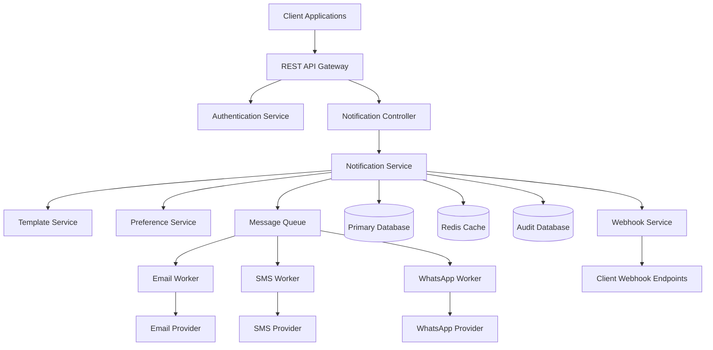

# Notification Service Design Document

## Overview

The Notification Service is a scalable, multi-channel communication platform designed to handle enterprise-grade notification requirements. The system supports email, SMS, and WhatsApp delivery channels with comprehensive status tracking, template management, scheduling, and audit capabilities.

### Key Design Principles

- **Reliability**: Guaranteed message delivery with retry mechanisms
- **Scalability**: Horizontal scaling to handle high-volume notification loads
- **Flexibility**: Support for multiple channels and delivery providers
- **Observability**: Comprehensive logging and monitoring
- **Security**: Secure handling of sensitive data and webhook verification

## Non-Functional Requirements

### Availability & Reliability

```
┌─────────────────────────────────────────────────────────────────────────────────┐
│                           AVAILABILITY REQUIREMENTS                            │
└─────────────────────────────────────────────────────────────────────────────────┘

System Availability:
• Overall System Uptime: 99.9% (8.76 hours downtime/year)
• API Gateway Uptime: 99.95% (4.38 hours downtime/year)
• Database Uptime: 99.9% with automatic failover
• Message Queue Uptime: 99.9% with clustering
• External Provider Tolerance: Circuit breaker protection

Reliability Metrics:
• Mean Time Between Failures (MTBF): 720 hours (30 days)
• Mean Time To Recovery (MTTR): 15 minutes
• Recovery Time Objective (RTO): 15 minutes
• Recovery Point Objective (RPO): 5 minutes
• Data Durability: 99.999999999% (11 9's)

Fault Tolerance:
• Single point of failure elimination
• Graceful degradation under load
• Automatic retry with exponential backoff
• Circuit breaker pattern for external services
• Health checks and automatic service recovery
```

### Performance Requirements

```
┌─────────────────────────────────────────────────────────────────────────────────┐
│                           PERFORMANCE REQUIREMENTS                             │
└─────────────────────────────────────────────────────────────────────────────────┘

Throughput Requirements:
• Peak Load: 10,000 notifications/second
• Sustained Load: 5,000 notifications/second
• Daily Volume: 100 million notifications
• Batch Processing: 50,000 notifications/batch
• Concurrent Users: 10,000 simultaneous API users

Latency Requirements:
• API Response Time: <200ms (95th percentile)
• Notification Processing: <30 seconds (high priority)
• Notification Processing: <5 minutes (normal priority)
• Database Query Time: <100ms (95th percentile)
• Cache Hit Response: <10ms

Scalability Requirements:
• Horizontal Scaling: Auto-scale from 3 to 50 instances
• Database Connections: Support 1000+ concurrent connections
• Queue Processing: Handle 100,000+ messages in queue
• Storage Growth: Support 10TB+ data growth per year
• Geographic Distribution: Multi-region deployment capability
```

### Security Requirements

```
┌─────────────────────────────────────────────────────────────────────────────────┐
│                            SECURITY REQUIREMENTS                               │
└─────────────────────────────────────────────────────────────────────────────────┘

Authentication & Authorization:
• Multi-factor Authentication (MFA) for admin access
• JWT token expiration: 1 hour for user tokens, 24 hours for service tokens
• API rate limiting: 1000 requests/minute per client
• Role-based access control (RBAC) with principle of least privilege
• Service-to-service authentication via mutual TLS

Data Protection:
• Encryption at Rest: AES-256 for all sensitive data
• Encryption in Transit: TLS 1.3 for all communications
• PII Tokenization: Replace sensitive data with tokens
• Key Rotation: Automatic rotation every 90 days
• Data Masking: Mask PII in logs and non-production environments

Network Security:
• VPC isolation with private subnets
• Web Application Firewall (WAF) protection
• DDoS protection and rate limiting
• Network segmentation between tiers
• Intrusion detection and prevention systems

Compliance Requirements:
• GDPR compliance: Data portability, right to erasure
• SOC 2 Type II certification
• PCI DSS compliance for payment-related notifications
• HIPAA compliance for healthcare notifications
• Regular security audits and penetration testing
```

### Scalability & Capacity

```
┌─────────────────────────────────────────────────────────────────────────────────┐
│                          SCALABILITY REQUIREMENTS                              │
└─────────────────────────────────────────────────────────────────────────────────┘

Horizontal Scaling:
• Stateless application design for easy scaling
• Auto-scaling based on CPU, memory, and queue depth
• Load balancing across multiple availability zones
• Database read replicas for read scaling
• Microservices architecture for independent scaling

Vertical Scaling:
• Support for larger instance types without code changes
• Memory-efficient data structures and algorithms
• CPU optimization for high-throughput processing
• Storage optimization with data compression
• Network bandwidth optimization

Capacity Planning:
• 10x current load capacity (1M notifications/day → 10M/day)
• Storage growth: 50TB capacity with 10TB/year growth
• Network bandwidth: 1Gbps with burst to 10Gbps
• Database connections: 1000 concurrent with pooling
• Cache capacity: 100GB Redis cluster with 6 nodes

Geographic Scaling:
• Multi-region deployment capability
• Cross-region data replication
• Regional failover and disaster recovery
• Content delivery network (CDN) integration
• Latency optimization for global users
```

### Monitoring & Observability

```
┌─────────────────────────────────────────────────────────────────────────────────┐
│                        MONITORING REQUIREMENTS                                 │
└─────────────────────────────────────────────────────────────────────────────────┘

Application Monitoring:
• Real-time metrics collection (Prometheus)
• Distributed tracing (Jaeger/Zipkin)
• Structured logging with correlation IDs
• Custom business metrics and KPIs
• Performance profiling and bottleneck identification

Infrastructure Monitoring:
• System resource monitoring (CPU, memory, disk, network)
• Database performance monitoring
• Message queue depth and consumer lag
• Cache hit rates and memory usage
• Network latency and bandwidth utilization

Alerting Requirements:
• Real-time alerting for critical issues
• Escalation procedures for unresolved alerts
• Alert fatigue prevention with intelligent grouping
• Integration with PagerDuty/OpsGenie
• Runbook automation for common issues

Observability Standards:
• 360-degree visibility into system behavior
• Root cause analysis capabilities
• Performance trend analysis
• Capacity planning insights
• Business impact correlation
```

### Data Requirements

```
┌─────────────────────────────────────────────────────────────────────────────────┐
│                            DATA REQUIREMENTS                                   │
└─────────────────────────────────────────────────────────────────────────────────┘

Data Consistency:
• ACID compliance for critical transactions
• Eventual consistency for non-critical data
• Data validation and integrity checks
• Referential integrity enforcement
• Conflict resolution strategies

Data Retention:
• Notification data: 90 days in primary storage
• Audit logs: 7 years for compliance
• Delivery logs: 1 year for analytics
• User preferences: Indefinite with GDPR compliance
• System logs: 30 days for troubleshooting

Data Backup & Recovery:
• Daily full backups with 30-day retention
• Incremental backups every 4 hours
• Point-in-time recovery capability
• Cross-region backup replication
• Automated backup testing and validation

Data Privacy:
• PII identification and classification
• Data anonymization for analytics
• Right to be forgotten implementation
• Data portability features
• Consent management and tracking
```

### Usability & Maintainability

```
┌─────────────────────────────────────────────────────────────────────────────────┐
│                        USABILITY REQUIREMENTS                                  │
└─────────────────────────────────────────────────────────────────────────────────┘

API Usability:
• RESTful API design with clear documentation
• Consistent error messages and status codes
• SDK/client libraries for popular languages
• Interactive API documentation (Swagger/OpenAPI)
• Backward compatibility for API versions

Developer Experience:
• Comprehensive documentation and examples
• Local development environment setup
• Testing frameworks and mock services
• Debugging tools and log analysis
• Performance profiling capabilities

Operational Maintainability:
• Infrastructure as Code (Terraform/CloudFormation)
• Automated deployment pipelines (CI/CD)
• Configuration management without code changes
• Feature flags for gradual rollouts
• Blue-green deployment capabilities

Code Quality:
• 90%+ unit test coverage
• Automated code quality checks (SonarQube)
• Security vulnerability scanning
• Dependency management and updates
• Code review requirements and standards
```

## Architecture

### High-Level Architecture

```
┌─────────────────┐    ┌─────────────────┐    ┌─────────────────┐
│   Mobile App    │    │   Web Client    │    │  Backend API    │
└─────────┬───────┘    └─────────┬───────┘    └─────────┬───────┘
          │                      │                      │
          └──────────────────────┼──────────────────────┘
                                 │
                    ┌────────────▼────────────┐
                    │    Load Balancer        │
                    │   (Rate Limiting)       │
                    └────────────┬────────────┘
                                 │
                    ┌────────────▼────────────┐
                    │   API Gateway           │
                    │ (Auth, Validation)      │
                    └────────────┬────────────┘
                                 │
              ┌──────────────────┼──────────────────┐
              │                  │                  │
    ┌─────────▼─────────┐ ┌─────▼─────┐ ┌─────────▼─────────┐
    │ Notification      │ │ Template  │ │ Preference        │
    │ Controller        │ │ Service   │ │ Service           │
    └─────────┬─────────┘ └─────┬─────┘ └─────────┬─────────┘
              │                 │                 │
              └─────────────────┼─────────────────┘
                                │
                    ┌───────────▼───────────┐
                    │ Notification Service  │
                    │  (Core Orchestrator)  │
                    └───────────┬───────────┘
                                │
                    ┌───────────▼───────────┐
                    │   Apache Kafka        │
                    │  (Message Streaming)  │
                    └───┬───────┬───────┬───┘
                        │       │       │
            ┌───────────▼─┐ ┌───▼───┐ ┌─▼───────────┐
            │ Email       │ │ SMS   │ │ WhatsApp    │
            │ Worker      │ │Worker │ │ Worker      │
            └───────┬─────┘ └───┬───┘ └─────┬───────┘
                    │           │           │
            ┌───────▼─────┐ ┌───▼───┐ ┌─────▼───────┐
            │ SMTP        │ │Twilio │ │ WhatsApp    │
            │ Provider    │ │ API   │ │ Business    │
            │(SendGrid)   │ │       │ │ API         │
            └─────────────┘ └───────┘ └─────────────┘
                     Data Layer
    ┌─────────────────────────────────────────────────────┐
    │                                                     │
    │  ┌─────────────┐  ┌─────────────┐  ┌─────────────┐ │
    │  │ PostgreSQL  │  │   Redis     │  │ PostgreSQL  │ │
    │  │ (Primary)   │  │  (Cache)    │  │  (Audit)    │ │
    │  │             │  │             │  │             │ │
    │  │• Notifications│ │• Templates  │  │• Audit Logs │ │
    │  │• Templates   │  │• Rate Limits│  │• Delivery   │ │
    │  │• Preferences │  │• Sessions   │  │  Tracking   │ │
    │  │• Webhooks    │  │• Temp Data  │  │• Compliance │ │
    │  └─────────────┘  └─────────────┘  └─────────────┘ │
    └─────────────────────────────────────────────────────┘
                     External Integrations
    ┌─────────────────────────────────────────────────────┐
    │                                                     │
    │  ┌─────────────┐  ┌─────────────┐  ┌─────────────┐ │
    │  │  Webhook    │  │ Monitoring  │  │   Client    │ │
    │  │  Service    │  │   Stack     │  │ Callback    │ │
    │  │             │  │             │  │ Endpoints   │ │
    │  │• Delivery   │  │• Prometheus │  │             │ │
    │  │  Callbacks  │  │• Grafana    │  │• Status     │ │
    │  │• Retry      │  │• ELK Stack  │  │  Updates    │ │
    │  │  Logic      │  │• Alerts     │  │• Webhooks   │ │
    │  └─────────────┘  └─────────────┘  └─────────────┘ │
    └─────────────────────────────────────────────────────┘
```

**Mermaid Diagram:**


### Component Architecture

The system follows an event-driven microservices architecture with the following core components:

1. **API Layer**: REST endpoints for notification management
2. **Service Layer**: Business logic and orchestration
3. **Streaming Layer**: Kafka-based event processing
4. **Worker Layer**: Channel-specific message processors
5. **Data Layer**: Persistent storage and caching
6. **Integration Layer**: External provider integrations

### Event-Driven Architecture with Kafka

#### Kafka Cluster Configuration
```
Cluster Setup:
- 5 Kafka brokers (3 minimum for production)
- Zookeeper ensemble: 3 nodes
- Replication factor: 3
- Min in-sync replicas: 2
- Log retention: 7 days (processing), 30 days (audit)

Performance Tuning:
- batch.size: 16384
- linger.ms: 5
- compression.type: lz4
- acks: 1 (for throughput), all (for critical data)
```

#### Event Flow Patterns

**1. Notification Processing Flow**
```
API Request → notification.created → Template Processing → 
Channel Routing → notification.{channel} → Worker Processing → 
Provider Delivery → notification.status → Webhook Callbacks
```

**2. Retry and Dead Letter Flow**
```
Failed Message → notification.retry → Exponential Backoff → 
Max Retries Exceeded → notification.dlq → Manual Investigation
```

**3. Status Tracking Flow**
```
Status Change → notification.status → Real-time Dashboard → 
Webhook Service → Client Callbacks → Audit Logging
```

#### Kafka Consumer Groups
```
notification-email-workers: 4 consumers (auto-scaling)
notification-sms-workers: 3 consumers
notification-whatsapp-workers: 2 consumers
notification-scheduler: 1 consumer (singleton)
notification-status-tracker: 2 consumers
notification-webhook-dispatcher: 3 consumers
audit-logger: 1 consumer (guaranteed processing)
```

#### Stream Processing with Kafka Streams
```java
// Real-time notification metrics
KStream<String, NotificationEvent> notifications = builder.stream("notification.status");

// Aggregate success rates by channel
KTable<String, Double> successRates = notifications
    .groupBy((key, value) -> value.getChannel())
    .aggregate(
        () -> new SuccessRateAggregator(),
        (key, value, aggregate) -> aggregate.update(value),
        Materialized.as("success-rates-store")
    );

// Alert on low success rates
notifications
    .filter((key, value) -> value.getStatus() == FAILED)
    .groupByKey()
    .windowedBy(TimeWindows.of(Duration.ofMinutes(5)))
    .count()
    .filter((key, count) -> count > 100)
    .toStream()
    .to("alerts.high-failure-rate");
```

## Components and Interfaces

### Core Components

#### 1. Notification Controller
- **Purpose**: HTTP API endpoints for notification operations
- **Responsibilities**:
    - Request validation and sanitization
    - Authentication and authorization
    - Rate limiting enforcement
    - Response formatting

#### 2. Notification Service
- **Purpose**: Core business logic orchestration
- **Responsibilities**:
    - Notification lifecycle management
    - Template processing and validation
    - Scheduling and queuing
    - Status tracking and updates
    - Retry policy enforcement

#### 3. Template Service
- **Purpose**: Template management and processing
- **Responsibilities**:
    - Template storage and versioning
    - Parameter substitution
    - Localization support
    - Template validation

#### 4. Preference Service
- **Purpose**: Recipient preference management
- **Responsibilities**:
    - Opt-in/opt-out management
    - Channel preference storage
    - Compliance enforcement

#### 5. Channel Workers
- **Purpose**: Channel-specific message delivery
- **Responsibilities**:
    - Provider-specific formatting
    - Delivery execution
    - Status callback handling
    - Error handling and retry logic

#### 6. Webhook Service
- **Purpose**: Delivery status callbacks
- **Responsibilities**:
    - Webhook registration and validation
    - Callback delivery with retry
    - Payload signing and security

### API Design

```
┌─────────────────────────────────────────────────────────────────────────────────┐
│                              REST API ENDPOINTS                                │
└─────────────────────────────────────────────────────────────────────────────────┘

┌─────────────────────────────────────────────────────────────────────────────────┐
│                           NOTIFICATION MANAGEMENT                              │
│                                                                                 │
│  POST   /api/v1/notifications                                                  │
│  ┌─────────────────────────────────────────────────────────────────────────┐   │
│  │ Request Body:                                                           │   │
│  │ {                                                                       │   │
│  │   "recipients": ["user1", "user2"],                                    │   │
│  │   "template_id": "welcome_template",                                   │   │
│  │   "variables": { "name": "John", "action": "signup" },                │   │
│  │   "priority": "normal",                                                │   │
│  │   "channels": ["email", "sms"],                                        │   │
│  │   "metadata": { "campaign_id": "123" }                                │   │
│  │ }                                                                       │   │
│  └─────────────────────────────────────────────────────────────────────────┘   │
│                                                                                 │
│  POST   /api/v1/notifications/bulk                                             │
│  GET    /api/v1/notifications/{id}                                             │
│  GET    /api/v1/notifications/{id}/status                                      │
│  PUT    /api/v1/notifications/{id}/cancel                                      │
│  DELETE /api/v1/notifications/{id}                                             │
└─────────────────────────────────────────────────────────────────────────────────┘

┌─────────────────────────────────────────────────────────────────────────────────┐
│                            USER PREFERENCES                                    │
│                                                                                 │
│  GET    /api/v1/preferences/{recipient}                                        │
│  PUT    /api/v1/preferences/{recipient}                                        │
│  ┌─────────────────────────────────────────────────────────────────────────┐   │
│  │ Request/Response Body:                                                  │   │
│  │ {                                                                       │   │
│  │   "channels": {                                                         │   │
│  │     "email": { "enabled": true, "frequency": "immediate" },            │   │
│  │     "sms": { "enabled": true, "quiet_hours": "22:00-08:00" },         │   │
│  │     "whatsapp": { "enabled": false }                                   │   │
│  │   },                                                                    │   │
│  │   "categories": {                                                       │   │
│  │     "marketing": false,                                                 │   │
│  │     "security": true,                                                   │   │
│  │     "updates": true                                                     │   │
│  │   }                                                                     │   │
│  │ }                                                                       │   │
│  └─────────────────────────────────────────────────────────────────────────┘   │
│                                                                                 │
│  PATCH  /api/v1/preferences/{recipient}/channels/{channel}                     │
│  POST   /api/v1/preferences/{recipient}/opt-out                                │
│  POST   /api/v1/preferences/{recipient}/opt-in                                 │
└─────────────────────────────────────────────────────────────────────────────────┘

┌─────────────────────────────────────────────────────────────────────────────────┐
│                           TEMPLATE MANAGEMENT                                  │
│                                                                                 │
│  GET    /api/v1/templates                                                      │
│  POST   /api/v1/templates                                                      │
│  GET    /api/v1/templates/{id}                                                 │
│  PUT    /api/v1/templates/{id}                                                 │
│  DELETE /api/v1/templates/{id}                                                 │
│  POST   /api/v1/templates/{id}/versions                                        │
│  GET    /api/v1/templates/{id}/preview                                         │
│  GET    /api/v1/templates/search?name={name}&channel={channel}                 │
└─────────────────────────────────────────────────────────────────────────────────┘

┌─────────────────────────────────────────────────────────────────────────────────┐
│                         MONITORING & METRICS                                   │
│                                                                                 │
│  GET    /api/v1/health                                                         │
│  GET    /api/v1/metrics/delivery-rates                                         │
│  GET    /api/v1/metrics/channel-performance                                    │
│  GET    /api/v1/metrics/system-status                                          │
│  GET    /api/v1/admin/queue-status                                             │
│  POST   /api/v1/admin/retry-failed                                             │
│  GET    /api/v1/audit/logs?start={date}&end={date}                             │
└─────────────────────────────────────────────────────────────────────────────────┘

┌─────────────────────────────────────────────────────────────────────────────────┐
│                              WEBHOOKS                                          │
│                                                                                 │
│  POST   /api/v1/webhooks                   # Register webhook endpoint         │
│  GET    /api/v1/webhooks                   # List registered webhooks          │
│  DELETE /api/v1/webhooks/{id}              # Delete webhook                    │
│  POST   /api/v1/webhooks/delivery-status   # Receive delivery status          │
│  POST   /api/v1/webhooks/sendgrid          # SendGrid delivery callbacks      │
│  POST   /api/v1/webhooks/twilio            # Twilio SMS callbacks             │
│  POST   /api/v1/webhooks/whatsapp          # WhatsApp delivery callbacks      │
└─────────────────────────────────────────────────────────────────────────────────┘
```

#### Kafka Topics and Partitioning

```
Topics:
- notification.email (partitions: 12, replication: 3)
- notification.sms (partitions: 8, replication: 3)  
- notification.whatsapp (partitions: 6, replication: 3)
- notification.scheduled (partitions: 4, replication: 3)
- notification.retry (partitions: 8, replication: 3)
- notification.dlq (partitions: 2, replication: 3)
- notification.status (partitions: 16, replication: 3)

Partitioning Strategy:
- Key: recipient_id (ensures ordered processing per recipient)
- Retention: 7 days for processing topics, 30 days for status
- Compression: LZ4 for optimal throughput
```

## Data Models

### Core Entities & Relationships

```
┌─────────────────────────────────────────────────────────────────────────────────┐
│                            CORE ENTITY RELATIONSHIPS                           │
└─────────────────────────────────────────────────────────────────────────────────┘

                    ┌─────────────────┐
                    │    Templates    │
                    │                 │
                    │ • id (UUID)     │
                    │ • name          │
                    │ • version       │
                    │ • locale        │
                    │ • subject       │
                    │ • body          │
                    │ • channel       │
                    │ • active        │
                    └─────────┬───────┘
                              │
                              │ (optional)
                              ▼
┌─────────────────┐    ┌─────────────────┐    ┌─────────────────────────────────┐
│   Recipients    │    │  Notifications  │    │        Delivery Logs            │
│                 │    │                 │    │                                 │
│ • recipient_id  │◄──►│ • id (UUID)     │───►│ • id (BIGSERIAL)                │
│ • email         │    │ • sender_id     │    │ • notification_id (FK)          │
│ • phone         │    │ • recipients[]  │    │ • channel                       │
│ • whatsapp      │    │ • template_id   │    │ • provider                      │
│ • created_at    │    │ • parameters{}  │    │ • provider_message_id           │
└─────────────────┘    │ • channels[]    │    │ • status                        │
          │            │ • status        │    │ • response_data{}               │
          │            │ • scheduled_at  │    │ • timestamp                     │
          ▼            │ • created_at    │    └─────────────────────────────────┘
┌─────────────────┐    │ • retry_count   │    
│ Recipient Prefs │    │ • error_message │    ┌─────────────────────────────────┐
│                 │    └─────────────────┘    │         Audit Logs              │
│ • recipient_id  │                           │                                 │
│ • channel       │    ┌─────────────────┐    │ • id (BIGSERIAL)                │
│ • opted_in      │    │    Webhooks     │    │ • notification_id               │
│ • updated_at    │    │                 │    │ • event_type                    │
│ • reason        │    │ • id (UUID)     │    │ • event_data{}                  │
└─────────────────┘    │ • url           │    │ • timestamp                     │
                       │ • events[]      │    │ • user_id                       │
                       │ • secret        │    │ • ip_address                    │
                       │ • active        │    │ • user_agent                    │
                       │ • created_at    │    └─────────────────────────────────┘
                       └─────────────────┘    

┌─────────────────────────────────────────────────────────────────────────────────┐
│                              RELATIONSHIPS                                      │
└─────────────────────────────────────────────────────────────────────────────────┘

• Recipients (1) ←→ (N) Recipient Preferences
• Templates (1) ←→ (N) Notifications (optional)
• Notifications (1) ←→ (N) Delivery Logs
• Notifications (1) ←→ (N) Audit Logs
• Recipients (1) ←→ (N) Delivery Logs (via notification)
• Webhooks (N) ←→ (N) Notifications (via events)

┌─────────────────────────────────────────────────────────────────────────────────┐
│                            DATABASE TABLES SUMMARY                             │
└─────────────────────────────────────────────────────────────────────────────────┘

Primary Database (PostgreSQL):
• notifications          - Core notification records with partitioning
• templates              - Notification templates with versioning
• recipient_preferences  - User opt-in/opt-out settings per channel
• webhooks              - Registered webhook endpoints for callbacks

Audit Database (PostgreSQL):
• audit_logs            - Complete audit trail of all events
• delivery_logs         - Provider-specific delivery tracking
• compliance_logs       - GDPR/regulatory compliance records

Cache Layer (Redis):
• Templates cache       - Frequently used templates
• Preferences cache     - User preferences for fast lookup
• Rate limiting         - Per-user/client rate limit counters
• Session data          - Authentication and temporary data
• Circuit breakers      - Provider health status

Partitioning Strategy:
• notifications: Monthly partitions by created_at
• audit_logs: Weekly partitions by timestamp
• delivery_logs: Weekly partitions by timestamp
```

### Core Entities

#### Notification
```java
@Entity
public class Notification {
    private String id;
    private String senderId;
    private List<String> recipients;
    private String templateId;
    private Map<String, Object> parameters;
    private List<NotificationChannel> channels;
    private NotificationStatus status;
    private LocalDateTime scheduledAt;
    private LocalDateTime createdAt;
    private LocalDateTime updatedAt;
    private Integer retryCount;
    private String errorMessage;
}
```

#### NotificationTemplate
```java
@Entity
public class NotificationTemplate {
    private String id;
    private String name;
    private String version;
    private String locale;
    private String subject;
    private String body;
    private List<String> requiredParameters;
    private NotificationChannel channel;
    private LocalDateTime createdAt;
    private boolean active;
}
```

#### RecipientPreference
```java
@Entity
public class RecipientPreference {
    private String recipientId;
    private NotificationChannel channel;
    private boolean optedIn;
    private LocalDateTime updatedAt;
    private String reason;
}
```

#### AuditLog
```java
@Entity
public class AuditLog {
    private String id;
    private String notificationId;
    private String event;
    private String details;
    private LocalDateTime timestamp;
    private String userId;
    private Map<String, Object> metadata;
}
```

### Database Schema Design

#### Database Architecture and Patterns

**Primary Database (PostgreSQL 14+)**
```sql
-- Partitioned by date for performance
CREATE TABLE notifications (
    id UUID PRIMARY KEY,
    sender_id VARCHAR(255) NOT NULL,
    recipients JSONB NOT NULL,
    template_id UUID REFERENCES templates(id),
    parameters JSONB,
    channels notification_channel[] NOT NULL,
    status notification_status NOT NULL DEFAULT 'pending',
    scheduled_at TIMESTAMP WITH TIME ZONE,
    created_at TIMESTAMP WITH TIME ZONE DEFAULT NOW(),
    updated_at TIMESTAMP WITH TIME ZONE DEFAULT NOW(),
    retry_count INTEGER DEFAULT 0,
    error_message TEXT
) PARTITION BY RANGE (created_at);

-- Monthly partitions for better performance
CREATE TABLE notifications_2024_01 PARTITION OF notifications
    FOR VALUES FROM ('2024-01-01') TO ('2024-02-01');

-- Indexes for common queries
CREATE INDEX idx_notifications_status ON notifications (status, created_at);
CREATE INDEX idx_notifications_scheduled ON notifications (scheduled_at) WHERE scheduled_at IS NOT NULL;
CREATE INDEX idx_notifications_recipient ON notifications USING GIN (recipients);

-- Templates with versioning
CREATE TABLE templates (
    id UUID PRIMARY KEY,
    name VARCHAR(255) NOT NULL,
    version INTEGER NOT NULL,
    locale VARCHAR(10) NOT NULL DEFAULT 'en',
    subject TEXT,
    body TEXT NOT NULL,
    required_parameters TEXT[] NOT NULL DEFAULT '{}',
    channel notification_channel NOT NULL,
    created_at TIMESTAMP WITH TIME ZONE DEFAULT NOW(),
    active BOOLEAN DEFAULT true,
    UNIQUE(name, version, locale, channel)
);

-- Recipient preferences with compound indexing
CREATE TABLE recipient_preferences (
    recipient_id VARCHAR(255) NOT NULL,
    channel notification_channel NOT NULL,
    opted_in BOOLEAN NOT NULL DEFAULT true,
    updated_at TIMESTAMP WITH TIME ZONE DEFAULT NOW(),
    reason TEXT,
    PRIMARY KEY (recipient_id, channel)
);
```

**Read Replicas Configuration:**
- 2 read replicas for query distribution
- Async replication with 1-2 second lag
- Connection pooling with PgBouncer (100 connections per pool)

**Audit Database (Separate PostgreSQL Cluster)**
```sql
-- Time-series optimized for append-only workload
CREATE TABLE audit_logs (
    id BIGSERIAL PRIMARY KEY,
    notification_id UUID NOT NULL,
    event_type VARCHAR(50) NOT NULL,
    event_data JSONB NOT NULL,
    timestamp TIMESTAMP WITH TIME ZONE DEFAULT NOW(),
    user_id VARCHAR(255),
    ip_address INET,
    user_agent TEXT
) PARTITION BY RANGE (timestamp);

-- Weekly partitions for audit data
CREATE TABLE audit_logs_2024_w01 PARTITION OF audit_logs
    FOR VALUES FROM ('2024-01-01') TO ('2024-01-08');

-- Delivery tracking with provider-specific data
CREATE TABLE delivery_logs (
    id BIGSERIAL PRIMARY KEY,
    notification_id UUID NOT NULL,
    channel notification_channel NOT NULL,
    provider VARCHAR(100) NOT NULL,
    provider_message_id VARCHAR(255),
    status delivery_status NOT NULL,
    response_data JSONB,
    timestamp TIMESTAMP WITH TIME ZONE DEFAULT NOW()
) PARTITION BY RANGE (timestamp);
```

**Database Performance Optimizations:**
- **Connection Pooling**: PgBouncer with transaction pooling
- **Query Optimization**: Prepared statements, query plan caching
- **Partitioning**: Time-based partitioning for large tables
- **Indexing Strategy**: Composite indexes for common query patterns
- **Vacuum Strategy**: Automated vacuum with custom schedules
- **WAL Configuration**: Optimized for high-write workloads

#### Multi-Layer Caching Strategy

**L1 Cache (Application Level - Caffeine)**
```
- Template Cache: 1000 entries, 1 hour TTL
- Preference Cache: 10000 entries, 30 minutes TTL
- Configuration Cache: 100 entries, 24 hours TTL
- Provider Status: 50 entries, 5 minutes TTL
```

**L2 Cache (Redis Cluster)**
```
- Templates: Key pattern "template:{id}:{version}", TTL: 6 hours
- Preferences: Key pattern "pref:{recipient_id}", TTL: 2 hours
- Rate Limits: Key pattern "rate:{client_id}:{window}", TTL: window size
- Sessions: Key pattern "session:{token}", TTL: 1 hour
- Provider Circuits: Key pattern "circuit:{provider}", TTL: 15 minutes

Redis Configuration:
- Cluster: 6 nodes (3 masters, 3 replicas)
- Memory: 16GB per node
- Eviction Policy: allkeys-lru
- Persistence: RDB snapshots every 15 minutes
```

**Cache Patterns:**
- **Cache-Aside**: Templates and preferences
- **Write-Through**: Rate limiting counters
- **Write-Behind**: Non-critical metrics
- **Circuit Breaker**: Provider availability status

## Back-of-Envelope Calculations

### Scale Assumptions
- **Peak Load**: 10,000 notifications/second
- **Daily Volume**: 100 million notifications
- **Template Count**: 1,000 active templates
- **Recipients**: 10 million unique recipients
- **Retention**: 90 days for notifications, 7 years for audit logs

### Storage Requirements

#### Primary Database
```
Notifications: 100M/day × 90 days × 2KB = 18TB
Templates: 1K × 10KB = 10MB
Preferences: 10M × 0.5KB = 5GB
Total Primary: ~18TB
```

#### Audit Database
```
Audit Logs: 100M/day × 365 days × 7 years × 1KB = 256TB
Delivery Logs: 100M/day × 365 days × 7 years × 0.5KB = 128TB
Total Audit: ~384TB
```

#### Kafka Storage Requirements
```
Daily Message Volume: 100M notifications
Average Message Size: 2KB
Daily Kafka Storage: 100M × 2KB = 200GB
7-day Retention: 200GB × 7 = 1.4TB
Replication Factor 3: 1.4TB × 3 = 4.2TB
Total Kafka Storage: ~5TB (with overhead)
```

#### Cache Requirements
```
L1 Cache (Caffeine - Per Instance):
- Templates: 1K × 10KB = 10MB
- Preferences: 10K × 0.5KB = 5MB
- Config: 100 × 1KB = 100KB
Total L1 per instance: ~16MB

L2 Cache (Redis Cluster):
- Templates: 1K × 10KB = 10MB
- Preferences: 10M × 0.5KB = 5GB
- Rate Limits: 100K counters × 0.1KB = 10MB
- Sessions: 50K × 2KB = 100MB
- Circuit Breakers: 100 × 1KB = 100KB
Total L2 Cache: ~6GB (across cluster)
```

### Compute Requirements

#### API Layer
```
Peak RPS: 10,000
Response Time: <100ms
CPU per request: 10ms
Required CPU cores: 10,000 × 0.01 = 100 cores
Recommended: 3 instances × 40 cores = 120 cores
```

#### Worker Layer
```
Email Processing: 5,000/sec × 50ms = 250 cores
SMS Processing: 3,000/sec × 30ms = 90 cores  
WhatsApp Processing: 2,000/sec × 40ms = 80 cores
Total Worker Cores: 420 cores
```

#### Infrastructure Requirements

**Kafka Cluster**
```
5 Brokers: 8 cores, 32GB RAM, 2TB NVMe SSD each
3 Zookeepers: 4 cores, 8GB RAM, 500GB SSD each
Network: 10Gbps between brokers
Total Kafka: 40 cores, 160GB RAM, 10TB storage
```

**Database Cluster**
```
Primary DB: 16 cores, 64GB RAM, 20TB SSD
Read Replicas: 2 × (12 cores, 48GB RAM, 20TB SSD)
Audit DB: 8 cores, 32GB RAM, 400TB HDD
Connection Pools: 4 × PgBouncer instances
Total DB: 52 cores, 208GB RAM, 460TB storage
```

**Redis Cluster**
```
6 Redis Nodes: 4 cores, 16GB RAM, 1TB SSD each
Sentinel: 3 × (2 cores, 4GB RAM)
Total Redis: 30 cores, 108GB RAM, 6TB storage
```

### Network Requirements

#### Bandwidth
```
Inbound API: 10K RPS × 2KB = 20MB/s
Outbound Webhooks: 5K RPS × 1KB = 5MB/s
Provider APIs: 10K RPS × 1KB = 10MB/s
Total: ~35MB/s peak
```

#### Provider Rate Limits
```
Email (SendGrid): 10,000/hour per IP
SMS (Twilio): 1,000/second per account
WhatsApp: 250/second per phone number
```

## Error Handling

### Error Categories

#### 1. Validation Errors
- Invalid recipient format
- Missing required template parameters
- Unsupported notification channel
- **Response**: HTTP 400 with detailed error message

#### 2. Authentication/Authorization Errors
- Invalid API key
- Insufficient permissions
- Rate limit exceeded
- **Response**: HTTP 401/403 with error details

#### 3. Business Logic Errors
- Recipient opted out
- Template not found
- Scheduled time in past
- **Response**: HTTP 422 with business rule violation

#### 4. Provider Errors
- SMTP server unavailable
- SMS gateway timeout
- WhatsApp API rate limit
- **Response**: Retry with exponential backoff

#### 5. System Errors
- Database connection failure
- Queue service unavailable
- Internal service error
- **Response**: HTTP 500, trigger alerts

### Retry Strategy

#### Exponential Backoff Configuration
```
Initial Delay: 1 second
Multiplier: 2.0
Max Delay: 300 seconds (5 minutes)
Max Attempts: 5
Jitter: ±25% random variation
```

#### Retry Conditions
- **Retry**: Network timeouts, 5xx errors, rate limits
- **No Retry**: 4xx errors (except 429), validation failures
- **Dead Letter**: After max attempts exceeded

## Testing Strategy

### Unit Testing
- **Coverage Target**: 90%
- **Focus Areas**: Business logic, validation, error handling
- **Tools**: JUnit 5, Mockito, TestContainers
- **Mocking**: External provider APIs, database interactions

### Integration Testing
- **Database Integration**: Real database with test data
- **Queue Integration**: Embedded message broker
- **Provider Integration**: Mock provider services
- **API Testing**: Full request/response cycle

### Performance Testing
- **Load Testing**: Simulate peak traffic (10K RPS)
- **Stress Testing**: Beyond capacity limits (15K RPS)
- **Endurance Testing**: Sustained load over 24 hours
- **Tools**: JMeter, Gatling

### End-to-End Testing
- **Notification Flow**: Complete delivery cycle
- **Multi-Channel**: Simultaneous channel delivery
- **Failure Scenarios**: Provider failures, retries
- **Webhook Testing**: Callback delivery verification

### Monitoring and Observability

#### Key Metrics
- **Throughput**: Notifications/second by channel
- **Latency**: P95/P99 response times
- **Success Rate**: Delivery success percentage
- **Error Rate**: Failed notifications by error type
- **Queue Depth**: Pending notifications count

#### Alerting Thresholds
- **High Priority**: >5% error rate, >1000ms P95 latency
- **Medium Priority**: >2% error rate, >500ms P95 latency
- **Low Priority**: Queue depth >10K, unusual traffic patterns

#### Logging Strategy
- **Structured Logging**: JSON format with correlation IDs
- **Log Levels**: ERROR for failures, WARN for retries, INFO for success
- **Sensitive Data**: Mask PII in logs, encrypt audit trails
- **Retention**: 30 days for application logs, 7 years for audit logs

## Security Considerations

### Data Protection
- **Encryption at Rest**: AES-256 for sensitive data
- **Encryption in Transit**: TLS 1.3 for all communications
- **PII Handling**: Tokenization of sensitive recipient data
- **Key Management**: AWS KMS or HashiCorp Vault

### API Security
- **Authentication**: JWT tokens with short expiration
- **Authorization**: Role-based access control (RBAC)
- **Rate Limiting**: Per-client and global limits
- **Input Validation**: Strict schema validation

### Webhook Security
- **Payload Signing**: HMAC-SHA256 signatures
- **Endpoint Validation**: SSL certificate verification
- **Retry Security**: Exponential backoff with jitter
- **Timeout Protection**: 30-second request timeout

### Compliance
- **GDPR**: Right to erasure, data portability
- **CAN-SPAM**: Unsubscribe mechanisms, sender identification
- **TCPA**: SMS consent tracking and management
- **SOX**: Audit trail integrity and retention

## Deployment Architecture

### Multi-Environment Strategy

```
┌─────────────────────────────────────────────────────────────────────────────────┐
│                            ENVIRONMENT TOPOLOGY                                │
└─────────────────────────────────────────────────────────────────────────────────┘

Development Environment:
• Single-node Kafka cluster
• PostgreSQL single instance
• Redis single instance
• Mock external providers
• Local file-based configuration

Staging Environment:
• 3-node Kafka cluster
• PostgreSQL with 1 read replica
• Redis cluster (3 nodes)
• Sandbox external providers
• Configuration via environment variables

Production Environment:
• 5-node Kafka cluster with Zookeeper
• PostgreSQL with 2 read replicas + audit DB
• Redis cluster (6 nodes: 3 masters, 3 replicas)
• Production external providers
• Configuration via secrets management

Disaster Recovery:
• Cross-region database replication
• Kafka cluster in secondary region
• Automated failover procedures
• RTO: 15 minutes, RPO: 5 minutes
```

### Container Orchestration

```yaml
# Kubernetes Deployment Strategy
apiVersion: apps/v1
kind: Deployment
metadata:
  name: notification-service
spec:
  replicas: 3
  strategy:
    type: RollingUpdate
    rollingUpdate:
      maxSurge: 1
      maxUnavailable: 0
  template:
    spec:
      containers:
      - name: notification-service
        image: notification-service:latest
        resources:
          requests:
            memory: "2Gi"
            cpu: "1000m"
          limits:
            memory: "4Gi"
            cpu: "2000m"
        livenessProbe:
          httpGet:
            path: /health
            port: 8080
          initialDelaySeconds: 30
          periodSeconds: 10
        readinessProbe:
          httpGet:
            path: /ready
            port: 8080
          initialDelaySeconds: 5
          periodSeconds: 5
```

## Scalability & Performance

### Horizontal Scaling Strategy

```
┌─────────────────────────────────────────────────────────────────────────────────┐
│                              SCALING TRIGGERS                                  │
└─────────────────────────────────────────────────────────────────────────────────┘

Auto-Scaling Metrics:
• CPU utilization > 70% for 5 minutes
• Memory utilization > 80% for 5 minutes
• Queue depth > 5000 messages for 2 minutes
• API response time > 500ms (95th percentile)
• Error rate > 2% for 10 minutes

Scaling Targets:
• API Gateway: 2-10 instances
• Notification Service: 3-15 instances
• Email Workers: 2-8 instances
• SMS Workers: 2-6 instances
• WhatsApp Workers: 2-4 instances

Database Scaling:
• Read replicas: 2-5 instances based on read load
• Connection pooling: Auto-adjust pool sizes
• Query optimization: Automated index recommendations
• Partitioning: Automatic partition creation/cleanup

Kafka Scaling:
• Brokers: 3-7 instances based on throughput
• Partitions: Auto-rebalancing based on load
• Consumer groups: Dynamic scaling based on lag
• Storage: Automatic log compaction and cleanup
```

### Performance Optimization

```
┌─────────────────────────────────────────────────────────────────────────────────┐
│                           PERFORMANCE TUNING                                   │
└─────────────────────────────────────────────────────────────────────────────────┘

Application Level:
• Connection pooling: HikariCP with optimal settings
• Async processing: Non-blocking I/O with reactive streams
• Batch processing: Bulk operations for database and APIs
• Circuit breakers: Prevent cascade failures
• Request deduplication: Idempotency keys

Database Optimization:
• Query optimization: Prepared statements, query plans
• Index strategy: Composite indexes for common patterns
• Partitioning: Time-based partitioning for large tables
• Vacuum strategy: Automated maintenance schedules
• Connection pooling: PgBouncer transaction pooling

Cache Optimization:
• Cache warming: Preload frequently accessed data
• Cache invalidation: Event-driven cache updates
• Compression: LZ4 compression for large objects
• Eviction policies: LRU with TTL-based expiration
• Cache hierarchy: L1 (local) + L2 (distributed)

Network Optimization:
• HTTP/2: Multiplexed connections
• Compression: Gzip/Brotli for API responses
• CDN: Static content delivery
• Load balancing: Weighted round-robin with health checks
• Keep-alive: Persistent connections to external APIs
```

## Disaster Recovery & Business Continuity

### Backup Strategy

```
┌─────────────────────────────────────────────────────────────────────────────────┐
│                              BACKUP & RECOVERY                                 │
└─────────────────────────────────────────────────────────────────────────────────┘

Database Backups:
• Full backup: Daily at 2 AM UTC
• Incremental backup: Every 4 hours
• Point-in-time recovery: 7-day window
• Cross-region replication: Real-time to DR site
• Backup testing: Weekly restore validation

Kafka Backups:
• Topic snapshots: Daily backup of critical topics
• Configuration backup: Cluster and topic configs
• Consumer offset backup: For replay capability
• Cross-region mirroring: Real-time replication

Application Backups:
• Configuration: Version-controlled in Git
• Secrets: Encrypted backup in secure storage
• Container images: Multi-region registry replication
• Infrastructure as Code: Terraform state backups

Recovery Procedures:
• RTO (Recovery Time Objective): 15 minutes
• RPO (Recovery Point Objective): 5 minutes
• Automated failover: Database and application tiers
• Manual procedures: Documented runbooks
• Testing schedule: Monthly DR drills
```

### High Availability Design

```
Multi-Region Architecture:
• Primary region: US-East-1 (Production traffic)
• Secondary region: US-West-2 (DR standby)
• Database replication: Async cross-region
• DNS failover: Route 53 health checks
• Data synchronization: Eventual consistency model

Availability Targets:
• Overall system: 99.9% uptime (8.76 hours/year downtime)
• Database: 99.95% uptime with read replicas
• Message queue: 99.9% uptime with clustering
• External providers: Circuit breaker protection
• Monitoring: 24/7 alerting and on-call rotation
```

## Cost Optimization

### Resource Optimization

```
┌─────────────────────────────────────────────────────────────────────────────────┐
│                              COST BREAKDOWN                                    │
└─────────────────────────────────────────────────────────────────────────────────┘

Monthly Cost Estimates (100M notifications/day):

Compute Resources:
• API Gateway: 3 × m5.xlarge = $420/month
• Core Services: 6 × m5.xlarge = $840/month
• Workers: 8 × m5.large = $560/month
• Total Compute: $1,820/month

Storage & Database:
• Primary DB: db.r5.2xlarge = $650/month
• Read Replicas: 2 × db.r5.xlarge = $650/month
• Audit DB: db.r5.xlarge = $325/month
• Storage: 25TB × $0.115 = $2,875/month
• Total Database: $4,500/month

Message Queue & Cache:
• Kafka Cluster: 5 × m5.xlarge = $700/month
• Redis Cluster: 6 × cache.r5.large = $900/month
• Total Queue/Cache: $1,600/month

External Services:
• SendGrid: $500/month (2.5M emails)
• Twilio SMS: $9,000/month (3M SMS × $0.003)
• WhatsApp: $1,500/month (500K messages × $0.003)
• Total External: $11,000/month

Monitoring & Security:
• CloudWatch: $200/month
• Third-party APM: $300/month
• Security tools: $200/month
• Total Monitoring: $700/month

Total Monthly Cost: ~$19,620/month
Cost per notification: $0.0065 per notification

Cost Optimization Strategies:
• Reserved instances: 30% savings on compute
• Spot instances: For non-critical workloads
• Auto-scaling: Right-size resources based on demand
• Data lifecycle: Archive old data to cheaper storage
• Provider optimization: Negotiate volume discounts
```

## Migration Strategy

### Phased Implementation Approach

```
┌─────────────────────────────────────────────────────────────────────────────────┐
│                            IMPLEMENTATION PHASES                               │
└─────────────────────────────────────────────────────────────────────────────────┘

Phase 1: Foundation (Weeks 1-4)
• Core infrastructure setup
• Basic API endpoints
• Single channel (email) implementation
• Database schema and migrations
• Basic monitoring and logging

Phase 2: Multi-Channel (Weeks 5-8)
• SMS and WhatsApp channel implementation
• Template system with versioning
• User preference management
• Enhanced error handling and retries
• Performance testing and optimization

Phase 3: Enterprise Features (Weeks 9-12)
• Kafka event streaming implementation
• Advanced monitoring and alerting
• Audit logging and compliance features
• Webhook system for callbacks
• Security hardening and penetration testing

Phase 4: Scale & Polish (Weeks 13-16)
• Load testing and performance tuning
• Multi-region deployment
• Disaster recovery procedures
• Documentation and training
• Go-live preparation and monitoring

Migration from Legacy System:
• Parallel running: 2-week overlap period
• Gradual traffic migration: 10% → 50% → 100%
• Rollback procedures: Immediate fallback capability
• Data migration: Bulk export/import with validation
• User communication: Advance notice and support
```