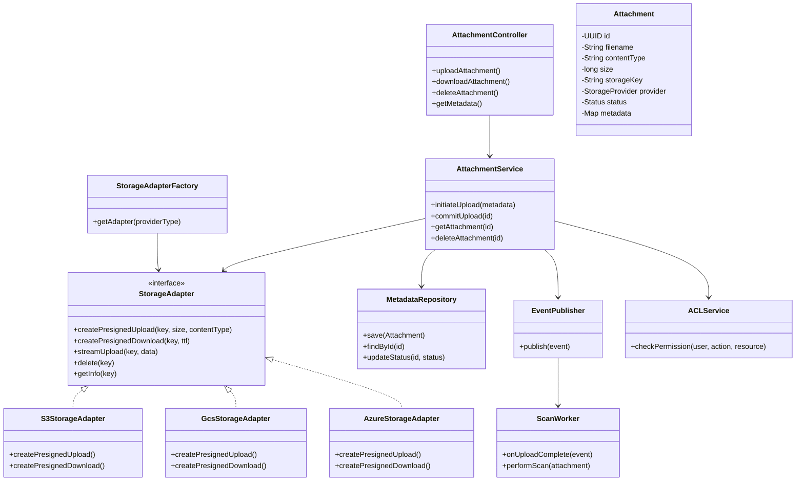
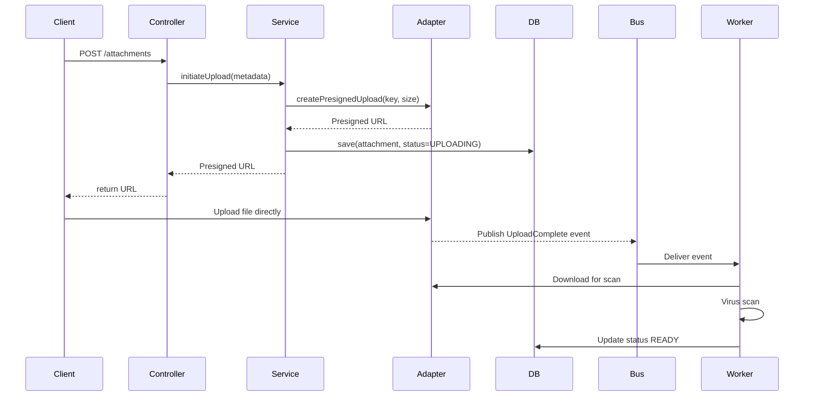

# Attachment Service — HLD & LLD (Java + Spring Boot, Cloud-Extensible)

> Standalone Attachment Service — with UML diagrams & applied design patterns (no code)

---

## 1. Overview

The **Attachment Service** provides secure, scalable storage and retrieval of user-uploaded files (attachments) across
multiple cloud providers. It is built using **Java + Spring Boot**, designed as a **pluggable, cloud-agnostic
microservice**.

---

## 3. Applied Design Patterns

| Pattern                             | Used In                         | Description                                                                                                                 |
|-------------------------------------|---------------------------------|-----------------------------------------------------------------------------------------------------------------------------|
| **Strategy Pattern**                | StorageAdapter                  | Defines a common interface for multiple storage providers (S3, GCS, Azure, Local). Switches strategy at runtime via config. |
| **Factory Pattern**                 | StorageAdapterFactory           | Creates appropriate adapter based on environment or tenant configuration.                                                   |
| **Observer / Event-Driven Pattern** | Message Bus + Workers           | Workers subscribe to upload events for asynchronous processing (scan, indexing).                                            |
| **Decorator Pattern**               | Security + Audit Layer          | Wraps core service logic to add logging, metrics, and audit trails without modifying main logic.                            |
| **Builder Pattern**                 | Presigned URL Generation        | Used for constructing presigned URL metadata with multiple optional attributes (expiry, ACLs, regions).                     |
| **Template Method Pattern**         | AbstractStorageAdapter          | Defines skeleton for upload/download; concrete classes override storage-specific behavior.                                  |
| **Singleton Pattern**               | Configuration, Connection Pools | Manages global resources like DB connection, Kafka producers.                                                               |

---

## 4. UML — Core Class Diagram

---

## 5. UML — Sequence Diagram (Upload + Processing)

---

## 6. Low-Level Design (LLD) Overview

### Core Packages

* `api` — Controllers & DTOs
* `service` — Business logic orchestration
* `storage` — Adapters, factories, and abstractions
* `db` — Repositories & entity mapping
* `worker` — Async processing
* `security` — Auth, ACL checks
* `audit` — Logging, metrics, decorators

### Transactional Boundaries

* Each API call is atomic.
* Upload operations use DB transactions for state consistency.
* Workers operate idempotently and retry-safe (using event IDs).

---

## 7. Extensibility Model

* Add new storage provider → implement `StorageAdapter` + register via factory.
* Add new worker type → subscribe to relevant topic (Observer pattern).
* Add new metadata field → extend JSON schema in metadata column.
* Add new validation rule → implement `Validator` strategy and inject via Spring.

---

## 8. Summary of Key Design Strengths

* **Cloud-neutral** via Strategy pattern.
* **Scalable & decoupled** via Event-driven Observer pattern.
* **Secure & auditable** via Decorator for logging/auditing.
* **Testable & modular** via interface-based abstractions.
* **Maintainable**: easily extend storage, auth, and background workers without rewriting existing modules.

---