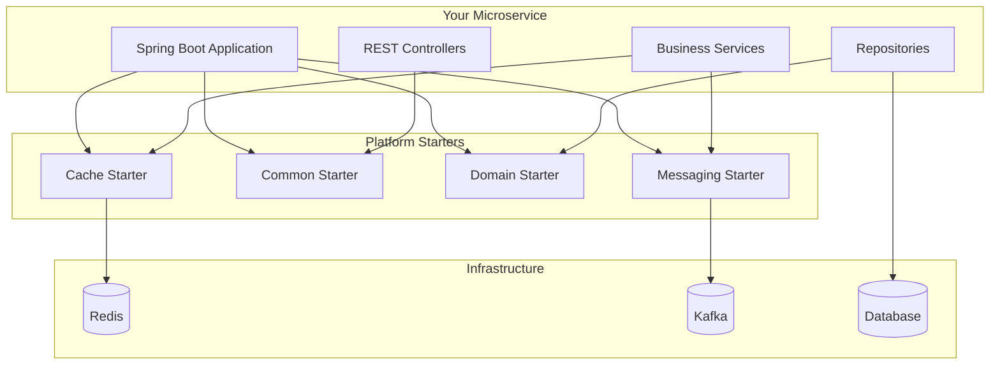

# Platform Starters

🚀 **Production-ready Spring Boot starters** providing enterprise-grade functionality for microservices architecture. These starters offer consistent, reusable components that accelerate development while maintaining high quality and reliability standards.

## 📦 Available Starters

| Starter | Description | Key Features | Version |
|---------|-------------|--------------|---------|
| **[cache-starter](cache-starter/README.md)** | Multi-provider caching with resilience patterns | Redis, Caffeine, Multi-level, Circuit Breaker, Metrics | 1.0.0 |
| **[common-starter](common-starter/README.md)** | Common utilities, exceptions, and base classes | Exception Handling, API Responses, Utilities | 1.0.0 |
| **[domain-starter](domain-starter/README.md)** | Domain-driven design utilities and base entities | Base Entities, DTOs, Enums, Pagination | 1.0.0 |
| **[messaging-starter](messaging-starter/README.md)** | Event-driven messaging with Kafka | Event Publishing, DLQ, Retry Logic, Idempotency | 1.0.0 |

## 🏗️ Architecture Overview



## 🚀 Quick Start

### 1. Add Repository

Add the GitHub Packages repository to your `pom.xml`:

```xml
<repositories>
    <repository>
        <id>github</id>
        <url>https://maven.pkg.github.com/YOUR_GITHUB_USERNAME/YOUR_REPO_NAME</url>
    </repository>
</repositories>
```

### 2. Configure Authentication

Add to your `~/.m2/settings.xml`:

```xml
<settings>
    <servers>
        <server>
            <id>github</id>
            <username>YOUR_GITHUB_USERNAME</username>
            <password>YOUR_GITHUB_TOKEN</password>
        </server>
    </servers>
</settings>
```

### 3. Add Dependencies

Choose the starters you need:

```xml
<dependencies>
    <!-- Essential for all services -->
    <dependency>
        <groupId>com.immortals.platform</groupId>
        <artifactId>common-starter</artifactId>
        <version>1.0.0</version>
    </dependency>
    
    <!-- For domain entities and DTOs -->
    <dependency>
        <groupId>com.immortals.platform</groupId>
        <artifactId>domain-starter</artifactId>
        <version>1.0.0</version>
    </dependency>
    
    <!-- For caching capabilities -->
    <dependency>
        <groupId>com.immortals.platform</groupId>
        <artifactId>cache-starter</artifactId>
        <version>1.0.0</version>
    </dependency>
    
    <!-- For event-driven messaging -->
    <dependency>
        <groupId>com.immortals.platform</groupId>
        <artifactId>messaging-starter</artifactId>
        <version>1.0.0</version>
    </dependency>
</dependencies>
```

### 4. Configure Your Application

Create `application.yml`:

```yaml
spring:
  application:
    name: my-service
  
# Cache configuration
platform:
  cache:
    enabled: true
    provider: redis
    redis-properties:
      host: localhost
      port: 6379
      
# Messaging configuration
  messaging:
    kafka:
      bootstrap-servers: localhost:9092
      consumer-group-prefix: my-service
    retry:
      enabled: true
      max-attempts: 3
    dlq:
      enabled: true
```

### 5. Start Coding

```java
@SpringBootApplication
@EnableCaching
public class MyServiceApplication {
    public static void main(String[] args) {
        SpringApplication.run(MyServiceApplication.class, args);
    }
}

@RestController
@RequestMapping("/api/v1/users")
@RequiredArgsConstructor
public class UserController {
    
    private final UserService userService;
    
    @GetMapping("/{id}")
    public ResponseEntity<ApiResponse<User>> getUser(@PathVariable String id) {
        User user = userService.findById(id);
        return ResponseEntity.ok(ApiResponse.success(user));
    }
    
    @PostMapping
    public ResponseEntity<ApiResponse<User>> createUser(@Valid @RequestBody CreateUserRequest request) {
        User user = userService.create(request);
        return ResponseEntity.ok(ApiResponse.success(user, "User created successfully"));
    }
}

@Service
@RequiredArgsConstructor
public class UserService {
    
    private final UserRepository userRepository;
    private final EventPublisher eventPublisher;
    
    @Cacheable(namespace = "users", key = "#id", ttl = 3600)
    public User findById(String id) {
        return userRepository.findById(id)
            .orElseThrow(() -> new ResourceNotFoundException("User", id));
    }
    
    @Transactional
    public User create(CreateUserRequest request) {
        User user = User.builder()
            .email(request.getEmail())
            .firstName(request.getFirstName())
            .lastName(request.getLastName())
            .build();
        
        user = userRepository.save(user);
        
        // Publish domain event
        DomainEvent<UserCreatedPayload> event = DomainEvent.<UserCreatedPayload>builder()
            .eventType("UserCreated")
            .aggregateId(user.getId())
            .payload(new UserCreatedPayload(user))
            .build();
        
        eventPublisher.publish("user-events", event);
        
        return user;
    }
}

@Entity
@Table(name = "users")
public class User extends BaseEntity {
    
    @Column(unique = true, nullable = false)
    private String email;
    
    private String firstName;
    private String lastName;
    
    // Getters, setters, builders...
}
```

## 📚 Detailed Documentation

### 🗄️ Cache Starter

**Enterprise-grade caching with multiple providers and resilience patterns.**

**Key Features:**
- **Multi-Provider Support**: Caffeine (in-memory), Redis (distributed), Multi-level (L1+L2)
- **Resilience Patterns**: Circuit breaker, stampede protection, timeout handling
- **Advanced Features**: Compression, encryption, distributed eviction
- **Observability**: Comprehensive metrics, health checks, distributed tracing
- **Declarative Caching**: Annotation-based caching with TTL support

**Quick Example:**
```java
@Service
public class ProductService {
    
    @Cacheable(namespace = "products", key = "#id", ttl = 1800)
    public Product findById(String id) {
        return productRepository.findById(id);
    }
    
    @CachePut(namespace = "products", key = "#product.id")
    public Product update(Product product) {
        return productRepository.save(product);
    }
    
    @CacheEvict(namespace = "products", key = "#id")
    public void delete(String id) {
        productRepository.deleteById(id);
    }
}
```

**[📖 Full Documentation](cache-starter/README.md)**

---

### 🛠️ Common Starter

**Essential utilities, exception handling, and API response models.**

**Key Features:**
- **Exception Hierarchy**: Structured exception handling with proper HTTP status mapping
- **API Response Models**: Consistent response wrappers with correlation IDs
- **Global Exception Handler**: Automatic exception handling across all controllers
- **Utility Classes**: Date/time, string manipulation, validation utilities
- **Standard Error Responses**: Consistent error format across all services

**Quick Example:**
```java
@RestController
public class OrderController {
    
    @GetMapping("/{id}")
    public ResponseEntity<ApiResponse<Order>> getOrder(@PathVariable String id) {
        Order order = orderService.findById(id)
            .orElseThrow(() -> new ResourceNotFoundException("Order", id));
        return ResponseEntity.ok(ApiResponse.success(order));
    }
    
    @PostMapping
    public ResponseEntity<ApiResponse<Order>> createOrder(@Valid @RequestBody CreateOrderRequest request) {
        Order order = orderService.create(request);
        return ResponseEntity.ok(ApiResponse.success(order, "Order created successfully"));
    }
}
```

**[📖 Full Documentation](common-starter/README.md)**

---

### 🏛️ Domain Starter

**Domain-driven design utilities, base entities, and standard DTOs.**

**Key Features:**
- **Base Entity Classes**: Audit fields, optimistic locking, UUID primary keys
- **Standard DTOs**: Request/response models for common operations
- **Domain Enums**: Standardized enumerations (OrderStatus, PaymentStatus, etc.)
- **Pagination Support**: Complete pagination request/response models
- **Address Utilities**: Standardized address handling
- **Rate Limiting**: Token bucket implementation

**Quick Example:**
```java
@Entity
@Table(name = "orders")
public class Order extends BaseEntity {
    
    @Enumerated(EnumType.STRING)
    private OrderStatus status = OrderStatus.PENDING;
    
    @Enumerated(EnumType.STRING)
    private PaymentStatus paymentStatus = PaymentStatus.PENDING;
    
    private BigDecimal totalAmount;
    
    @Embedded
    private Address shippingAddress;
}

@RestController
public class OrderController {
    
    @GetMapping
    public ResponseEntity<PageResponse<Order>> getOrders(
            @RequestParam(defaultValue = "0") int page,
            @RequestParam(defaultValue = "20") int size) {
        
        PageRequest pageRequest = PageRequest.of(page, size);
        PageResponse<Order> response = orderService.findAll(pageRequest);
        return ResponseEntity.ok(response);
    }
}
```

**[📖 Full Documentation](domain-starter/README.md)**

---

### 📨 Messaging Starter

**Event-driven communication with Apache Kafka, including resilience patterns.**

**Key Features:**
- **Event Publishing**: Simple API for publishing domain events
- **Idempotency**: Automatic duplicate detection using Redis
- **Retry Logic**: Exponential backoff retry for transient failures
- **Dead Letter Queue**: Automatic handling of failed messages
- **Transactional Support**: Transactional event publishing
- **Comprehensive Metrics**: Built-in metrics for event processing

**Quick Example:**
```java
@Service
@RequiredArgsConstructor
public class OrderService {
    
    private final EventPublisher eventPublisher;
    
    @Transactional
    public Order createOrder(CreateOrderRequest request) {
        Order order = orderRepository.save(new Order(request));
        
        // Publish domain event
        DomainEvent<OrderCreatedPayload> event = DomainEvent.<OrderCreatedPayload>builder()
            .eventType("OrderCreated")
            .aggregateId(order.getId())
            .payload(new OrderCreatedPayload(order))
            .build();
        
        eventPublisher.publish("order-events", event);
        
        return order;
    }
}

@Component
public class OrderCreatedEventHandler extends DlqEnabledEventHandler<OrderCreatedPayload> {
    
    @Override
    @KafkaListener(topics = "order-events", groupId = "inventory-service")
    public void handleEvent(@Payload DomainEvent<OrderCreatedPayload> event,
                           @Header(KafkaHeaders.RECEIVED_TOPIC) String topic,
                           Acknowledgment acknowledgment) {
        super.handleEvent(event, topic, acknowledgment);
    }
    
    @Override
    protected void processEvent(DomainEvent<OrderCreatedPayload> event) throws Exception {
        // Process order created event
        inventoryService.reserveItems(event.getPayload().getOrderItems());
    }
    
    @Override
    protected String getEventType() {
        return "OrderCreated";
    }
}
```

**[📖 Full Documentation](messaging-starter/README.md)**

## 🔧 Development Setup

### Prerequisites

- **Java 17+**
- **Maven 3.8+**
- **Docker** (for Redis, Kafka)
- **GitHub Personal Access Token** (for package publishing)

### Local Development

1. **Clone Repository**
   ```bash
   git clone https://github.com/YOUR_USERNAME/YOUR_REPO.git
   cd YOUR_REPO/platform-starters
   ```

2. **Start Infrastructure**
   ```bash
   docker-compose up -d redis kafka
   ```

3. **Build All Starters**
   ```bash
   mvn clean install
   ```

4. **Run Tests**
   ```bash
   mvn test
   ```

### Building Individual Starters

```bash
# Build specific starter
cd cache-starter
mvn clean install

# Skip tests for faster builds
mvn clean install -DskipTests

# Run only unit tests
mvn test

# Run integration tests
mvn verify
```

## 📦 Publishing to GitHub Packages

### Automated Setup

Use the provided setup script:

```bash
cd platform-starters
./setup-publishing.sh
```

This script will:
- Create/update your `~/.m2/settings.xml`
- Update POM files with your repository info
- Set up environment variables

### Manual Setup

1. **Create GitHub Token**
   - Go to: https://github.com/settings/tokens
   - Generate token with `write:packages` permission

2. **Configure Maven Settings**
   ```xml
   <!-- ~/.m2/settings.xml -->
   <settings>
       <servers>
           <server>
               <id>github</id>
               <username>YOUR_GITHUB_USERNAME</username>
               <password>YOUR_GITHUB_TOKEN</password>
           </server>
       </servers>
   </settings>
   ```

3. **Update POM Files**
   Replace placeholders in all `pom.xml` files:
   - `YOUR_GITHUB_USERNAME` → your GitHub username
   - `YOUR_REPO_NAME` → your repository name

4. **Publish Packages**
   ```bash
   mvn clean deploy -DskipTests
   ```

### Automated Publishing (GitHub Actions)

The repository includes GitHub Actions workflows:

- **On Release**: Automatically publishes when you create a GitHub release
- **Manual Trigger**: Run workflow manually from GitHub Actions tab

```bash
# Create and push a release tag
git tag v1.0.0
git push origin v1.0.0

# Create release on GitHub - packages will be published automatically
```

## 🔄 Version Management

### Update Version

```bash
# Update to new version
mvn versions:set -DnewVersion=1.1.0
mvn versions:commit

# Build and test
mvn clean install

# Deploy
mvn deploy -DskipTests
```

### Release Process

```bash
# 1. Update to release version
mvn versions:set -DnewVersion=1.0.0
mvn versions:commit

# 2. Build and test
mvn clean install

# 3. Deploy to GitHub Packages
mvn deploy -DskipTests

# 4. Create and push tag
git add .
git commit -m "Release version 1.0.0"
git tag v1.0.0
git push origin main
git push origin v1.0.0

# 5. Update to next snapshot version
mvn versions:set -DnewVersion=1.1.0-SNAPSHOT
mvn versions:commit
git add .
git commit -m "Prepare for next development iteration"
git push origin main
```

## 🧪 Testing Strategy

### Unit Tests
- Test individual components in isolation
- Mock external dependencies
- Fast execution, no external resources

### Integration Tests
- Test starter auto-configuration
- Use Testcontainers for external dependencies
- Test real interactions with Redis, Kafka

### Example Test Structure

```java
// Unit Test
@ExtendWith(MockitoExtension.class)
class CacheServiceTest {
    
    @Mock
    private RedisTemplate<String, Object> redisTemplate;
    
    @InjectMocks
    private CacheService cacheService;
    
    @Test
    void shouldCacheValue() {
        // Test logic
    }
}

// Integration Test
@SpringBootTest
@Testcontainers
class CacheIntegrationTest {
    
    @Container
    static GenericContainer<?> redis = new GenericContainer<>("redis:7-alpine")
        .withExposedPorts(6379);
    
    @DynamicPropertySource
    static void configureProperties(DynamicPropertyRegistry registry) {
        registry.add("platform.cache.redis-properties.host", redis::getHost);
        registry.add("platform.cache.redis-properties.port", redis::getFirstMappedPort);
    }
    
    @Test
    void shouldCacheWithRedis() {
        // Integration test logic
    }
}
```

## 📊 Monitoring and Observability

### Metrics

All starters provide comprehensive metrics:

```yaml
# Actuator configuration
management:
  endpoints:
    web:
      exposure:
        include: health,metrics,prometheus
  metrics:
    export:
      prometheus:
        enabled: true
```

**Available Metrics:**
- **Cache**: Hit/miss ratios, eviction counts, size metrics
- **Messaging**: Event processing rates, failure counts, processing times
- **Common**: Exception counts, response times
- **Domain**: Entity operation metrics

### Health Checks

```bash
# Check overall health
curl http://localhost:8080/actuator/health

# Check specific components
curl http://localhost:8080/actuator/health/redis
curl http://localhost:8080/actuator/health/kafka
```

### Distributed Tracing

Enable tracing with Micrometer Tracing:

```yaml
management:
  tracing:
    sampling:
      probability: 1.0
```

## 🚨 Troubleshooting

### Common Issues

#### 1. Authentication Failed (401)
```
[ERROR] Failed to execute goal org.apache.maven.plugins:maven-deploy-plugin:3.1.1:deploy
```

**Solution:**
- Verify GitHub token is valid and has `write:packages` permission
- Check `~/.m2/settings.xml` has correct username/token
- Ensure token hasn't expired

#### 2. Package Not Found (404)
```
Could not find artifact com.immortals.platform:cache-starter:jar:1.0.0
```

**Solution:**
- Verify repository URL in `pom.xml`
- Check package was successfully published
- Ensure authentication is configured for consumers

#### 3. Auto-Configuration Not Working
```
No qualifying bean of type 'CacheManager' available
```

**Solution:**
- Verify starter dependency is included
- Check `@SpringBootApplication` is present
- Review configuration properties
- Enable debug logging: `logging.level.org.springframework.boot.autoconfigure=DEBUG`

#### 4. Redis Connection Failed
```
Unable to connect to Redis; nested exception is io.lettuce.core.RedisConnectionException
```

**Solution:**
- Verify Redis is running: `docker run -d -p 6379:6379 redis:7-alpine`
- Check connection properties in `application.yml`
- Verify network connectivity

#### 5. Kafka Connection Failed
```
org.apache.kafka.common.errors.TimeoutException: Topic metadata fetch timeout
```

**Solution:**
- Verify Kafka is running
- Check bootstrap servers configuration
- Ensure topics exist or auto-creation is enabled

### Debug Configuration

Enable debug logging for troubleshooting:

```yaml
logging:
  level:
    com.immortals.platform: DEBUG
    org.springframework.boot.autoconfigure: DEBUG
    org.springframework.cache: DEBUG
    org.springframework.kafka: DEBUG
```

## 🔒 Security Best Practices

### 1. Token Management
- **Never commit tokens** to version control
- **Use environment variables** for sensitive data
- **Rotate tokens regularly** (every 90 days)
- **Use minimal permissions** (only `write:packages`)

### 2. Dependency Security
- **Regular updates**: Keep dependencies up to date
- **Vulnerability scanning**: Use tools like OWASP Dependency Check
- **Security patches**: Apply security patches promptly

### 3. Configuration Security
- **Encrypt sensitive properties** using Spring Cloud Config
- **Use secrets management** (Kubernetes secrets, AWS Secrets Manager)
- **Validate input** at all boundaries
- **Sanitize output** to prevent injection attacks

## 📈 Performance Considerations

### Cache Starter
- **Choose appropriate provider**: Caffeine for speed, Redis for distribution
- **Configure TTL properly**: Balance freshness vs performance
- **Monitor hit ratios**: Aim for >80% cache hit ratio
- **Size limits**: Set appropriate cache size limits

### Messaging Starter
- **Batch processing**: Process events in batches when possible
- **Async processing**: Use async event handlers for non-critical events
- **Partition strategy**: Use appropriate Kafka partitioning
- **Consumer tuning**: Adjust concurrency and batch sizes

### General
- **Connection pooling**: Configure appropriate pool sizes
- **Timeouts**: Set reasonable timeouts for external calls
- **Resource limits**: Set JVM memory limits appropriately
- **Monitoring**: Monitor resource usage and performance metrics

## 🤝 Contributing

### Development Workflow

1. **Fork the repository**
2. **Create feature branch**: `git checkout -b feature/new-feature`
3. **Make changes** and add tests
4. **Run tests**: `mvn clean verify`
5. **Commit changes**: Follow conventional commit format
6. **Push branch**: `git push origin feature/new-feature`
7. **Create Pull Request**

### Code Standards

- **Java 17+** language features
- **Spring Boot 3.x** compatibility
- **Comprehensive tests** (unit + integration)
- **Javadoc** for public APIs
- **Consistent formatting** (use provided `.editorconfig`)

### Commit Message Format

```
type(scope): description

[optional body]

[optional footer]
```

**Types:** `feat`, `fix`, `docs`, `style`, `refactor`, `test`, `chore`

**Examples:**
```
feat(cache): add multi-level cache support
fix(messaging): resolve duplicate event processing
docs(readme): update configuration examples
```

## 📄 License

```
Copyright © 2024 Immortals Platform

Licensed under the Apache License, Version 2.0 (the "License");
you may not use this file except in compliance with the License.
You may obtain a copy of the License at

    http://www.apache.org/licenses/LICENSE-2.0

Unless required by applicable law or agreed to in writing, software
distributed under the License is distributed on an "AS IS" BASIS,
WITHOUT WARRANTIES OR CONDITIONS OF ANY KIND, either express or implied.
See the License for the specific language governing permissions and
limitations under the License.
```

## 🆘 Support

### Getting Help

- 📖 **Documentation**: Check starter-specific README files
- 🐛 **Issues**: Create a GitHub issue with detailed description
- 💬 **Discussions**: Use GitHub Discussions for questions
- 📧 **Email**: Contact platform team at kapilsrivastava712@gmail.com

### Issue Template

When creating issues, please include:

1. **Starter name and version**
2. **Spring Boot version**
3. **Java version**
4. **Configuration** (sanitized)
5. **Error messages** (full stack trace)
6. **Steps to reproduce**
7. **Expected vs actual behavior**

### Support Matrix

| Component | Version | Support Status |
|-----------|---------|----------------|
| Java | 17+ | ✅ Supported |
| Spring Boot | 3.2+ | ✅ Supported |
| Spring Boot | 3.1 | ⚠️ Limited |
| Spring Boot | 2.x | ❌ Not Supported |

---

## 🎯 Roadmap

### Version 1.1.0 (Q2 2024)
- [ ] **Observability Starter**: Distributed tracing, metrics, logging
- [ ] **Security Starter**: JWT, OAuth2, RBAC utilities
- [ ] **Testing Starter**: Test utilities, Testcontainers integration
- [ ] **Enhanced Caching**: Write-through, write-behind patterns

### Version 1.2.0 (Q3 2024)
- [ ] **Event Sourcing**: Event store integration
- [ ] **CQRS Support**: Command/Query separation utilities
- [ ] **Saga Pattern**: Distributed transaction support
- [ ] **API Gateway Integration**: Rate limiting, circuit breaker

### Version 2.0.0 (Q4 2024)
- [ ] **Spring Boot 3.3** compatibility
- [ ] **Virtual Threads** support
- [ ] **GraalVM Native** image support
- [ ] **Kubernetes** native features

---

**Happy coding! 🚀**

*Built with ❤️ by the Immortals Platform Team*