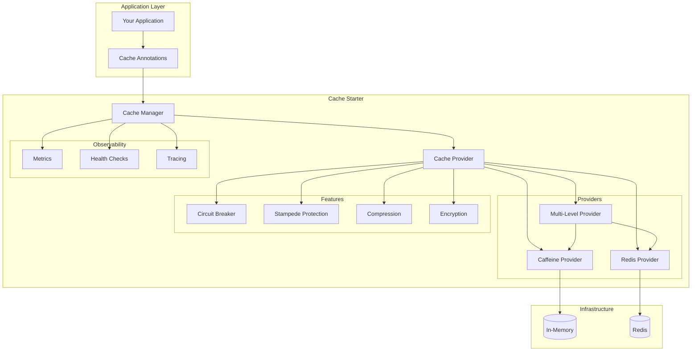

# Cache Starter

🚀 **Enterprise-grade caching solution** for Spring Boot applications with multiple providers, resilience patterns, and comprehensive observability. This starter provides a unified caching abstraction that supports various caching strategies from simple in-memory caching to sophisticated multi-level distributed caching.

## 🌟 Key Features

### 🔄 Multi-Provider Support
- **Caffeine**: High-performance in-memory caching
- **Redis**: Distributed caching with persistence
- **Multi-Level**: L1 (Caffeine) + L2 (Redis) with intelligent eviction

### 🛡️ Resilience Patterns
- **Circuit Breaker**: Automatic fallback when cache is unavailable
- **Stampede Protection**: Prevents cache stampede scenarios
- **Timeout Handling**: Configurable timeouts for cache operations
- **Graceful Degradation**: Continues operation when cache fails

### 🚀 Advanced Features
- **Compression**: Automatic data compression for large objects
- **Encryption**: Optional encryption for sensitive cached data
- **Distributed Eviction**: Coordinated cache invalidation across instances
- **TTL Support**: Flexible time-to-live configurations

### 📊 Observability
- **Comprehensive Metrics**: Hit/miss ratios, eviction counts, size metrics
- **Health Checks**: Built-in health indicators for all providers
- **Distributed Tracing**: Full tracing support with correlation IDs
- **Performance Monitoring**: Detailed performance metrics and alerts

### 🎯 Declarative Caching
- **Annotation-Based**: Simple `@Cacheable`, `@CachePut`, `@CacheEvict`
- **Namespace Support**: Logical separation of cached data
- **Dynamic TTL**: Runtime TTL configuration per cache operation
- **Conditional Caching**: Cache based on conditions and expressions

## 📦 Installation

Add the dependency to your `pom.xml`:

```xml
<dependency>
    <groupId>com.immortals.platform</groupId>
    <artifactId>cache-starter</artifactId>
    <version>1.0.0</version>
</dependency>
```

## 🏗️ Architecture

### Package Structure

```
com.immortals.platform.cache
├── core/                    # Core interfaces and abstractions
│   ├── CacheManager         # Main cache management interface
│   ├── CacheProvider        # Provider abstraction
│   └── CacheConfiguration   # Configuration models
├── providers/               # Cache provider implementations
│   ├── redis/              # Redis-based caching
│   ├── caffeine/           # Caffeine in-memory caching
│   └── composite/          # Multi-level caching
├── features/               # Advanced cache features
│   ├── distributed/        # Distributed caching features
│   ├── serialization/      # Serialization strategies
│   └── eviction/          # Eviction policies
├── observability/          # Monitoring and metrics
│   ├── metrics/           # Metrics collection
│   ├── health/            # Health checks
│   └── tracing/           # Distributed tracing
└── config/                # Auto-configuration classes
    ├── CacheAutoConfiguration
    ├── RedisAutoConfiguration
    └── ObservabilityAutoConfiguration
```

### Provider Architecture



## ⚙️ Configuration

### Basic Configuration

```yaml
platform:
  cache:
    enabled: true
    provider: redis  # caffeine, redis, or composite
    default-ttl: 3600  # Default TTL in seconds
    
    # Caffeine-specific configuration
    caffeine-properties:
      maximum-size: 10000
      expire-after-write: 1h
      expire-after-access: 30m
      
    # Redis-specific configuration
    redis-properties:
      host: localhost
      port: 6379
      password: ${REDIS_PASSWORD:}
      database: 0
      timeout: 2s
      
      # Connection pool settings
      pool:
        max-active: 8
        max-idle: 8
        min-idle: 0
        max-wait: -1ms
        
    # Multi-level configuration
    multilevel-properties:
      l1-provider: caffeine
      l2-provider: redis
      l1-ttl: 300  # 5 minutes
      l2-ttl: 3600  # 1 hour
      
    # Resilience configuration
    resilience:
      circuit-breaker:
        enabled: true
        failure-rate-threshold: 50
        wait-duration-in-open-state: 30s
        sliding-window-size: 10
        
      stampede-protection:
        enabled: true
        lock-timeout: 5s
        
      timeout:
        enabled: true
        duration: 2s
        
    # Feature configuration
    features:
      compression:
        enabled: true
        threshold: 1024  # Compress objects larger than 1KB
        algorithm: gzip
        
      encryption:
        enabled: false
        algorithm: AES
        key: ${CACHE_ENCRYPTION_KEY:}
        
      distributed-eviction:
        enabled: true
        channel: cache-eviction
        
    # Observability configuration
    observability:
      metrics:
        enabled: true
        detailed: true
        
      health-checks:
        enabled: true
        
      tracing:
        enabled: true
```

### Environment-Specific Configuration

#### Development
```yaml
platform:
  cache:
    provider: caffeine
    caffeine-properties:
      maximum-size: 1000
      expire-after-write: 5m
    observability:
      metrics:
        detailed: false
```

#### Production
```yaml
platform:
  cache:
    provider: composite
    multilevel-properties:
      l1-provider: caffeine
      l2-provider: redis
    redis-properties:
      host: ${REDIS_HOST}
      port: ${REDIS_PORT}
      password: ${REDIS_PASSWORD}
      pool:
        max-active: 20
        max-idle: 10
    resilience:
      circuit-breaker:
        enabled: true
      stampede-protection:
        enabled: true
    features:
      compression:
        enabled: true
      distributed-eviction:
        enabled: true
    observability:
      metrics:
        enabled: true
        detailed: true
```

## 💻 Usage Examples

### Basic Caching

```java
@Service
@RequiredArgsConstructor
public class UserService {
    
    private final UserRepository userRepository;
    
    @Cacheable(namespace = "users", key = "#id", ttl = 3600)
    public User findById(String id) {
        log.info("Fetching user from database: {}", id);
        return userRepository.findById(id)
            .orElseThrow(() -> new ResourceNotFoundException("User", id));
    }
    
    @CachePut(namespace = "users", key = "#user.id", ttl = 3600)
    public User update(User user) {
        log.info("Updating user: {}", user.getId());
        return userRepository.save(user);
    }
    
    @CacheEvict(namespace = "users", key = "#id")
    public void delete(String id) {
        log.info("Deleting user: {}", id);
        userRepository.deleteById(id);
    }
    
    @CacheEvict(namespace = "users", allEntries = true)
    public void deleteAll() {
        log.info("Clearing all users from cache");
        userRepository.deleteAll();
    }
}
```

### Advanced Caching Patterns

#### Conditional Caching
```java
@Service
public class ProductService {
    
    // Only cache if product is active
    @Cacheable(namespace = "products", key = "#id", 
               condition = "#result != null && #result.active", 
               ttl = 1800)
    public Product findById(String id) {
        return productRepository.findById(id).orElse(null);
    }
    
    // Cache unless product is on sale
    @Cacheable(namespace = "products", key = "#id", 
               unless = "#result.onSale", 
               ttl = 900)
    public Product findByIdWithPrice(String id) {
        return productRepository.findByIdWithCurrentPrice(id);
    }
}
```

#### Dynamic TTL
```java
@Service
public class PricingService {
    
    @Cacheable(namespace = "prices", key = "#productId")
    public Price getPrice(String productId) {
        Price price = pricingRepository.findByProductId(productId);
        
        // Set TTL based on price volatility
        int ttl = price.isVolatile() ? 300 : 3600;  // 5 min vs 1 hour
        CacheContext.setTtl(ttl);
        
        return price;
    }
}
```

#### Bulk Operations
```java
@Service
public class ProductCacheService {
    
    @Autowired
    private CacheManager cacheManager;
    
    public void warmUpCache(List<String> productIds) {
        Map<String, Product> products = productRepository.findAllById(productIds)
            .stream()
            .collect(Collectors.toMap(Product::getId, Function.identity()));
        
        // Bulk cache population
        cacheManager.putAll("products", products, 3600);
    }
    
    public void evictProducts(List<String> productIds) {
        // Bulk eviction
        cacheManager.evictAll("products", productIds);
    }
}
```

### Multi-Level Caching

```java
@Configuration
@EnableCaching
public class CacheConfiguration {
    
    @Bean
    @Primary
    public CacheManager multiLevelCacheManager() {
        return MultiLevelCacheManager.builder()
            .l1Provider(caffeineCacheManager())
            .l2Provider(redisCacheManager())
            .l1Ttl(Duration.ofMinutes(5))
            .l2Ttl(Duration.ofHours(1))
            .enableDistributedEviction(true)
            .build();
    }
}

@Service
public class InventoryService {
    
    // Uses multi-level caching automatically
    @Cacheable(namespace = "inventory", key = "#productId", ttl = 1800)
    public InventoryLevel getInventoryLevel(String productId) {
        // This will:
        // 1. Check L1 cache (Caffeine) first
        // 2. If miss, check L2 cache (Redis)
        // 3. If miss, fetch from database
        // 4. Store in both L1 and L2 caches
        return inventoryRepository.findByProductId(productId);
    }
}
```

### Programmatic Cache Access

```java
@Service
@RequiredArgsConstructor
public class CacheService {
    
    private final CacheManager cacheManager;
    
    public <T> Optional<T> get(String namespace, String key, Class<T> type) {
        return cacheManager.get(namespace, key, type);
    }
    
    public <T> void put(String namespace, String key, T value, int ttl) {
        cacheManager.put(namespace, key, value, ttl);
    }
    
    public void evict(String namespace, String key) {
        cacheManager.evict(namespace, key);
    }
    
    public void clear(String namespace) {
        cacheManager.clear(namespace);
    }
    
    // Advanced operations
    public <T> T getOrCompute(String namespace, String key, 
                              Supplier<T> valueSupplier, int ttl) {
        return cacheManager.get(namespace, key)
            .orElseGet(() -> {
                T value = valueSupplier.get();
                cacheManager.put(namespace, key, value, ttl);
                return value;
            });
    }
    
    public Map<String, Object> getAll(String namespace, Set<String> keys) {
        return cacheManager.getAll(namespace, keys);
    }
    
    public void putAll(String namespace, Map<String, Object> entries, int ttl) {
        cacheManager.putAll(namespace, entries, ttl);
    }
}
```

## 🔧 Provider-Specific Features

### Caffeine Provider

**Best for**: High-performance local caching, low latency requirements

```yaml
platform:
  cache:
    provider: caffeine
    caffeine-properties:
      maximum-size: 10000
      maximum-weight: 100MB
      expire-after-write: 1h
      expire-after-access: 30m
      refresh-after-write: 15m
      weak-keys: false
      weak-values: false
      soft-values: false
      record-stats: true
```

**Features**:
- **Size-based eviction**: Maximum entries or memory weight
- **Time-based eviction**: Expire after write/access
- **Refresh ahead**: Asynchronous refresh before expiration
- **Reference types**: Weak/soft references for memory management
- **Statistics**: Built-in hit/miss statistics

### Redis Provider

**Best for**: Distributed caching, session sharing, persistence

```yaml
platform:
  cache:
    provider: redis
    redis-properties:
      host: localhost
      port: 6379
      password: secret
      database: 0
      timeout: 2s
      
      # Cluster configuration
      cluster:
        nodes:
          - redis-node1:6379
          - redis-node2:6379
          - redis-node3:6379
        max-redirects: 3
        
      # Sentinel configuration
      sentinel:
        master: mymaster
        nodes:
          - sentinel1:26379
          - sentinel2:26379
          - sentinel3:26379
          
      # SSL configuration
      ssl:
        enabled: true
        key-store: classpath:redis-keystore.jks
        key-store-password: secret
        trust-store: classpath:redis-truststore.jks
        trust-store-password: secret
```

**Features**:
- **Persistence**: Data survives restarts
- **Clustering**: Horizontal scaling with Redis Cluster
- **High Availability**: Redis Sentinel support
- **SSL/TLS**: Encrypted connections
- **Pub/Sub**: Distributed eviction notifications

### Multi-Level Provider

**Best for**: Optimal performance with distributed consistency

```yaml
platform:
  cache:
    provider: composite
    multilevel-properties:
      l1-provider: caffeine
      l2-provider: redis
      l1-ttl: 300      # 5 minutes
      l2-ttl: 3600     # 1 hour
      l1-max-size: 1000
      promotion-threshold: 2  # Promote to L1 after 2 L2 hits
      
      # Eviction coordination
      distributed-eviction:
        enabled: true
        channel: cache-eviction
        batch-size: 100
        flush-interval: 1s
```

**How it works**:
1. **Read Path**: Check L1 → L2 → Database
2. **Write Path**: Store in both L1 and L2
3. **Eviction**: Coordinate eviction across all instances
4. **Promotion**: Frequently accessed L2 items promoted to L1

## 🛡️ Resilience Features

### Circuit Breaker

Protects against cascade failures when cache is unavailable:

```java
@Service
public class ResilientService {
    
    @Cacheable(namespace = "products", key = "#id", ttl = 3600)
    @CircuitBreaker(name = "cache", fallbackMethod = "fallbackGetProduct")
    public Product getProduct(String id) {
        return productRepository.findById(id);
    }
    
    public Product fallbackGetProduct(String id, Exception ex) {
        log.warn("Cache circuit breaker open, fetching from database: {}", ex.getMessage());
        return productRepository.findById(id);
    }
}
```

### Stampede Protection

Prevents multiple threads from computing the same cache value:

```java
@Service
public class ExpensiveComputationService {
    
    @Cacheable(namespace = "computations", key = "#input", ttl = 7200)
    @StampedeProtection(lockTimeout = "5s")
    public ComputationResult compute(String input) {
        // Expensive computation that should only run once
        return performExpensiveComputation(input);
    }
}
```

### Timeout Handling

Configurable timeouts for cache operations:

```yaml
platform:
  cache:
    resilience:
      timeout:
        enabled: true
        duration: 2s
        interrupt-on-timeout: true
```

## 📊 Monitoring and Observability

### Metrics

The starter provides comprehensive metrics through Micrometer:

```java
// Available metrics
cache.size                    // Current cache size
cache.gets{result=hit}       // Cache hits
cache.gets{result=miss}      // Cache misses
cache.puts                   // Cache puts
cache.evictions             // Cache evictions
cache.load.duration         // Load time for cache misses
cache.operation.duration    // Cache operation duration
```

### Custom Metrics

```java
@Component
@RequiredArgsConstructor
public class CacheMetricsCollector {
    
    private final MeterRegistry meterRegistry;
    private final CacheManager cacheManager;
    
    @EventListener
    public void onCacheHit(CacheHitEvent event) {
        Counter.builder("cache.custom.hits")
            .tag("namespace", event.getNamespace())
            .tag("provider", event.getProvider())
            .register(meterRegistry)
            .increment();
    }
    
    @Scheduled(fixedRate = 60000)
    public void recordCacheStats() {
        cacheManager.getStats().forEach((namespace, stats) -> {
            Gauge.builder("cache.hit.ratio")
                .tag("namespace", namespace)
                .register(meterRegistry, stats, CacheStats::getHitRatio);
        });
    }
}
```

### Health Checks

```java
@Component
public class CacheHealthIndicator implements HealthIndicator {
    
    @Override
    public Health health() {
        try {
            // Test cache connectivity
            cacheManager.get("health-check", "test");
            return Health.up()
                .withDetail("provider", cacheManager.getProviderType())
                .withDetail("status", "operational")
                .build();
        } catch (Exception e) {
            return Health.down()
                .withDetail("error", e.getMessage())
                .build();
        }
    }
}
```

### Distributed Tracing

```java
@Service
public class TracedCacheService {
    
    @Cacheable(namespace = "users", key = "#id")
    @NewSpan("cache-lookup")
    public User getUser(@SpanTag("user.id") String id) {
        // Tracing automatically includes:
        // - Cache hit/miss information
        // - Cache provider type
        // - Operation duration
        // - Correlation IDs
        return userRepository.findById(id);
    }
}
```

## 🧪 Testing

### Unit Testing

```java
@ExtendWith(MockitoExtension.class)
class UserServiceTest {
    
    @Mock
    private UserRepository userRepository;
    
    @Mock
    private CacheManager cacheManager;
    
    @InjectMocks
    private UserService userService;
    
    @Test
    void shouldCacheUser() {
        // Given
        String userId = "user-123";
        User user = new User(userId, "John Doe");
        when(userRepository.findById(userId)).thenReturn(Optional.of(user));
        
        // When
        User result = userService.findById(userId);
        
        // Then
        assertThat(result).isEqualTo(user);
        verify(cacheManager).put("users", userId, user, 3600);
    }
    
    @Test
    void shouldReturnCachedUser() {
        // Given
        String userId = "user-123";
        User cachedUser = new User(userId, "John Doe");
        when(cacheManager.get("users", userId, User.class))
            .thenReturn(Optional.of(cachedUser));
        
        // When
        User result = userService.findById(userId);
        
        // Then
        assertThat(result).isEqualTo(cachedUser);
        verify(userRepository, never()).findById(userId);
    }
}
```

### Integration Testing

```java
@SpringBootTest
@Testcontainers
class CacheIntegrationTest {
    
    @Container
    static GenericContainer<?> redis = new GenericContainer<>("redis:7-alpine")
        .withExposedPorts(6379);
    
    @DynamicPropertySource
    static void configureProperties(DynamicPropertyRegistry registry) {
        registry.add("platform.cache.provider", () -> "redis");
        registry.add("platform.cache.redis-properties.host", redis::getHost);
        registry.add("platform.cache.redis-properties.port", redis::getFirstMappedPort);
    }
    
    @Autowired
    private UserService userService;
    
    @Autowired
    private UserRepository userRepository;
    
    @Test
    void shouldCacheUserInRedis() {
        // Given
        User user = new User("user-123", "John Doe");
        userRepository.save(user);
        
        // When - First call should hit database
        User result1 = userService.findById("user-123");
        
        // Then
        assertThat(result1).isEqualTo(user);
        
        // When - Second call should hit cache
        User result2 = userService.findById("user-123");
        
        // Then
        assertThat(result2).isEqualTo(user);
        // Verify cache hit through metrics or logs
    }
}
```

### Performance Testing

```java
@SpringBootTest
class CachePerformanceTest {
    
    @Autowired
    private ProductService productService;
    
    @Test
    void shouldImprovePerformanceWithCache() {
        // Warm up
        productService.findById("product-123");
        
        // Measure uncached performance
        long start = System.nanoTime();
        for (int i = 0; i < 1000; i++) {
            productService.findById("product-" + (i % 10));
        }
        long uncachedTime = System.nanoTime() - start;
        
        // Clear cache and warm up again
        cacheManager.clear("products");
        productService.findById("product-123");
        
        // Measure cached performance
        start = System.nanoTime();
        for (int i = 0; i < 1000; i++) {
            productService.findById("product-" + (i % 10));
        }
        long cachedTime = System.nanoTime() - start;
        
        // Cache should be significantly faster
        assertThat(cachedTime).isLessThan(uncachedTime / 5);
    }
}
```

## 🚨 Troubleshooting

### Common Issues

#### 1. Cache Not Working
```
@Cacheable annotation not working
```

**Causes & Solutions:**
- **Missing @EnableCaching**: Add to configuration class
- **Self-invocation**: Cache annotations don't work on self-calls
- **Proxy issues**: Ensure method is public and class is Spring-managed
- **Configuration**: Verify cache provider is properly configured

```java
// ❌ Wrong - self-invocation
@Service
public class UserService {
    public User getUser(String id) {
        return getCachedUser(id);  // Won't be cached
    }
    
    @Cacheable("users")
    private User getCachedUser(String id) {
        return userRepository.findById(id);
    }
}

// ✅ Correct - external call
@Service
public class UserService {
    @Cacheable("users")
    public User getUser(String id) {
        return userRepository.findById(id);
    }
}
```

#### 2. Redis Connection Issues
```
Unable to connect to Redis; nested exception is io.lettuce.core.RedisConnectionException
```

**Solutions:**
- Verify Redis is running: `docker run -d -p 6379:6379 redis:7-alpine`
- Check connection properties
- Verify network connectivity
- Check firewall settings

#### 3. Serialization Errors
```
Cannot serialize object of type com.example.User
```

**Solutions:**
- Implement `Serializable` interface
- Configure custom serializer
- Use JSON serialization

```java
// ❌ Not serializable
public class User {
    private String name;
    // No Serializable interface
}

// ✅ Serializable
public class User implements Serializable {
    private static final long serialVersionUID = 1L;
    private String name;
}

// ✅ Or configure JSON serialization
@Configuration
public class CacheConfig {
    @Bean
    public RedisTemplate<String, Object> redisTemplate() {
        RedisTemplate<String, Object> template = new RedisTemplate<>();
        template.setDefaultSerializer(new GenericJackson2JsonRedisSerializer());
        return template;
    }
}
```

#### 4. Memory Issues
```
OutOfMemoryError: Java heap space
```

**Solutions:**
- Configure cache size limits
- Use weak/soft references
- Monitor cache metrics
- Implement proper eviction policies

```yaml
platform:
  cache:
    caffeine-properties:
      maximum-size: 10000  # Limit entries
      maximum-weight: 100MB  # Limit memory
      weak-values: true  # Allow GC
```

#### 5. Performance Issues
```
Cache operations are slow
```

**Solutions:**
- Check network latency to Redis
- Optimize serialization
- Use connection pooling
- Monitor cache hit ratios

### Debug Configuration

Enable debug logging:

```yaml
logging:
  level:
    com.immortals.platform.cache: DEBUG
    org.springframework.cache: DEBUG
    io.lettuce.core: DEBUG  # For Redis
    com.github.benmanes.caffeine: DEBUG  # For Caffeine
```

### Monitoring Commands

```bash
# Check cache health
curl http://localhost:8080/actuator/health/cache

# View cache metrics
curl http://localhost:8080/actuator/metrics/cache.gets

# Prometheus metrics
curl http://localhost:8080/actuator/prometheus | grep cache
```

## 🔧 Advanced Configuration

### Custom Cache Provider

```java
@Component
public class CustomCacheProvider implements CacheProvider {
    
    @Override
    public <T> Optional<T> get(String namespace, String key, Class<T> type) {
        // Custom cache implementation
        return Optional.empty();
    }
    
    @Override
    public void put(String namespace, String key, Object value, int ttl) {
        // Custom cache implementation
    }
    
    @Override
    public void evict(String namespace, String key) {
        // Custom cache implementation
    }
    
    @Override
    public void clear(String namespace) {
        // Custom cache implementation
    }
    
    @Override
    public CacheStats getStats(String namespace) {
        // Return cache statistics
        return CacheStats.empty();
    }
}
```

### Custom Serialization

```java
@Configuration
public class CacheSerializationConfig {
    
    @Bean
    public CacheSerializer customSerializer() {
        return new CacheSerializer() {
            @Override
            public byte[] serialize(Object object) throws SerializationException {
                // Custom serialization logic
                return objectMapper.writeValueAsBytes(object);
            }
            
            @Override
            public Object deserialize(byte[] bytes, Class<?> type) throws SerializationException {
                // Custom deserialization logic
                return objectMapper.readValue(bytes, type);
            }
        };
    }
}
```

### Cache Event Listeners

```java
@Component
public class CacheEventListener {
    
    @EventListener
    public void onCacheHit(CacheHitEvent event) {
        log.debug("Cache hit: namespace={}, key={}", 
                 event.getNamespace(), event.getKey());
    }
    
    @EventListener
    public void onCacheMiss(CacheMissEvent event) {
        log.debug("Cache miss: namespace={}, key={}", 
                 event.getNamespace(), event.getKey());
    }
    
    @EventListener
    public void onCacheEviction(CacheEvictionEvent event) {
        log.info("Cache eviction: namespace={}, key={}, reason={}", 
                event.getNamespace(), event.getKey(), event.getReason());
    }
}
```

## 📈 Performance Tuning

### Caffeine Tuning

```yaml
platform:
  cache:
    caffeine-properties:
      # Size-based eviction
      maximum-size: 10000
      maximum-weight: 100MB
      
      # Time-based eviction
      expire-after-write: 1h
      expire-after-access: 30m
      refresh-after-write: 15m
      
      # Memory management
      weak-keys: false      # Use for memory-sensitive apps
      weak-values: false    # Use for memory-sensitive apps
      soft-values: false    # Use for memory-sensitive apps
      
      # Performance
      record-stats: true    # Enable for monitoring
      initial-capacity: 100 # Reduce initial allocations
```

### Redis Tuning

```yaml
platform:
  cache:
    redis-properties:
      # Connection tuning
      timeout: 2s
      pool:
        max-active: 20      # Increase for high concurrency
        max-idle: 10        # Keep connections warm
        min-idle: 5         # Minimum connections
        max-wait: 1s        # Connection wait timeout
        
      # Performance tuning
      database: 0           # Use dedicated database
      client-name: my-app   # For monitoring
      
      # Cluster tuning (if using Redis Cluster)
      cluster:
        max-redirects: 3    # Reduce for lower latency
        topology-refresh-period: 30s
```

### Multi-Level Tuning

```yaml
platform:
  cache:
    multilevel-properties:
      # Size optimization
      l1-max-size: 1000     # Keep L1 small and fast
      l2-ttl-multiplier: 4  # L2 TTL = L1 TTL * 4
      
      # Promotion strategy
      promotion-threshold: 2 # Promote after 2 L2 hits
      promotion-rate-limit: 100  # Max promotions per second
      
      # Eviction coordination
      distributed-eviction:
        batch-size: 100     # Batch eviction notifications
        flush-interval: 1s  # Flush frequency
        compression: true   # Compress eviction messages
```

## 🔒 Security Considerations

### Encryption

```yaml
platform:
  cache:
    features:
      encryption:
        enabled: true
        algorithm: AES-256-GCM
        key: ${CACHE_ENCRYPTION_KEY}
        key-rotation:
          enabled: true
          interval: 30d
```

### Access Control

```java
@Configuration
@EnableGlobalMethodSecurity(prePostEnabled = true)
public class CacheSecurityConfig {
    
    @PreAuthorize("hasRole('CACHE_READ')")
    @Cacheable("secure-data")
    public SecureData getSecureData(String id) {
        return secureDataRepository.findById(id);
    }
    
    @PreAuthorize("hasRole('CACHE_WRITE')")
    @CachePut("secure-data")
    public SecureData updateSecureData(SecureData data) {
        return secureDataRepository.save(data);
    }
}
```

### Data Sanitization

```java
@Component
public class CacheDataSanitizer {
    
    @EventListener
    public void sanitizeBeforeCache(CachePutEvent event) {
        if (event.getValue() instanceof SensitiveData) {
            SensitiveData data = (SensitiveData) event.getValue();
            data.maskSensitiveFields();
        }
    }
}
```

## 📄 Migration Guide

### From Spring Cache

```java
// Before (Spring Cache)
@Cacheable("users")
public User getUser(String id) {
    return userRepository.findById(id);
}

// After (Platform Cache Starter)
@Cacheable(namespace = "users", key = "#id", ttl = 3600)
public User getUser(String id) {
    return userRepository.findById(id);
}
```

### Configuration Migration

```yaml
# Before (Spring Cache)
spring:
  cache:
    type: redis
    redis:
      time-to-live: 3600s

# After (Platform Cache Starter)
platform:
  cache:
    provider: redis
    default-ttl: 3600
    redis-properties:
      host: localhost
      port: 6379
```

## 📚 Best Practices

### 1. Choose the Right Provider
- **Caffeine**: Single instance, high performance
- **Redis**: Distributed, persistence required
- **Multi-level**: Best of both worlds

### 2. Set Appropriate TTLs
- **Short TTL**: Frequently changing data (1-5 minutes)
- **Medium TTL**: Semi-static data (15-60 minutes)
- **Long TTL**: Static data (1-24 hours)

### 3. Use Namespaces
```java
// ✅ Good - organized namespaces
@Cacheable(namespace = "users", key = "#id")
@Cacheable(namespace = "products", key = "#id")
@Cacheable(namespace = "orders", key = "#id")

// ❌ Bad - no namespace organization
@Cacheable(key = "#id")
```

### 4. Handle Cache Failures Gracefully
```java
@Service
public class ResilientService {
    
    @Cacheable(namespace = "data", key = "#id")
    public Data getData(String id) {
        try {
            return dataRepository.findById(id);
        } catch (Exception e) {
            log.warn("Database error, returning cached data if available", e);
            return cacheManager.get("data", id, Data.class)
                .orElseThrow(() -> new ServiceUnavailableException("Data unavailable"));
        }
    }
}
```

### 5. Monitor Cache Performance
```java
@Component
@RequiredArgsConstructor
public class CacheMonitor {
    
    private final MeterRegistry meterRegistry;
    
    @Scheduled(fixedRate = 60000)
    public void monitorCacheHealth() {
        cacheManager.getStats().forEach((namespace, stats) -> {
            double hitRatio = stats.getHitRatio();
            
            if (hitRatio < 0.8) {
                log.warn("Low cache hit ratio for namespace {}: {}", namespace, hitRatio);
            }
            
            Gauge.builder("cache.hit.ratio")
                .tag("namespace", namespace)
                .register(meterRegistry, () -> hitRatio);
        });
    }
}
```

## 📄 License

Copyright © 2024 Immortals Platform

Licensed under the Apache License, Version 2.0

## 🆘 Support

- 📖 **Documentation**: [Platform Starters Documentation](../README.md)
- 🐛 **Issues**: [GitHub Issues](https://github.com/YOUR_USERNAME/YOUR_REPO/issues)
- 💬 **Discussions**: [GitHub Discussions](https://github.com/YOUR_USERNAME/YOUR_REPO/discussions)
- 📧 **Email**: kapilsrivastava712@gmail.com

---

**Built with ❤️ by the Immortals Platform Team**