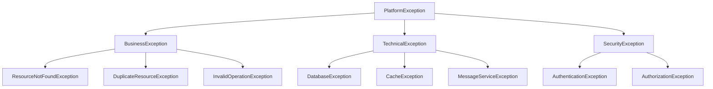

# Common Starter

🛠️ **Essential utilities and foundational components** for Spring Boot microservices. This starter provides a comprehensive set of common utilities, exception handling, API response models, and development tools that every microservice needs.

## 🌟 Key Features

### 🚨 Exception Management
- **Structured Exception Hierarchy**: Well-organized exception types for different scenarios
- **Global Exception Handler**: Automatic exception handling across all REST controllers
- **HTTP Status Mapping**: Intelligent mapping of exceptions to appropriate HTTP status codes
- **Correlation ID Tracking**: Automatic correlation ID generation and propagation

### 📋 API Response Standards
- **Consistent Response Format**: Standardized API response wrappers
- **Pagination Support**: Complete pagination request/response models
- **Error Response Format**: Uniform error response structure
- **Validation Error Details**: Field-level validation error reporting

### 🔧 Utility Classes
- **Date/Time Operations**: Comprehensive date and time manipulation utilities
- **String Manipulation**: Advanced string processing and validation
- **Validation Utilities**: Common validation patterns and helpers
- **UUID Generation**: Correlation ID and unique identifier generation

### 🎯 Developer Experience
- **Auto-Configuration**: Zero-configuration setup with sensible defaults
- **Comprehensive Logging**: Structured logging with correlation IDs
- **Development Tools**: Utilities for testing and debugging
- **Performance Monitoring**: Built-in performance metrics

## 📦 Installation

Add the dependency to your `pom.xml`:

```xml
<dependency>
    <groupId>com.immortals.platform</groupId>
    <artifactId>common-starter</artifactId>
    <version>1.0.0</version>
</dependency>
```

## 🏗️ Architecture

### Package Structure

```
com.immortals.platform.common
├── exception/              # Exception hierarchy and handling
│   ├── PlatformException   # Base exception class
│   ├── BusinessException   # Business logic violations
│   ├── TechnicalException  # Technical/infrastructure failures
│   ├── SecurityException   # Security-related failures
│   └── GlobalExceptionHandler  # Global exception handling
├── dto/                   # Data Transfer Objects
│   ├── ApiResponse        # Standard API response wrapper
│   ├── PageableResponse   # Paginated response wrapper
│   ├── ErrorResponse      # Error response structure
│   └── ValidationError    # Validation error details
├── util/                  # Utility classes
│   ├── DateTimeUtils      # Date and time operations
│   ├── StringUtils        # String manipulation
│   ├── ValidationUtils    # Validation helpers
│   └── UUIDGenerator      # UUID and correlation ID generation
└── config/               # Auto-configuration
    └── CommonAutoConfiguration
```

### Exception Hierarchy



## ⚙️ Configuration

### Auto-Configuration

The starter automatically configures:
- Global exception handler
- Correlation ID filter
- Standard response format
- Validation error handling

No additional configuration is required for basic functionality.

### Optional Configuration

```yaml
platform:
  common:
    # Exception handling configuration
    exception-handling:
      enabled: true
      include-stack-trace: false  # Set to true for development
      include-binding-errors: true
      log-exceptions: true
      
    # Correlation ID configuration
    correlation-id:
      enabled: true
      header-name: X-Correlation-ID
      generate-if-missing: true
      
    # Response configuration
    response:
      include-timestamp: true
      include-path: true
      default-success-message: "Operation completed successfully"
      
    # Validation configuration
    validation:
      enabled: true
      fail-fast: false  # Validate all fields, not just first error
      
    # Logging configuration
    logging:
      log-requests: false  # Set to true for debugging
      log-responses: false  # Set to true for debugging
      mask-sensitive-data: true
```

## 💻 Usage Examples

### Exception Handling

#### Basic Exception Usage

```java
@Service
@RequiredArgsConstructor
public class UserService {
    
    private final UserRepository userRepository;
    
    public User findById(String id) {
        return userRepository.findById(id)
            .orElseThrow(() -> new ResourceNotFoundException("User", id));
    }
    
    public User create(CreateUserRequest request) {
        // Check for duplicate email
        if (userRepository.existsByEmail(request.getEmail())) {
            throw new DuplicateResourceException("User", "email", request.getEmail());
        }
        
        try {
            User user = User.builder()
                .email(request.getEmail())
                .firstName(request.getFirstName())
                .lastName(request.getLastName())
                .build();
                
            return userRepository.save(user);
        } catch (DataIntegrityViolationException e) {
            throw new DatabaseException("Failed to create user", e);
        }
    }
    
    public User update(String id, UpdateUserRequest request) {
        User user = findById(id);
        
        // Business rule validation
        if (!user.isActive()) {
            throw new InvalidOperationException("Cannot update inactive user");
        }
        
        user.setFirstName(request.getFirstName());
        user.setLastName(request.getLastName());
        
        return userRepository.save(user);
    }
    
    public void delete(String id) {
        User user = findById(id);
        
        // Check if user can be deleted
        if (user.hasActiveOrders()) {
            throw new BusinessException("Cannot delete user with active orders");
        }
        
        userRepository.delete(user);
    }
}
```

#### Custom Exception Types

```java
// Custom business exception
public class InsufficientFundsException extends BusinessException {
    public InsufficientFundsException(BigDecimal available, BigDecimal required) {
        super(String.format("Insufficient funds. Available: %s, Required: %s", 
              available, required));
    }
}

// Custom technical exception
public class PaymentGatewayException extends TechnicalException {
    public PaymentGatewayException(String gateway, String errorCode, String message) {
        super(String.format("Payment gateway %s error [%s]: %s", 
              gateway, errorCode, message));
    }
}

// Usage in service
@Service
public class PaymentService {
    
    public Payment processPayment(PaymentRequest request) {
        Account account = accountService.findById(request.getAccountId());
        
        if (account.getBalance().compareTo(request.getAmount()) < 0) {
            throw new InsufficientFundsException(account.getBalance(), request.getAmount());
        }
        
        try {
            return paymentGateway.processPayment(request);
        } catch (GatewayException e) {
            throw new PaymentGatewayException("stripe", e.getErrorCode(), e.getMessage());
        }
    }
}
```

### API Response Models

#### Standard API Responses

```java
@RestController
@RequestMapping("/api/v1/users")
@RequiredArgsConstructor
public class UserController {
    
    private final UserService userService;
    
    @GetMapping("/{id}")
    public ResponseEntity<ApiResponse<UserDTO>> getUser(@PathVariable String id) {
        User user = userService.findById(id);
        UserDTO userDTO = UserDTO.from(user);
        
        return ResponseEntity.ok(ApiResponse.success(userDTO));
    }
    
    @PostMapping
    public ResponseEntity<ApiResponse<UserDTO>> createUser(
            @Valid @RequestBody CreateUserRequest request) {
        
        User user = userService.create(request);
        UserDTO userDTO = UserDTO.from(user);
        
        return ResponseEntity.status(HttpStatus.CREATED)
            .body(ApiResponse.success(userDTO, "User created successfully"));
    }
    
    @PutMapping("/{id}")
    public ResponseEntity<ApiResponse<UserDTO>> updateUser(
            @PathVariable String id,
            @Valid @RequestBody UpdateUserRequest request) {
        
        User user = userService.update(id, request);
        UserDTO userDTO = UserDTO.from(user);
        
        return ResponseEntity.ok(ApiResponse.success(userDTO, "User updated successfully"));
    }
    
    @DeleteMapping("/{id}")
    public ResponseEntity<ApiResponse<Void>> deleteUser(@PathVariable String id) {
        userService.delete(id);
        
        return ResponseEntity.ok(ApiResponse.success(null, "User deleted successfully"));
    }
}
```

#### Paginated Responses

```java
@RestController
@RequestMapping("/api/v1/users")
public class UserController {
    
    @GetMapping
    public ResponseEntity<PageableResponse<UserDTO>> getUsers(
            @RequestParam(defaultValue = "0") int page,
            @RequestParam(defaultValue = "20") int size,
            @RequestParam(defaultValue = "createdAt") String sortBy,
            @RequestParam(defaultValue = "desc") String sortDir) {
        
        // Create page request
        Sort.Direction direction = Sort.Direction.fromString(sortDir);
        Pageable pageable = PageRequest.of(page, size, Sort.by(direction, sortBy));
        
        // Get paginated data
        Page<User> userPage = userService.findAll(pageable);
        
        // Convert to DTOs
        List<UserDTO> userDTOs = userPage.getContent().stream()
            .map(UserDTO::from)
            .collect(Collectors.toList());
        
        // Create pageable response
        PageableResponse<UserDTO> response = PageableResponse.<UserDTO>builder()
            .content(userDTOs)
            .page(userPage.getNumber())
            .size(userPage.getSize())
            .totalElements(userPage.getTotalElements())
            .totalPages(userPage.getTotalPages())
            .first(userPage.isFirst())
            .last(userPage.isLast())
            .numberOfElements(userPage.getNumberOfElements())
            .empty(userPage.isEmpty())
            .build();
        
        return ResponseEntity.ok(response);
    }
}
```

### Utility Classes

#### Date/Time Operations

```java
@Service
public class ReportService {
    
    public Report generateMonthlyReport(String month) {
        // Parse date strings
        Instant startOfMonth = DateTimeUtils.parseInstant(month + "-01T00:00:00Z");
        Instant endOfMonth = DateTimeUtils.addDays(
            DateTimeUtils.addMonths(startOfMonth, 1), -1);
        
        // Format for display
        String displayPeriod = DateTimeUtils.formatIso(startOfMonth) + 
                              " to " + 
                              DateTimeUtils.formatIso(endOfMonth);
        
        // Check if report is for past period
        if (DateTimeUtils.isFuture(startOfMonth)) {
            throw new InvalidOperationException("Cannot generate report for future period");
        }
        
        return Report.builder()
            .period(displayPeriod)
            .startDate(startOfMonth)
            .endDate(endOfMonth)
            .generatedAt(DateTimeUtils.now())
            .build();
    }
    
    public boolean isReportStale(Report report) {
        Instant oneDayAgo = DateTimeUtils.addDays(DateTimeUtils.now(), -1);
        return DateTimeUtils.isBefore(report.getGeneratedAt(), oneDayAgo);
    }
}
```

#### String Manipulation

```java
@Service
public class UserProfileService {
    
    public UserProfile createProfile(CreateProfileRequest request) {
        // Validate and clean input
        String email = request.getEmail().toLowerCase().trim();
        ValidationUtils.requireValidEmail(email, "email");
        
        String firstName = StringUtils.capitalizeFirst(request.getFirstName().trim());
        String lastName = StringUtils.capitalizeFirst(request.getLastName().trim());
        
        // Generate username
        String baseUsername = StringUtils.toCamelCase(firstName + "_" + lastName);
        String username = generateUniqueUsername(baseUsername);
        
        return UserProfile.builder()
            .email(email)
            .firstName(firstName)
            .lastName(lastName)
            .username(username)
            .displayName(firstName + " " + lastName)
            .build();
    }
    
    public String maskSensitiveData(String data, String type) {
        switch (type.toLowerCase()) {
            case "email":
                return StringUtils.maskEmail(data);
            case "phone":
                return StringUtils.maskPhone(data);
            case "ssn":
                return StringUtils.maskSSN(data);
            default:
                return StringUtils.mask(data, 2, 2, '*');
        }
    }
    
    private String generateUniqueUsername(String baseUsername) {
        String username = baseUsername;
        int counter = 1;
        
        while (userRepository.existsByUsername(username)) {
            username = baseUsername + counter++;
        }
        
        return username;
    }
}
```

#### Validation Utilities

```java
@Service
public class ValidationService {
    
    public void validateCreateUserRequest(CreateUserRequest request) {
        // Basic null/blank checks
        ValidationUtils.requireNonNull(request, "request");
        ValidationUtils.requireNonBlank(request.getEmail(), "email");
        ValidationUtils.requireNonBlank(request.getFirstName(), "firstName");
        ValidationUtils.requireNonBlank(request.getLastName(), "lastName");
        
        // Email validation
        ValidationUtils.requireValidEmail(request.getEmail(), "email");
        
        // Password validation
        if (StringUtils.isNotBlank(request.getPassword())) {
            ValidationUtils.requireMinLength(request.getPassword(), 8, "password");
            ValidationUtils.requirePattern(request.getPassword(), 
                "^(?=.*[a-z])(?=.*[A-Z])(?=.*\\d).*$", 
                "password", "Password must contain uppercase, lowercase, and digit");
        }
        
        // Phone validation (if provided)
        if (StringUtils.isNotBlank(request.getPhone())) {
            ValidationUtils.requireValidPhone(request.getPhone(), "phone");
        }
        
        // Age validation (if provided)
        if (request.getAge() != null) {
            ValidationUtils.requireRange(request.getAge(), 13, 120, "age");
        }
    }
}
```

## 🚨 Exception Handling Details

### Exception Types and Usage

#### Business Exceptions
```java
// Resource not found
throw new ResourceNotFoundException("User", userId);
throw new ResourceNotFoundException("Order", "orderNumber", orderNumber);

// Duplicate resource
throw new DuplicateResourceException("User", "email", email);
throw new DuplicateResourceException("Product", "sku", sku);

// Invalid operation
throw new InvalidOperationException("Cannot cancel shipped order");
throw new InvalidOperationException("User account is suspended");

// General business rule violation
throw new BusinessException("Insufficient inventory for product: " + productId);
```

#### Technical Exceptions
```java
// Database errors
throw new DatabaseException("Failed to save user", sqlException);
throw new DatabaseException("Connection timeout");

// Cache errors
throw new CacheException("Redis connection failed", redisException);
throw new CacheException("Cache serialization error");

// Message service errors
throw new MessageServiceException("Failed to publish event", kafkaException);
throw new MessageServiceException("Message queue unavailable");

// General technical error
throw new TechnicalException("External service unavailable", serviceException);
```

#### Security Exceptions
```java
// Authentication errors
throw new AuthenticationException("Invalid credentials");
throw new AuthenticationException("Token expired");

// Authorization errors
throw new AuthorizationException("Insufficient permissions");
throw new AuthorizationException("Access denied to resource: " + resourceId);

// General security error
throw new SecurityException("Suspicious activity detected");
```

### HTTP Status Code Mapping

| Exception Type | HTTP Status | Description |
|----------------|-------------|-------------|
| `ResourceNotFoundException` | 404 Not Found | Resource doesn't exist |
| `DuplicateResourceException` | 409 Conflict | Resource already exists |
| `InvalidOperationException` | 400 Bad Request | Operation not allowed |
| `BusinessException` | 400 Bad Request | Business rule violation |
| `ValidationException` | 400 Bad Request | Input validation failed |
| `AuthenticationException` | 401 Unauthorized | Authentication required |
| `AuthorizationException` | 403 Forbidden | Access denied |
| `SecurityException` | 403 Forbidden | Security violation |
| `DatabaseException` | 500 Internal Server Error | Database error |
| `CacheException` | 500 Internal Server Error | Cache error |
| `TechnicalException` | 500 Internal Server Error | Technical error |
| `PlatformException` | 500 Internal Server Error | Generic platform error |

### Error Response Format

#### Standard Error Response
```json
{
  "timestamp": "2024-01-15T10:30:00Z",
  "status": 404,
  "error": "Not Found",
  "message": "User with id 'user-123' not found",
  "path": "/api/v1/users/user-123",
  "correlationId": "abc-123-def-456"
}
```

#### Validation Error Response
```json
{
  "timestamp": "2024-01-15T10:30:00Z",
  "status": 400,
  "error": "Bad Request",
  "message": "Validation failed",
  "path": "/api/v1/users",
  "correlationId": "abc-123-def-456",
  "errors": [
    {
      "field": "email",
      "rejectedValue": "invalid-email",
      "message": "must be a valid email address",
      "code": "Email"
    },
    {
      "field": "age",
      "rejectedValue": -5,
      "message": "must be greater than or equal to 0",
      "code": "Min"
    }
  ]
}
```

## 🔧 Utility Classes Reference

### DateTimeUtils

```java
// Current time
Instant now = DateTimeUtils.now();
LocalDateTime localNow = DateTimeUtils.nowLocal();

// Formatting
String isoString = DateTimeUtils.formatIso(instant);
String customFormat = DateTimeUtils.format(instant, "yyyy-MM-dd HH:mm:ss");
String compactFormat = DateTimeUtils.formatCompact(instant); // "20240115103000"

// Parsing
Instant parsed = DateTimeUtils.parseInstant("2024-01-15T10:30:00Z");
LocalDateTime localParsed = DateTimeUtils.parseLocalDateTime("2024-01-15 10:30:00");

// Manipulation
Instant tomorrow = DateTimeUtils.addDays(now, 1);
Instant nextMonth = DateTimeUtils.addMonths(now, 1);
Instant nextYear = DateTimeUtils.addYears(now, 1);

// Comparison
boolean isPast = DateTimeUtils.isPast(someInstant);
boolean isFuture = DateTimeUtils.isFuture(someInstant);
boolean isBefore = DateTimeUtils.isBefore(instant1, instant2);
boolean isAfter = DateTimeUtils.isAfter(instant1, instant2);

// Conversion
long epochMilli = DateTimeUtils.toEpochMilli(instant);
Instant fromEpoch = DateTimeUtils.fromEpochMilli(epochMilli);
```

### StringUtils

```java
// Validation
boolean isBlank = StringUtils.isBlank(str);
boolean isNotBlank = StringUtils.isNotBlank(str);
boolean isValidEmail = StringUtils.isValidEmail("user@example.com");
boolean isValidPhone = StringUtils.isValidPhone("+1-555-123-4567");
boolean isValidUUID = StringUtils.isValidUUID("123e4567-e89b-12d3-a456-426614174000");

// Case conversion
String camelCase = StringUtils.toCamelCase("hello_world"); // "helloWorld"
String snakeCase = StringUtils.toSnakeCase("helloWorld"); // "hello_world"
String kebabCase = StringUtils.toKebabCase("helloWorld"); // "hello-world"
String capitalized = StringUtils.capitalizeFirst("hello"); // "Hello"

// Masking
String maskedEmail = StringUtils.maskEmail("user@example.com"); // "us**@example.com"
String maskedPhone = StringUtils.maskPhone("555-123-4567"); // "555-***-4567"
String maskedSSN = StringUtils.maskSSN("123-45-6789"); // "***-**-6789"
String masked = StringUtils.mask("sensitive", 2, 2, '*'); // "se*****ve"

// Manipulation
String truncated = StringUtils.truncate("long string", 10); // "long str..."
String padded = StringUtils.padLeft("123", 5, '0'); // "00123"
String cleaned = StringUtils.removeSpecialChars("hello@world!"); // "helloworld"
```

### ValidationUtils

```java
// Null/blank validation
ValidationUtils.requireNonNull(object, "object");
ValidationUtils.requireNonBlank(string, "string");

// Email validation
ValidationUtils.requireValidEmail("user@example.com", "email");

// Phone validation
ValidationUtils.requireValidPhone("+1-555-123-4567", "phone");

// UUID validation
ValidationUtils.requireValidUUID("123e4567-e89b-12d3-a456-426614174000", "id");

// URL validation
ValidationUtils.requireValidUrl("https://example.com", "url");

// Numeric validation
ValidationUtils.requirePositive(amount, "amount");
ValidationUtils.requireNonNegative(count, "count");
ValidationUtils.requireRange(age, 0, 120, "age");

// String validation
ValidationUtils.requireMinLength(password, 8, "password");
ValidationUtils.requireMaxLength(description, 500, "description");
ValidationUtils.requirePattern(code, "^[A-Z]{3}$", "code", "Code must be 3 uppercase letters");

// Collection validation
ValidationUtils.requireNonEmpty(list, "list");
ValidationUtils.requireSize(list, 1, 10, "list");

// Custom validation
ValidationUtils.require(condition, "Custom validation message");
ValidationUtils.requirePermission("ADMIN", "Admin permission required");
```

### UUIDGenerator

```java
// Standard UUID generation
String uuid = UUIDGenerator.generateUUID();
String correlationId = UUIDGenerator.generateCorrelationId();
String shortId = UUIDGenerator.generateShortCorrelationId(); // 8 characters

// Validation
boolean isValid = UUIDGenerator.isValidUUID(someString);

// Custom prefixes
String orderId = UUIDGenerator.generateWithPrefix("ORD");
String userId = UUIDGenerator.generateWithPrefix("USR");
```

## 🧪 Testing

### Unit Testing

```java
@ExtendWith(MockitoExtension.class)
class UserServiceTest {
    
    @Mock
    private UserRepository userRepository;
    
    @InjectMocks
    private UserService userService;
    
    @Test
    void shouldThrowResourceNotFoundExceptionWhenUserNotExists() {
        // Given
        String userId = "non-existent-id";
        when(userRepository.findById(userId)).thenReturn(Optional.empty());
        
        // When & Then
        assertThatThrownBy(() -> userService.findById(userId))
            .isInstanceOf(ResourceNotFoundException.class)
            .hasMessageContaining("User")
            .hasMessageContaining(userId);
    }
    
    @Test
    void shouldThrowDuplicateResourceExceptionWhenEmailExists() {
        // Given
        CreateUserRequest request = CreateUserRequest.builder()
            .email("existing@example.com")
            .firstName("John")
            .lastName("Doe")
            .build();
        
        when(userRepository.existsByEmail(request.getEmail())).thenReturn(true);
        
        // When & Then
        assertThatThrownBy(() -> userService.create(request))
            .isInstanceOf(DuplicateResourceException.class)
            .hasMessageContaining("email")
            .hasMessageContaining("existing@example.com");
    }
}
```

### Integration Testing

```java
@SpringBootTest
@AutoConfigureTestDatabase(replace = AutoConfigureTestDatabase.Replace.NONE)
@Testcontainers
class UserControllerIntegrationTest {
    
    @Autowired
    private TestRestTemplate restTemplate;
    
    @Autowired
    private UserRepository userRepository;
    
    @Test
    void shouldReturnApiResponseWhenUserExists() {
        // Given
        User user = User.builder()
            .id("user-123")
            .email("test@example.com")
            .firstName("John")
            .lastName("Doe")
            .build();
        userRepository.save(user);
        
        // When
        ResponseEntity<ApiResponse<UserDTO>> response = restTemplate.exchange(
            "/api/v1/users/user-123",
            HttpMethod.GET,
            null,
            new ParameterizedTypeReference<ApiResponse<UserDTO>>() {}
        );
        
        // Then
        assertThat(response.getStatusCode()).isEqualTo(HttpStatus.OK);
        assertThat(response.getBody()).isNotNull();
        assertThat(response.getBody().isSuccess()).isTrue();
        assertThat(response.getBody().getData().getId()).isEqualTo("user-123");
        assertThat(response.getBody().getCorrelationId()).isNotNull();
    }
    
    @Test
    void shouldReturnErrorResponseWhenUserNotFound() {
        // When
        ResponseEntity<ErrorResponse> response = restTemplate.exchange(
            "/api/v1/users/non-existent",
            HttpMethod.GET,
            null,
            ErrorResponse.class
        );
        
        // Then
        assertThat(response.getStatusCode()).isEqualTo(HttpStatus.NOT_FOUND);
        assertThat(response.getBody()).isNotNull();
        assertThat(response.getBody().getStatus()).isEqualTo(404);
        assertThat(response.getBody().getError()).isEqualTo("Not Found");
        assertThat(response.getBody().getMessage()).contains("User");
        assertThat(response.getBody().getCorrelationId()).isNotNull();
    }
}
```

## 🚨 Troubleshooting

### Common Issues

#### 1. Global Exception Handler Not Working
```
Exceptions are not being caught by GlobalExceptionHandler
```

**Solutions:**
- Ensure `GlobalExceptionHandler` has `@ControllerAdvice`
- Verify the handler is in a scanned package
- Check for conflicting exception handlers

#### 2. Correlation ID Not Propagating
```
Correlation ID is null in logs/responses
```

**Solutions:**
- Verify correlation ID filter is registered
- Check filter order
- Ensure MDC is properly configured

#### 3. Validation Not Working
```
@Valid annotation not triggering validation
```

**Solutions:**
- Add `spring-boot-starter-validation` dependency
- Ensure `@Valid` is on controller method parameters
- Check validation groups if using custom validation

### Debug Configuration

Enable debug logging:

```yaml
logging:
  level:
    com.immortals.platform.common: DEBUG
    org.springframework.web: DEBUG
    org.springframework.validation: DEBUG
```

## 📚 Best Practices

### 1. Exception Handling
- **Use specific exception types** for different scenarios
- **Include context** in exception messages
- **Don't expose internal details** in error messages
- **Log exceptions appropriately** (error level for unexpected, warn for business)

### 2. API Response Design
- **Always use ApiResponse wrapper** for consistency
- **Include correlation IDs** for traceability
- **Provide meaningful messages** for user feedback
- **Use appropriate HTTP status codes**

### 3. Validation
- **Validate at boundaries** (controller layer)
- **Use Bean Validation** annotations where possible
- **Implement custom validators** for complex business rules
- **Fail fast** but provide comprehensive error details

### 4. Utility Usage
- **Use utility methods** instead of duplicating logic
- **Validate inputs** to utility methods
- **Handle edge cases** gracefully
- **Document utility behavior** clearly

### 5. Performance
- **Avoid exceptions in hot paths**
- **Cache frequently used data**
- **Use appropriate data structures**
- **Monitor performance metrics**

## 📄 License

Copyright © 2024 Immortals Platform

Licensed under the Apache License, Version 2.0

## 🆘 Support

- 📖 **Documentation**: [Platform Starters Documentation](../README.md)
- 🐛 **Issues**: [GitHub Issues](https://github.com/YOUR_USERNAME/YOUR_REPO/issues)
- 💬 **Discussions**: [GitHub Discussions](https://github.com/YOUR_USERNAME/YOUR_REPO/discussions)
- 📧 **Email**: kapilsrivastava712@gmail.com

---

**Built with ❤️ by the Immortals Platform Team**